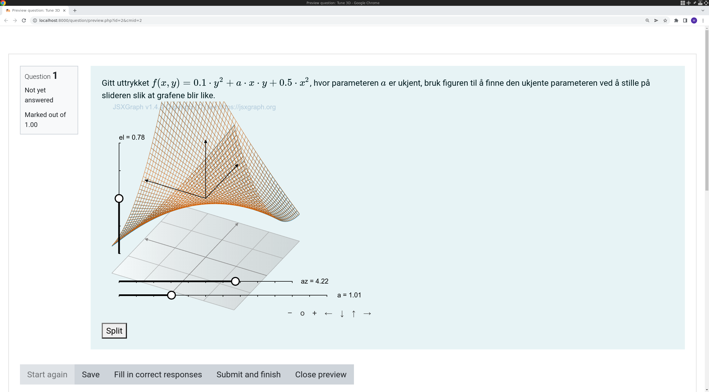

# Question



The student is given a plot of a function of the form

$$ f(x,y) = by^2 + axy + cx^2$$

where $$b$ and $$c$$ are known constants, randomly instantiated, and
$$a$$ is an unknown constant to be determined by the student.

The student sees two superimposed surface plots.
One with the unknown value for $$a$$, and another where the
value of $$a$$ can be controlled by a slider.

The student will have to use the slider to find the value for $$a$$
that makes the two functions coincide.

- [XML Code](XML/questions-jtc-Tune 3D-20220617-1129.xml)

# How it works

## Question Variables (Maxima)

```maxima
params:[a];
nonparams:[b,c];
a:1.0;
b:0.5;
c:0.1;
fxy:'a*x*y+b*x^2+c*y^2;
xrang:[-2,2];
yrang:[-2,2];
a_rs:[0,2,4];
b_rs:[0,2,4];
c_rs:[0,2,4];

fxy2:ev(fxy);
```

## Question Text

First we create three *hidden* input boxes which will
be manipulated from javascript only.

```html
<p style="display:none">[[input:ansa]] [[validation:ansa]]</p>
<p style="display:none">[[input:ansb]] [[validation:ansb]]</p>
<p style="display:none">[[input:ansc]] [[validation:ansc]]</p>
```

The question text proper is straight forward.

```html
Gitt uttrykket \(f(x,y) = {@fxy@}\), hvor parameteren \({@simplode(params,",")@}\) er ukjent, bruk figuren til å finne den ukjente parameteren ved å stille på slideren slik at grafene blir like.
```

The critical part is the javascript code, in `[[jsxgraph]]` tags.

```html
[[jsxgraph input-ref-ansa="ansaRef" input-ref-ansb="ansbRef" input-ref-ansc="anscRef"]]
(function () {

    var board = JXG.JSXGraph.initBoard(divid, {
        boundingbox: [-8, 8, 8, -8],
        keepaspectratio: false,
        axis: false
    });

    var box = [-3, 3];
    var boxx = {#xrang#};
    var boxy = {#yrang#};
    var view = board.create('view3d', [[-6, -3], [8, 8], [boxx, boxy, box]], {
        xPlaneRear: {visible: false},
        yPlaneRear: {visible: false},
    });

    var pnames = {#split(simplode(params,","),",")#};  
       // Array of string ["a","c"...] containing tunable parameters
    var sliders = []; //Array holding a reference to the tunable sliders - not used at the moment
    var slider_shift = 0 //For several sliders, we need to shift the y-position so they don't overlap

    for (var i=0; i<pnames.length; i++){   //Iterate over tunable parameter names

        switch (pnames[i]){
            case "a":
                sliders.push(board.create('slider',  [[-7, -6-slider_shift], [5, -6-slider_shift], {#a_rs#}], { name: pnames[i] })); //create slider with with span and initial value from maxima's a_rs
                slider_shift++; // Shift y-position for next slider
                stack_jxg.bind_slider(ansaRef,sliders[i]); //Bind slider value to stack's answer variable
                break;
            case "b":
                sliders.push(board.create('slider',  [[-7, -6-slider_shift], [5, -6-slider_shift], {#b_rs#}], { name: pnames[i] }));
                slider_shift++;
                stack_jxg.bind_slider(ansbRef,sliders[i]);
                break;
            case "c":
                sliders.push(board.create('slider',  [[-7, -6-slider_shift], [5, -6-slider_shift], {#c_rs#}], { name: pnames[i] }));
                slider_shift++;
                stack_jxg.bind_slider(anscRef,sliders[i]);
                break;
        }
        board.update();
    }

    var nonpnames = {#split(simplode(nonparams,","),",")#}; //Array of strings containing the non-tunable parameter names ["b", "d"...]
    for (var i=0; i<nonpnames.length; i++){ //Iterate over non-tunable parameter names
        
        switch(nonpnames[i]){
            case "a":
                var ansa=document.getElementById(ansaRef); //Get reference to stack's answer variable for the non-tunable parameter
                ansa.value = "{#a#}"; //Set the value to the correct value from maxima
                break;
            case "b":
                var ansb=document.getElementById(ansbRef);
                ansb.value = "{#b#}";
                break;
            case "c":
                var ansc=document.getElementById(anscRef);
                ansc.value = "{#c#}";
                break;  
        }
    }
    board.update();

    var f = board.jc.snippet('{#fxy#}', true, 'x,y', true);  // JessieCode parsing of maxima function - tunable

    //Create 3D tunable surface 
    view.create('functiongraph3d', [f, boxx, boxy], {
        strokeColor: JXG.palette.blue, stepsU: 50, stepsV: 50, strokeWidth: 0.5
    });
                       
    var g = board.jc.snippet('{#fxy2#}', true, 'x,y', true); // JessieCode parsing of maxima function - non-tunable
    var func_g = view.create('functiongraph3d', [g, boxx, boxy], {
	strokeColor: JXG.palette.red,
	stepsU: 50, stepsV: 50, strokeWidth: 0.5
    });

    // Set event listener for button that allows student to split the tunable and non-tunable surfaces into different figures
    var button = document.getElementById('split-button');
    button.addEventListener('click', function() { 
        if (button.value == "0"){                // If value=0 we hide the graph and show the other figure
            func_g.hide();                             //hide target function 
            button.value = "1";                     //toggle button value
            button.textContent = "Merge"; //Toggle button text
            document.getElementById("stack-jsxgraph-2").style.display = "block"; //Show plot of target graph in separate figure
        } else { 
            func_g.show();
            button.value="0";
            button.textContent = "Split";
            document.getElementById("stack-jsxgraph-2").style.display = "none";
        }
    });
})();	
[[/jsxgraph]]
```

An additional feature allows the student to split the view, seeing
each function in different surface plots.

```html
<button type="button" value="0" id="split-button"> Split </button>

[[jsxgraph]]
(function () {
                    // Much the same as previous jsxgraph block - figure of only the non-tunable surface, toggled by "split-button"
		    var board = JXG.JSXGraph.initBoard(divid, {
		        boundingbox: [-8, 8, 8, -8],
		        keepaspectratio: false,
		        axis: false
		    });

		    var box = [-3, 3];
                    var boxx = {#xrang#};
                    var boxy = {#yrang#};
		    var view = board.create('view3d', [[-6, -3], [8, 8], [boxx, boxy, box]], {
		        xPlaneRear: {visible: false},
		        yPlaneRear: {visible: false},
		    });
                      var g = board.jc.snippet('{#fxy2#}', true, 'x,y', true);
		        view.create('functiongraph3d', [g, boxx, boxy], {
		            strokeColor: JXG.palette.red,
		            stepsU: 50, stepsV: 50, strokeWidth: 0.5
		        });
                   board.update();
                   document.getElementById(divid).style.display="none";
})();

[[/jsxgraph]]]]
```
