# Integration region of type I

## Aim of task
+	Student can formulate the function term and the domain for elementary functions given by a graph (Modelling, Handling mathematical symbols and formalism)
+	Student can think of an area that is given by the area between to functions and is able to formulate the expressions for graphically given region (represent mathematical entities, posing and solving mathematical problems, making use of aids and tools)

| 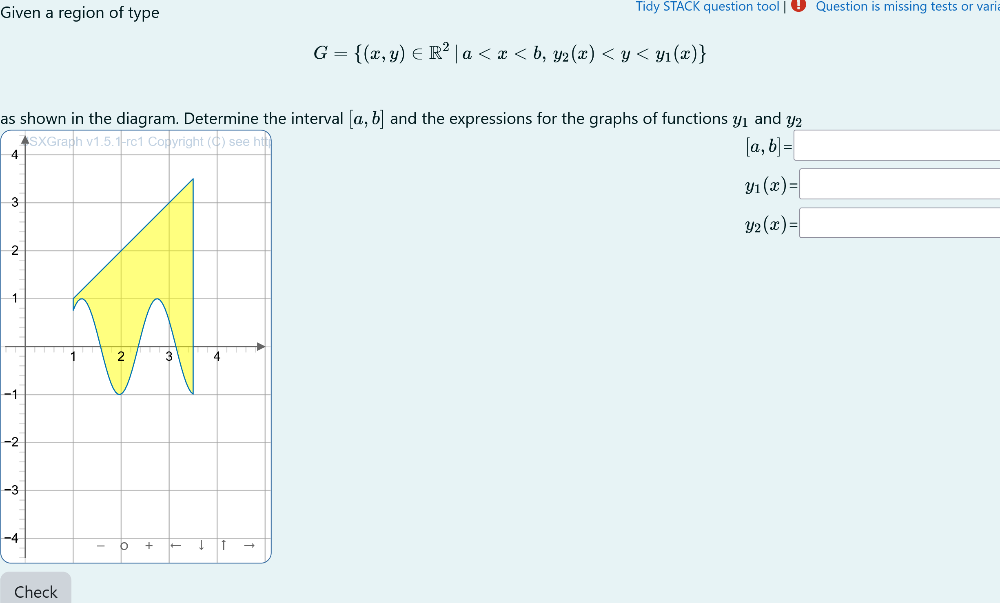 |
|:--:|
| *First impression of the question* |

## Question description

A 2D figure is plotted. It is a randomly generated section 

The task is to find the correct intervalls for $r$ and $\phi$ in real numbers that construct the generated figure in polar coordinates.


### Student perspective

The student will see a coordinate systems.

It is the aim to find the functions describing the given area and there domain. 

| 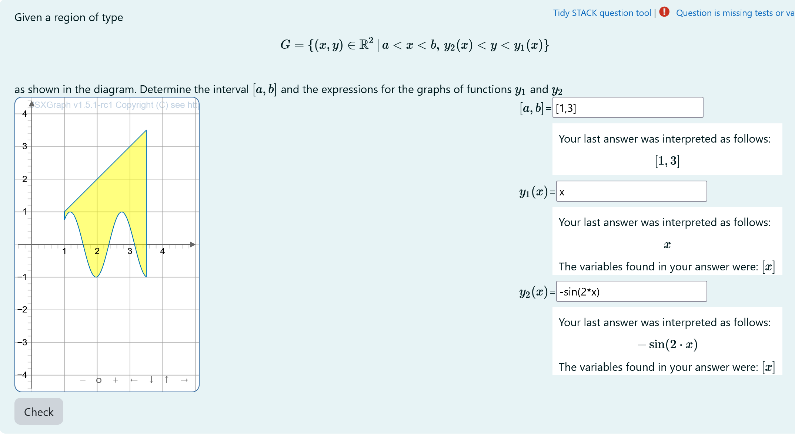 |
|:--:|
| *When the student solves the problem* |

### Feedback
| 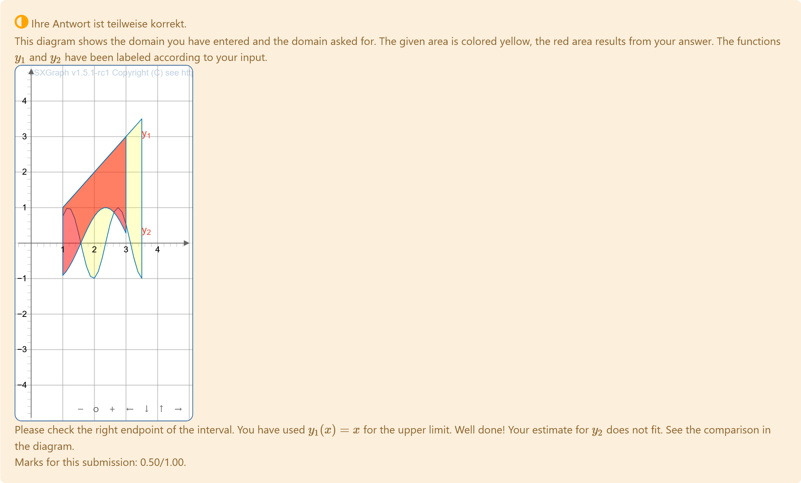 |
|:--:|
| *Feedback* |


### Teacher perspective
The teacher is able to give a list of possible functions for $y_1$ (`yupperfun`) and $y_2$ (`ylowerfun`). In order to do this, they need to modify the entries in the lists specified e.g. change `yupperlist` and `ylowerlist`.
The domain of the functions  $y_1$ and $y_2$ is defined by `x1` and `x2`. To adopt this the teacher has to change the corresponding lines.


**It may happen, that the functions $y_1$ and $y_2$ will intersect. The size of the JSXGraph applet is adjusted using [width and height](https://docs.stack-assessment.org/en/Authoring/JSXGraph/#block-options) and [bounding box](http://jsxgraph.uni-bayreuth.de/docs/symbols/JXG.Board.html#boundingbox).**


| 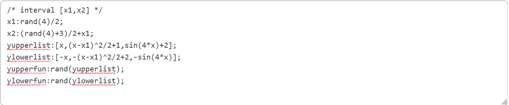 |
|:--:|
| *The above image shows which values the teacher may wish to change* |


## Question code

### Question Variables

#### Question variable code
```javascript
/* interval [x1,x2] */
x1:rand(4)/2;
x2:(rand(4)+3)/2+x1;
yupperlist:[x,(x-x1)^2/2+1,sin(4*x)+2];
ylowerlist:[-x,-(x-x1)^2/2+2,-sin(4*x)];
yupperfun:rand(yupperlist);
ylowerfun:rand(ylowerlist);
```

### Question Text


+ Task explanation using LaTex
+ Region described by general formulation $$G =\{(x,y)\in\mathbb{R}^2\, |\, a < x < b,\, y_2(x) < y < y_1(x)\}$$

+	JSXGraph applet using the functions and variables defined in **Question variables** plotting the randomized integration region.
+	`[[input:ans1]] [[validation:ans1]]` domain for the functions $y_1$ and $y_2$
+   `[[input:ans2]] [[validation:ans2]]` upper function $y_1$
+   `[[input:ans3]] [[validation:ans3]]` lower function $y_2$

#### Question text code

```javascript
Given a region of type
\[G =\{(x,y)\in\mathbb{R}^2\, |\, a < x < b,\, y_2(x) < y < y_1(x)\}\]
as shown in the diagram. Determine the interval \([a,b]\) and the expressions for the graphs of functions \(y_1\) and \(y_2\)
<div  style='float:right'>
<p>\([a,b]\)=[[input:ans1]] [[validation:ans1]]</p>
<p>\(y_1(x)\)=[[input:ans2]] [[validation:ans2]]</p>
<p>\(y_2(x)\)=[[input:ans3]] [[validation:ans3]]</p>
</div>
[[ jsxgraph width="250px" height="400px"]] 
var b1    = JXG.JSXGraph.initBoard(divid,{boundingbox: [-0.5,4.5,5.1,-4.5],grid:true, axis:true,keepAspectRatio:true});
               // some variables
               var nSubDivCurv = 51; // number of points to represent a curve -1
               var cIntArea // Integration area to be plotted by curves of the entered functions
               var yLower, yUpper;
               var txtraw;

               var xlp = b1.jc.snippet('{#x1#}', false, 'x', false); // random left interval
               var xup = b1.jc.snippet('{#x2#}', false, 'x', false); // random right interval
                    b1.suspendUpdate();

                   // to be replace be function from STACK
                    txtraw = '{#ylowerfun#}';
                    //txtraw = '0';
                    txtraw = txtraw.replace(/\s/g, "");
                    yLower = b1.jc.snippet(txtraw, true, 'x', false);

                    // to be replace be function from STACK
                    txtraw = '{#yupperfun#}';
                    //txtraw = '1';
                    txtraw = txtraw.replace(/\s/g, "");
                    yUpper = b1.jc.snippet(txtraw, true, 'x', false);

                    cIntArea = b1.create('curve', [[], []], { strokeWidth: 1, fillColor: 'yellow', fillOpacity: 0.5 });
                    cIntArea.updateDataArray = function () {
                         // generate upper curve
                         var hx = (xup - xlp) / (nSubDivCurv);
                         var pt = xlp;
                         this.dataX = [xlp];
                         this.dataY = [yUpper(xlp)];

                         for (let i = 1; i <= nSubDivCurv; i++) {
                              pt = xlp + i*hx;
                              this.dataX.push(pt);
                              this.dataY.push(yUpper(pt));
                         }

                         // add yLower between xu and xl
                         var hx = (xup - xlp) / (nSubDivCurv);
                         var pt = xup;
                         for (let i = 0 ; i <=  nSubDivCurv ; i++) {
                              pt = xup - i*hx;
                              this.dataX.push(pt);
                              this.dataY.push(yLower(pt));
                         }
                         
                         // close the curve
                         this.dataX.push(this.dataX[0]);
                         this.dataY.push(this.dataY[0]);
                    }; // end cIntArea.updateDataArray

                    b1.unsuspendUpdate();

[[/ jsxgraph ]]
```
## Answers
### Answer ans 1
|property | setting| 
|:---|:---|
|Input type | Algebraic input|
|Model answer | `[x1, x2]` defined in **Question variables** |
| Forbidden words | none |
| Forbid float | Yes |
| Student must verify | Yes |
| Show the validation | Yes, with variable list|
---
### Answer ans 2
|property | setting| 
|:---|:---|
|Input type | Algebraic input|
|Model answer | `yupperfun` defined in **Question variables** |
| Forbidden words | none |
| Forbid float | Yes |
| Student must verify | Yes |
| Show the validation | Yes, with variable list|
---
### Answer ans 3
|property | setting| 
|:---|:---|
|Input type | Algebraic input|
|Model answer | `ylowerfun` defined in **Question variables** |
| Forbidden words | none |
| Forbid float | Yes |
| Student must verify | Yes |
| Show the validation | Yes, with variable list|
---

## General feedback
None


## Potential response tree
### prt1

| 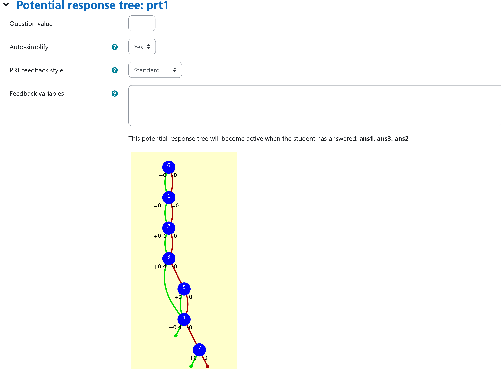 |
|:--:|
| *Display of **prt1*** |

Feedback variables:
```
r1:ans1[1]
r2:ans1[2]


```
#### Node 6
 |property | setting| 
|:---|:---|
|Answer Test | AlgEquiv|
|SAns | `0`|
|TAns | `1`| 
|Node 1 true feedback |none|
|Node 1 false feedback |`<p>This diagram shows the domain you have entered and the domain asked for. The given area is colored yellow, the red area results from your answer. The functions \(y_1\) and \(y_2\) have been labeled according to your input.  </p>`<br>This node generates a diagram showing the given region and the region from students answer.|

| 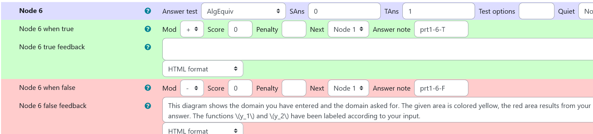 |
|:--:|
| *Values of **node 6 of prt 1*** |
```javascript
[[ jsxgraph width="250px" height="500px"]] 
   var b2    = JXG.JSXGraph.initBoard(divid,{boundingbox: [-0.5,5,5.1,-5],grid:true, axis:true});
// students answer: Interval ans1, y_1 = ans2 (upper limit), y_2 = ans3 (lower limit)
   var xlp2, xup2, txtraw2;
  // get intervals from question variables and students answer
   var nSubDivCurv = 20;
   xlp2 = b2.jc.snippet('{#x1#}', false, 'x', false); // random left interval
   xup2 = b2.jc.snippet('{#x2#}', false, 'x', false); // random right interval
  var xlpStud2 = b2.jc.snippet('{#ans1[1]#}', false, 'x', false); 
  var xupStud2 = b2.jc.snippet('{#ans1[2]#}', false, 'x', false); 

   // get lower functions from question variables and student's answer
   txtraw2 = '{#ylowerfun#}';
   txtraw2 = txtraw2.replace(/\s/g, "");
   var  yLower2 = b2.jc.snippet(txtraw2, true, 'x', false);
   txtraw2 = '{#ans3#}';
   txtraw2 = txtraw2.replace(/\s/g, "");
   var  yLowerStud2 = b2.jc.snippet(txtraw2, true, 'x', false);

   // get upper functions from question variables and student's answer
   txtraw2 = '{#yupperfun#}';
   txtraw2 = txtraw2.replace(/\s/g, "");
   var yUpper2 = b2.jc.snippet(txtraw2, true, 'x', false);
   txtraw2 = '{#ans2#}'; 
   txtraw2 = txtraw2.replace(/\s/g, "");
   var yUpperStud2 = b2.jc.snippet(txtraw2, true, 'x', false);

// add text to show student's answer
var textx2 = xupStud2+0.5;
var texty2 = yLowerStud2(xupStud2) + 0.1;
var textf2 = b2.create('text', [textx2, texty2, 'y_2'], {
  strokeColor: '#EE442F',fontsize:14
});
var textx3 = xupStud2+0.5;
var texty3 = yUpperStud2(xupStud2) + 0.1;
var textf3 = b2.create('text', [textx3, texty3, 'y_1'], {
  strokeColor: '#EE442F',fontsize:14
});

// b2.suspendUpdate();   
 var cIntArea2 = b2.create('curve', [[], []], { strokeWidth: 1, fillColor: 'yellow', fillOpacity: 0.2 });
 var cIntAreaStud2 = b2.create('curve', [ [], []], {  strokeWidth: 1,  fillColor: 'red',  fillOpacity: 0.5});
                       
   cIntArea2.updateDataArray = function () {
                         // generate upper curve
                         let hx = (xup2 - xlp2) / (nSubDivCurv);
                         let pt = xlp2;
                         this.dataX = [xlp2];
                         this.dataY = [yUpper2(xlp2)];
 
                         for (let i = 1; i <= nSubDivCurv; i++) {
                              let pt = xlp2 + i*hx;
                              this.dataX.push(pt);
                              this.dataY.push(yUpper2(pt));
                         }

                         // add yLower between xu and xl
                         hx = (xup2 - xlp2) / (nSubDivCurv);
                         pt = xup2;
                         for (let i = 0 ; i <=  nSubDivCurv ; i++) {
                              pt = xup2 - i*hx;
                              this.dataX.push(pt);
                              this.dataY.push(yLower2(pt));
                         }
                         // close the curve
                         this.dataX.push(this.dataX[0]);
                         this.dataY.push(this.dataY[0]);
                    }; // end cIntArea.updateDataArray

   cIntAreaStud2.updateDataArray = function () {
                         // generate upper curve
                         let hx = (xupStud2 - xlpStud2) / (nSubDivCurv);
                         let pt = xlpStud2;
                         this.dataX = [xlpStud2];
                         this.dataY = [yUpperStud2(xlpStud2)];
 
                         for (let i = 1; i <= nSubDivCurv; i++) {
                              let pt = xlpStud2 + i*hx;
                              this.dataX.push(pt);
                              this.dataY.push(yUpperStud2(pt));
                         }

                         // add yLower between xu and xl
                         hx = (xupStud2 - xlpStud2) / (nSubDivCurv);
                         pt = xupStud2;
                         for (let i = 0 ; i <=  nSubDivCurv ; i++) {
                              pt = xupStud2 - i*hx;
                              this.dataX.push(pt);
                              this.dataY.push(yLowerStud2(pt));
                         }
                         // close the curve
                         this.dataX.push(this.dataX[0]);
                         this.dataY.push(this.dataY[0]);
                    }; // end cIntArea.updateDataArray


   b2.unsuspendUpdate(); 
[[/jsxgraph]]
```

#### Node 1
 |property | setting| 
|:---|:---|
|Answer Test | AlgEquiv|
|SAns | `ans1[1]`|
|TAns | `x1`| 
|Node 1 true feedback |none|
|Node 1 false feedback |`<p>Please check the left endpoint of the interval.</p>`|

| 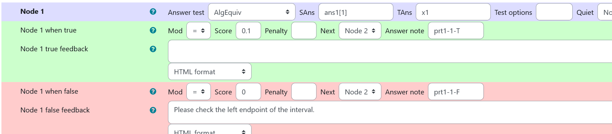 |
|:--:|
| *Values of **node 1 of prt 1*** |

#### Node 2
 |property | setting| 
|:---|:---|
|Answer Test | AlgEquiv|
|SAns | `ans1[2]`|
|TAns | `x2`| 
|Node 2 true feedback |none|
|Node 2 false feedback |`<p>Please check the right endpoint of the interval.</p>`|

| 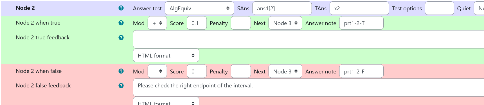 |
|:--:|
| *Values of **node 2 of prt 1*** |

#### Node 3
 |property | setting| 
|:---|:---|
|Answer Test | AlgEquiv|
|SAns | `ans2`|
|TAns | `yupperfun`| 
|Node 3 true feedback |`<p>You have used \(y_1(x)={@ans2@}\) for the upper limit. Well done!</p>`|
|Node 3 false feedback |none, next evaluation in node 4|

| 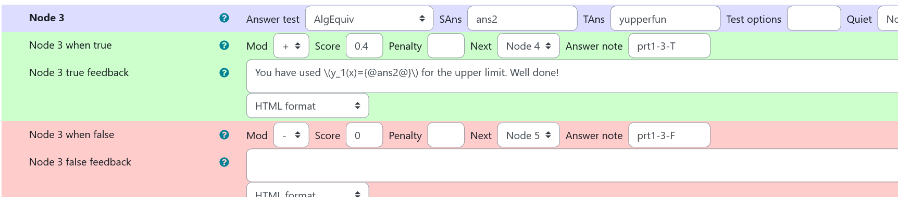 |
|:--:|
| *Values of **node 3 of prt 1*** |


### Node 4
 |property | setting| 
|:---|:---|
|Answer Test | AlgEquiv|
|SAns | `ans3`|
|TAns | `ylowerfun`| 
|Node 1 true feedback |`<p>You have used \(y_2(x)={@ans3@}\) for the lower limit. Well done!<p>`|
|Node 1 false feedback |none|

| 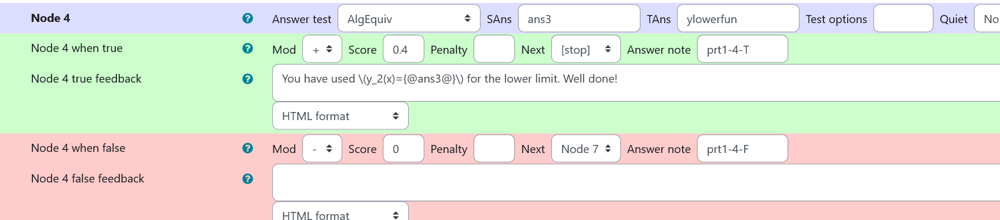 |
|:--:|
| *Values of **node 4 of prt 1*** |

### Node 5
 |property | setting| 
|:---|:---|
|Answer Test | AlgEquiv|
|SAns | `ans2`|
|TAns | `ylowerfun`| 
|Node 2 true feedback |`<p>You have used \(y_1(x)={@ans2@}\) as answer for the lower graph. Please check the diagram above.</p>`|
|Node 2 false feedback |`<p>Your estimate for  \(y_1\) does not fit. See the comparision in the diagram.</p>`|

| 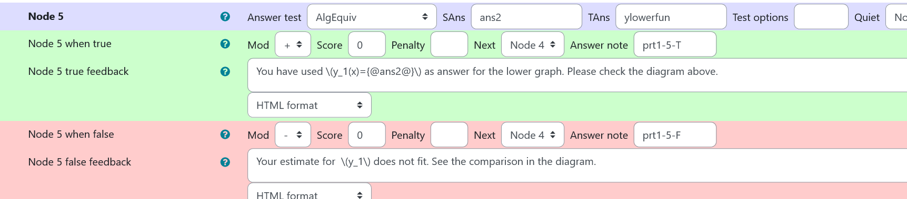 |
|:--:|
| *Values of **node 5 of prt 1*** |

### Node 7
 |property | setting| 
|:---|:---|
|Answer Test | AlgEquiv|
|SAns | `ans3`|
|TAns | `yupperfun`| 
|Node 3 true feedback |`<p>You have used \(y_2(x)={@ans3@}\) as answer for the upper graph. Please check the diagram above.</p>`|
|Node 3 false feedback |`<p>Your estimate for  \(y_2\) does not fit. See the comparision in the diagram.</p> `|

| 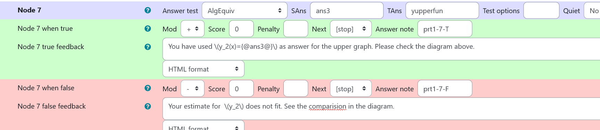 |
|:--:|
| *Values of **node 7 of prt 1*** |

