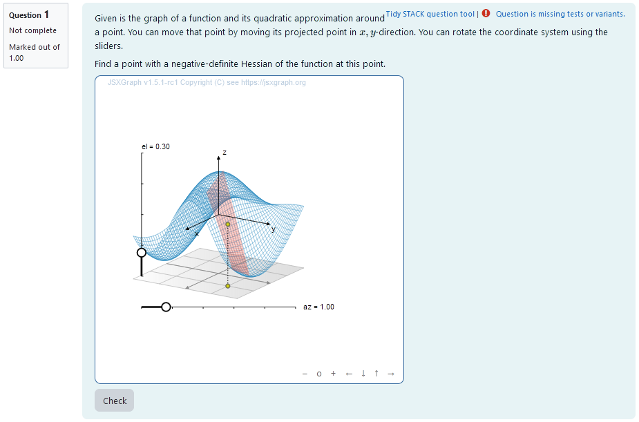
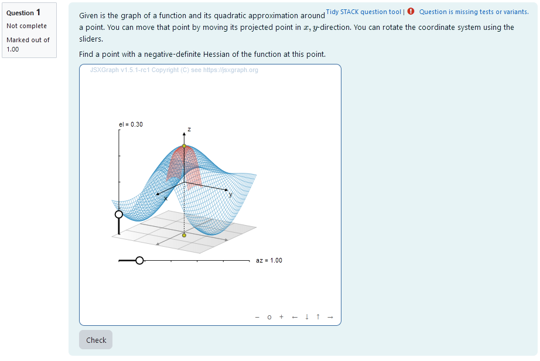
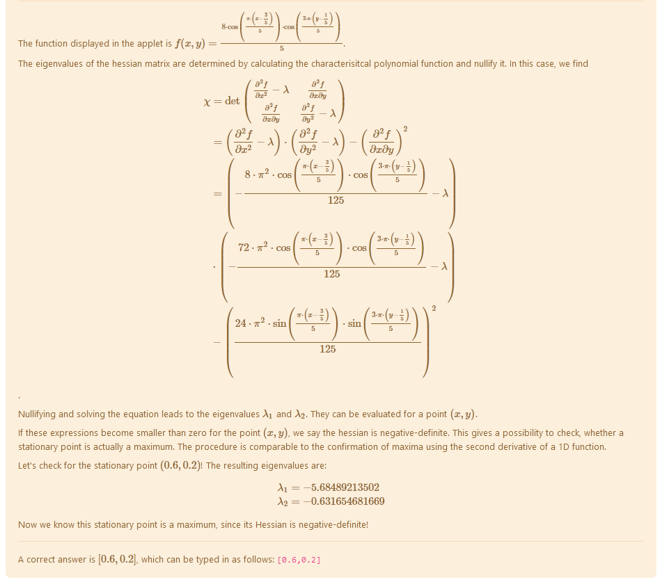
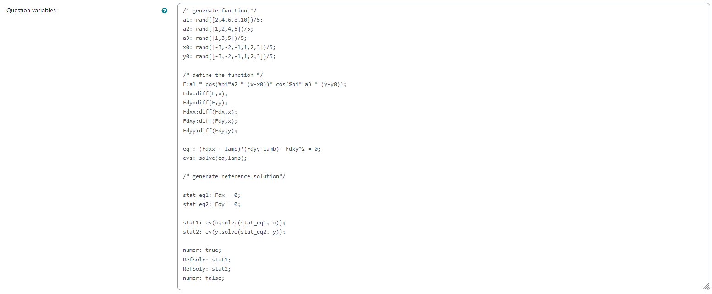
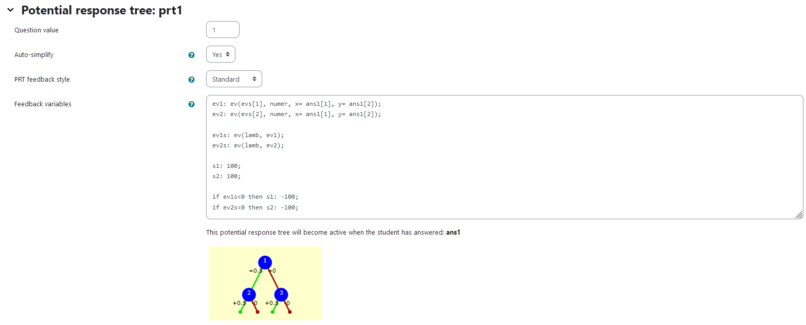
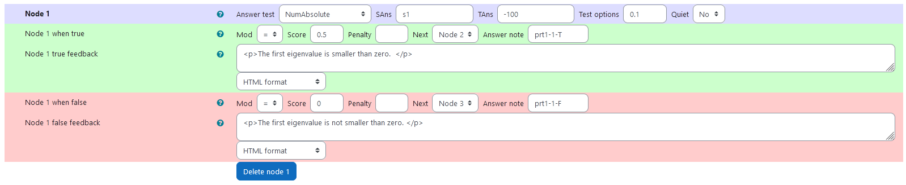
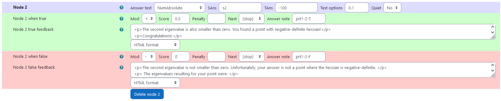
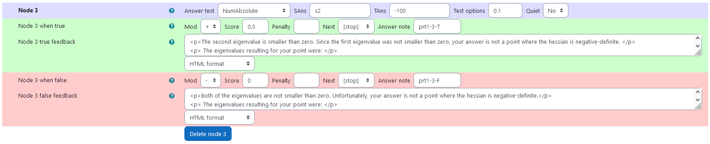

## Aim of task

+	Student understands how the Hessian matrix is used in Taylor approximation to locally approximate functions (Communicating in, with, and about mathematics)
+	Student understands, how local approximation and value of Hessian matrix are connected graphically (Representing mathematical entities)
+	Using a visualization of Taylor-approximation student can derive qualitative statements about Hessian matrix at a given point (Making use of aids and tools)

|  |
|:--:|
| *First impression of the question* |

## Question description

A 2D function is plotted and its Taylor approximation of second order is given at a moveable point $x= (x_1,x_2)$. 
Since the Taylor approximation is given as 
$$f_2 (t) = f(x_0) + \nabla f(x_0) \cdot (x-x_0) + \frac{1}{2} (x-x_0)^\text{T} H_f(x-x_0)$$
the character of the Taylor approximation gives information about the hessian of the function.

The student needs to find a point $(x,y)$, where the Hessian of the function is negative-definite.

### Student perspective
When the point is moved in $x-y$-direction, the height of a corresponding point with the same $x,y$-coordinates moves according to the 2D-function. At this point, the local quadratical taylor approximation  is calculated and plotted in a range big enough to estimate the infinite development. 
The student moves the plane to a point with an approximation that fulfils the requirements. The coordinates of the points are interpreted as answers.
|  |
|:--:|
| *When the student solves the problem* |

### Feedback example

|  |
|:--:|
| *Feedback on answer above* |

### Teacher perspective
The teacher is able to give a list of possible values for parameters of the function. In order to do this, they simply need to modify the entries in the lists specified e.g. change `a1: rand([2,4,6,8,10])/5` to `a1:rand([2,3,4,5,6,7,8])/5`.
Additionally, they can change the possible values for the $x$ and $y$ off-sets `x0` and `y0`. This offset is used to counteract the fact, that $(0,0)$ is a common stationary point.

Furthermore the teacher is able to change the function entirely to a function that fits his needs. They can change the function defined by `F: -a1 * cos(%pi*a2 * (x-x0))* cos(%pi* a3 * (y-y0));` to a function they desire. However, it might be necessary to define additional parameters analogous to the ones defined before.

Lastly, the reference solution `RefSolx` and`RefSoly` for an exemplatory stationary point must be adjusted to the function used.
|  |
|:--:|
| *The above image shows which values the teacher may wish to change* |


## Question code

### Question Variables
+	5 lists of integer numbers for variables `a1`,`a2`, `a3`, `x0` and `y0` to randomly select from
+	Selected number can be divided or multiplied with a number to    scale e.g.: `a1:rand([2,4,6,8,10])/5;`
+	function F using `a1`,`a2`, `a3`, `x0` and `y0` dependent on variables `x`, `y` as follows: 

    `F:a1 * cos(%pi*a2 * (x-x0))* cos( a3 * (y-y0));`  
    Note that this function’s parameters `a1`,`a2`, `a3`, `x0` and `y0` are randomized upon executing the code as mentioned above
+	derivatives of Function F using Maxima syntax e.g.: `Fdx: diff(F,x)` to calculate the components of the Hessian Matrix
+	numerical reference solution e.g.: `RefSolx: stat1;` with `stat1` being the coordinate of a stationary point.
`

#### Question variable code
```
/* generate function */
a1: rand([2,4,6,8,10])/5;
a2: rand([1,2,4,5])/5;
a3: rand([1,3,5])/5;
x0: rand([-3,-2,-1,1,2,3])/5;
y0: rand([-3,-2,-1,1,2,3])/5;

/* define the function */
F:a1 * cos(%pi*a2 * (x-x0))* cos(%pi* a3 * (y-y0));
Fdx:diff(F,x);
Fdy:diff(F,y);
Fdxx:diff(Fdx,x);
Fdxy:diff(Fdy,x);
Fdyy:diff(Fdy,y);

eq : (Fdxx - lamb)*(Fdyy-lamb)- Fdxy^2 = 0;
evs: solve(eq,lamb);

/* generate reference solution*/

stat_eq1: Fdx = 0;
stat_eq2: Fdy = 0;

stat1: ev(x,solve(stat_eq1, x));
stat2: ev(y,solve(stat_eq2, y));

numer: true;
RefSolx: stat1;
RefSoly: stat2;
numer: false;
```

### Question Text
+	“Find a point with a negative-definite Hessian of the function at this point.”
+	JSXGraph applet using the functions and variables defined in **Question variables** plotting the randomized function and displaying the Taylor-Approximation in a point of freely adjustable x,y-coordinates
+	`[[input:ans1]]` at the end of JSXGraph code to allow input of an answer of the student
+	`[[validation:ans1]]` checking of answer

#### Question text code


```javascript
<p>Given is the graph of a function and its quadratic approximation around a point. You can move that point by moving its projected point in \(x,y\)-direction. You can rotate the coordinate system using the sliders.</p>
<p>Find a point with a negative-definite Hessian of the function at this point.</p>


[[jsxgraph width="500px" height="500px" input-ref-ans1='ans1Ref']]
var board = JXG.JSXGraph.initBoard(divid,{boundingbox : [-10, 10, 10,-10], axis:false, shownavigation : true});

   var box = [-2, 2];
		    var view = board.create('view3d',
		        [
		            [-6, -3], [8, 8],
		            [box, box, box]
		        ],
		        {
		            xPlaneRear: {visible: false},
		            xPlaneRearYAxis: {visible: false},
		            xPlaneRearZAxis: {visible: false},
		            yPlaneRear: {visible: false},
		            yPlaneRearXAxis: {visible: false},
		            yPlaneRearZAxis: {visible: false},
		        });

                               var txtraw = '{#F#}';
                               txtraw=txtraw.replace(/%pi/g, "PI");
                               //txtraw=txtraw.replace(/pi/g, "PI");
                               var F =  board.jc.snippet(txtraw, true, 'x,y');
                               txtraw = '{#Fdx#}';
                               txtraw=txtraw.replace(/%/g, "");
                               txtraw=txtraw.replace(/pi/g, "PI");
                               var Fdx =  board.jc.snippet(txtraw, true, 'x,y');
                               var txtraw = '{#Fdy#}';
                               txtraw=txtraw.replace(/%/g, "");
                               txtraw=txtraw.replace(/pi/g, "PI");
                               var Fdy =  board.jc.snippet(txtraw, true, 'x,y');
var txtraw = '{#Fdxx#}';
                               txtraw=txtraw.replace(/%/g, "");
                               txtraw=txtraw.replace(/pi/g, "PI");
                               var Fdxx =  board.jc.snippet(txtraw, true, 'x,y');
var txtraw = '{#Fdyy#}';
                               txtraw=txtraw.replace(/%/g, "");
                               txtraw=txtraw.replace(/pi/g, "PI");
                               var Fdyy =  board.jc.snippet(txtraw, true, 'x,y');
var txtraw = '{#Fdxy#}';
                               txtraw=txtraw.replace(/%/g, "");
                               txtraw=txtraw.replace(/pi/g, "PI");
                               var Fdxy =  board.jc.snippet(txtraw, true, 'x,y');
var txtraw = '{#evs[1]#}';
                               txtraw=txtraw.replace(/%/g, "");
                               txtraw=txtraw.replace(/pi/g, "PI");
                               var evs1 =  board.jc.snippet(txtraw, true, 'x,y');
var txtraw = '{#evs[2]#}';
                               txtraw=txtraw.replace(/%/g, "");
                               txtraw=txtraw.replace(/pi/g, "PI");
                               var evs2 =  board.jc.snippet(txtraw, true, 'x,y');

    var c = view.create('functiongraph3d', [
        F,
        box,
        box,
    ], { strokeWidth: 0.5, stepU: 70, stepsV: 70, strokeColor: '#1f84bc'});

  // 3D points:
    // Point on xy plane
    var Axy = view.create('point3d', [1, 1, -2], { withLabel: false });

    // Project Axy to the surface
    var A = view.create('point3d', [
        () => [Axy.X(), Axy.Y(), F(Axy.X(), Axy.Y())]
        ], { withLabel: false, fixed: true});
    view.create('line3d', [Axy, A], { dash: 1 });


   var TF = (x,y) => F(Axy.X(),Axy.Y())+Fdx(Axy.X(),Axy.Y())*(x-Axy.X())
                                         +Fdy(Axy.X(),Axy.Y())*(y-Axy.Y())
                                         +Fdxx(Axy.X(),Axy.Y())*(x-Axy.X())*(x-Axy.X())
                                         +Fdyy(Axy.X(),Axy.Y())*(y-Axy.Y())*(y-Axy.Y())
                                         +2*Fdxy(Axy.X(),Axy.Y())*(y-Axy.Y())*(x-Axy.X());
   var c2 = view.create('functiongraph3d', [
       TF,
       () => [Axy.X()-0.5,Axy.X()+0.5],
       () => [Axy.Y()-0.5,Axy.Y()+0.5,],
   ], { strokeWidth: 0.25, stepU: 50, stepsV: 50, strokeColor: '#EE442F'});


board.update()

var p1 =board.create('point',[function () {return Axy.X();} ,function () {return Axy.Y();}],{visible:false}); 
stack_jxg.bind_point(ans1Ref,p1); 
var stateInput = document.getElementById(ans1Ref);
stateInput.style.display = 'none';


board.update(); 

 /* axis labels*/
                       var xlabel=view.create('point3d',[0.9*box[1],0,(0.6*box[0]+0.4*box[1])], {size:0,name:"x"});
                       var ylabel=view.create('point3d',[0,0.9*box[1],(0.6*box[0]+0.4*box[1])], {size:0,name:"y"});
                       var zlabel=view.create('point3d',[
                           0.7*(0.6*box[0]+0.4*box[1]),
                           0.7*(0.6*box[0]+0.4*box[1]),
                           0.9*box[1]], 
                           {size:0,name:"z"});

[[/jsxgraph]]
<div style="display:none;">
<p>[[input:ans1]] </p><p>[[validation:ans1]]</p></div>
```
## Answers
### Answer ans 1
|property | setting| 
|:---|:---|
|Input type | Numerical |
|Model answer | `[RefSolx, RefSoly]` defined in **Question variables** |
| Forbidden words | none |
| Forbid float | No |
| Student must verify | Yes |
| Show the validation | Yes, with variable list|
--- 

# General Feedback
```
<hr>
<p> The function displayed in the applet is \(f(x,y) = {@F@} \). </p>
<p> The eigenvalues of the hessian matrix are determined by calculating the characterisitcal polynomial function and nullify it. In this case, we find 
\[\begin{align*} 
\chi &= \text{det} 
      \begin{pmatrix} 
      \frac{\partial ^2 f}{\partial x^2}- \lambda &  \frac{\partial ^2 f}{\partial x \partial y} \\ 
     \frac{\partial ^2 f}{\partial x \partial y} & \frac{\partial ^2 f}{\partial y^2}- \lambda
      \end{pmatrix}\\ 
       &= \left( \frac{\partial ^2 f}{\partial x^2}- \lambda \right) \cdot \left( \frac{\partial ^2 f}{\partial y^2}- \lambda \right) - \left( \frac{\partial ^2 f}{\partial x \partial y} \right)^2\\ 
       &= \left( {@Fdxx@}- \lambda \right)\\
       & \cdot \left( {@Fdyy@}- \lambda \right) \\
       &- \left( {@Fdxy@} \right)^2 
\end{align*} \] .</p>
<p> Nullifying and solving the equation leads to the eigenvalues \(\lambda_1\) and \(\lambda_2\). They can be evaluated for a point \((x,y)\). </p>
<p> If these expressions become smaller than zero for the point \((x,y)\), we say the hessian is negative-definite. This gives a possibility to check, whether a stationary point is actually a maximum. The procedure is comparable to the confirmation of maxima using the second derivative of a 1D function. </p>
<p> Let's check for the stationary point \(({@ev(x0, numer)@},{@ev(y0, numer)@})\)! The resulting eigenvalues are:
\[\begin{align*}
\lambda_1 &= {@ev(lamb, ev(evs[1], numer, x= x0, y = y0))@} \\
\lambda_2 &= {@ev(lamb, ev(evs[2], numer, x= x0, y = y0))@}
\end{align*} \]
</p>
<p> Now we know this stationary point is a maximum, since its Hessian is negative-definite! </p>
```

## Potential response tree
### prt1

Feedback variables:
```
ev1: ev(evs[1], numer, x= ans1[1], y= ans1[2]);
ev2: ev(evs[2], numer, x= ans1[1], y= ans1[2]);

ev1s: ev(lamb, ev1);
ev2s: ev(lamb, ev2);

s1: 100;
s2: 100;

if ev1s<0 then s1: -100;
if ev2s<0 then s2: -100;
```
 Creates variables `ev1` and `ev2`by evaluating the formula for the matrix' eigenvalues at the location selected by the student. Since STACK gives this solution as an equation of type "lamb = {solution}", it needs to be evaluated once more.
 We do so creating the variables `ev1s`and `ev2s`. These are the eigenvalues at the selected point.
 To be able to check, whether the Hessian is negative-definite or not, we need to check the sign of the eigenvalues. Since STACK expects us to check a numeric answer, we cannot assign the bools `true`and `false`. We create a similar variable instead with `s1` and `s2` having either of the values `100` or `-100`.
 If the eigenvalues are negative, we assign `s1`and `s2` the value `-100`.

|  |
|:--:|
| *Visualization of **PRT 1*** |

### Node 1
 |property | setting| 
|:---|:---|
|Answer Test | NumAbsolute|
|SAns | s1|
|TAns | -100| 
|Node 1 true feedback | `<p>The first eigenvalue is smaller than zero.  </p>`|
|Node 1 false feedback | `<p>The first eigenvalue is not smaller than zero. </p>`|

|  |
|:--:|
| *Values of **node 1*** |

### Node 2
 |property | setting| 
|:---|:---|
|Answer Test | NumAbsolute|
|SAns | s2|
|TAns | -100| 
|Node 2 true feedback | `<p>The second eigenvalue is also smaller than zero. You found a point with negative-definite hessian!</p><p>Congratulations!</p><p> The eigenvalues resulting for your point were: </p><p> \[\begin{align*}\lambda_1 &= {@ev1s@}\\ \lambda_2 &= {@ev2s@} \end{align*} \] </p>` |
|Node 2 false feedback | ```<p>The second eigenvalue is not smaller than zero. Unfortunately, your answer is not a point where the hessian is negative-definite. </p><p> The eigenvalues resulting for your point were: </p><p> \[\begin{align*} \lambda_1 &= {@ev1s@}\\ \lambda_2 &= {@ev2s@} \end{align*} \] </p>```|

|  |
|:--:|
| *Values of **node 2*** |

### Node 3
 |property | setting| 
|:---|:---|
|Answer Test | NumAbsolute|
|SAns | s2|
|TAns | -100| 
|Node 3 true feedback | ```<p>The second eigenvalue is smaller than zero. Since the first eigenvalue was not smaller than zero, your answer is not a point where the hessian is negative-definite. </p><p> The eigenvalues resulting for your point were: </p><p> \[\begin{align*} \lambda_1 &= {@ev1s@}\\ \lambda_2 &= {@ev2s@} \end{align*} \] </p>```|
|Node 3 false feedback | ```<p>The second eigenvalue is smaller than zero. Since the first eigenvalue was not smaller than zero, your answer is not a point where the hessian is negative-definite. </p><p> The eigenvalues resulting for your point were: </p><p> \[\begin{align*} \lambda_1 &= {@ev1s@}\\\lambda_2 &= {@ev2s@} \end{align*} \] </p>```|

|  |
|:--:|
| *Values of **node 3*** |

## Todo:
* [x] Update figures
