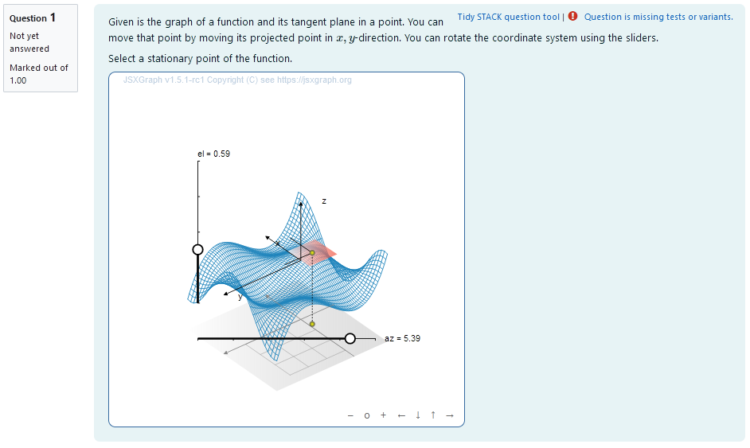
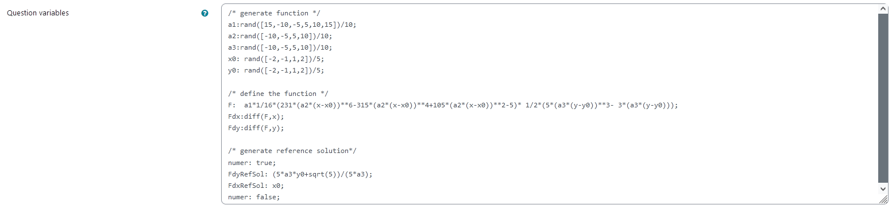
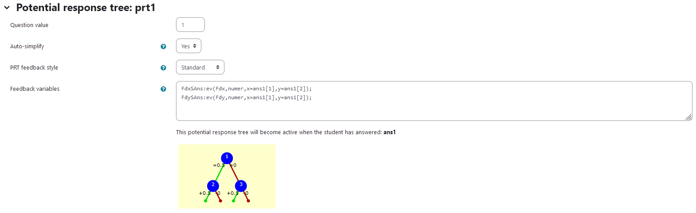
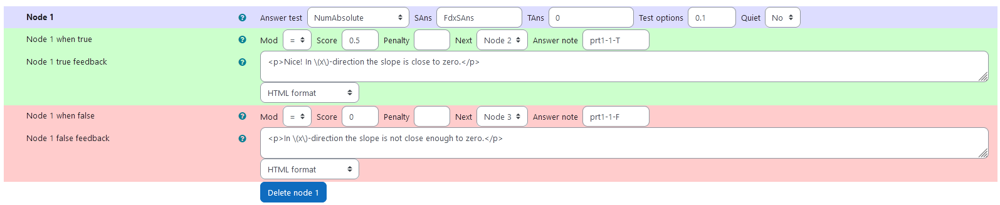
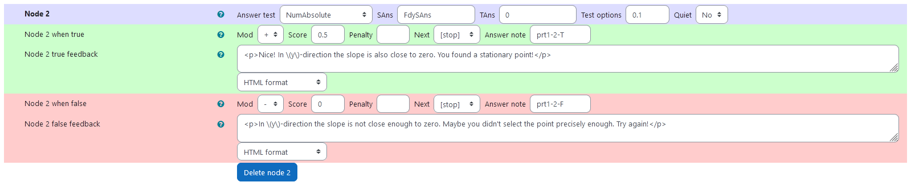
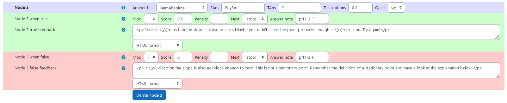

## Aim of task
+	Student knows the concept of stationary points in 2D and can calculate them  (Handling mathematical symbols and formalism)
+	Student understands, how stationary points and tangent planes are connected graphically  (Representing mathematical entities)
+ Using a visualization of planes tangent to a 2D function graph student can decide whether or not a point is stationary (Making use of aids and tools)

|  |
|:--:|
| *First impression of the question* |

## Question description

A 2D function is plotted and its Taylor approximation of first order is given at a moveable location $u_0= (x_0,y_0)$. 
Since the Taylor approximation is given as 
$$T_1 (u) = f(u_0) + \langle \nabla f(u_0),  u-u_0 \rangle $$
it describes the tangent plane to a given point $u_0$ with the scalar product $\langle \cdot , \cdot \rangle$.

The task is to move $x_0$ where it is stationary with the help of the tangent plane. It is stationary where the slope in both $x$ and $y$ direction are zero.

The function in this task is composed of two legendre polynomials.
 $$f(x,y)=\frac{a_1}{16} \cdot (231 \cdot( a_2 \cdot (x-x_0))^6-315 \cdot (a_2 \cdot (x-x_0))^4 +105 \cdot(a_2 \cdot(x-x_0))^2-5) \cdot \frac{1}{2} \cdot (5 \cdot( a_3 \cdot(y-y_0))^3- 3\cdot(a_3 \cdot(y-y_0))) $$

### Student perspective

When the point is moved in $x-y$-direction, the height of a corresponding point with the same $x,y$-coordinates moves according to the 2D-function. At this point, the tangent plane is calculated and plotted in a range big enough to estimate the infinite development. 
The student moves the plane to a point with a tangent plane that fulfils the requirements. The coordinates of the points are interpreted as answers.

|  |
|:--:|
| *When the student solves the problem* |


### Teacher perspective
The teacher is able to give a list of possible values for parameters of the function. In order to do this, they simply need to modify the entries in the lists specified e.g. change `a1:rand([15,-10,-5,5,10,15])/10;` to `a1:rand([2,3,4,5,6,7,8])/5`. Changing the values might lead to the surface not being completely depicted within the visible box.

Additionally, they can change the possible values for the $x$ and $y$ off-sets `x0` and `y0`. This offset is used to counteract the fact, that $(0,0)$ is a common stationary point.

Furthermore the teacher is able to change the function entirely to a function that fits his needs. They can change the function defined by `F: a1*1/16*(231*(a2*(x-x0))**6-315*(a2*(x-x0))**4+105*(a2*(x-x0))**2-5)* 1/2*(5*(a3*(y-y0))**3- 3*(a3*(y-y0)));` to a function they desire. However, it might be necessary to define additional parameters analogous to the ones defined before or make changes to the exisitng parameters.
Lastly, the reference solution for an exemplatory stationary point must be adjusted to the function used.

|  |
|:--:|
| *The above image shows which values the teacher may wish to change* |


## Question code

### Question Variables
+	3 lists of integer numbers for variables `a1`, `a2`, `a3`, `x0` and `y0` to randomly select from
+	Selected number can be divided or multiplied with a number to    scale e.g.: `a1:rand([-10,-8,-6,-4,-2,2,4,6,8,10])/5;`
+	function F using ` a1`, `a2`, `a3`, `x0`, `y0` dependent on variables `x`, `y` as follows: 

    `F: a1*1/16*(231*(a2*(x-x0))**6-315*(a2*(x-x0))**4+105*(a2*(x-x0))**2-5)* 1/2*(5*(a3*(y-y0))**3- 3*(a3*(y-y0)));`  
    Note that this function’s parameters `a1`, `a2`, `a3`, `x0` and `y0` are randomized upon executing the code as mentioned above
+	derivatives of Function F using Maxima syntax e.g.: `Fdx: diff(F,x)` to calculate the components of the Jacobian Matrix
+	numerical reference solution e.g.: `FdyRefSol:0
`

#### Question variable code
```
/* generate function */
a1:rand([15,-10,-5,5,10,15])/10;
a2:rand([-10,-5,5,10])/10;
a3:rand([-10,-5,5,10])/10;
x0: rand([-2,-1,1,2])/5;
y0: rand([-2,-1,1,2])/5;

/* define the function */
F:  a1*1/16*(231*(a2*(x-x0))**6-315*(a2*(x-x0))**4+105*(a2*(x-x0))**2-5)* 1/2*(5*(a3*(y-y0))**3- 3*(a3*(y-y0)));
Fdx:diff(F,x);
Fdy:diff(F,y);

/* generate reference solution*/
numer: true;
FdyRefSol: (5*a3*y0+sqrt(5))/(5*a3);
FdxRefSol: x0;
numer: false;
```

### Question Text
+	“Given is the graph of a function and its tangent plane in a point. You can   move that point by moving its projected point in $x,y$-direction. You can rotate the coordinate system using the sliders.

    Select a stationary point of the function.
”
+	JSXGraph applet using the functions and variables defined in **Question variables** plotting the randomized function and displaying the	tangent plane for a point of freely adjustable x,y-coordinates
+	`[[input:ans1]]` at the end of JSXGraph code to allow input of an answer of the student
+	`[[validation:ans1]]` checking of answer

#### Question text code


```javascript
<p>Given is the graph of a function and its tangent plane in a point. You can move that point by moving its projected point in \(x,y\)-direction. You can rotate the coordinate system using the sliders.</p>
<p> Select a stationary point of the function.</p>


[[jsxgraph width="500px" height="500px" input-ref-ans1='ans1Ref']]
var board = JXG.JSXGraph.initBoard(divid,{boundingbox : [-10, 10, 10,-10], axis:false, shownavigation : true});

	    var boxx = [{#x0#}-1, {#x0#}+1];
	    var boxy = [{#y0#}-1, {#y0#}+1];
	    var box = [-1, 1];
		    var view = board.create('view3d',
		        [
		            [-4, -3], [8, 8],
		            [boxx, boxy, box]
		        ],
		        {
		            xPlaneRear: {visible: false},
		            xPlaneRearYAxis: {visible: false},
		            xPlaneRearZAxis: {visible: false},
		            yPlaneRear: {visible: false},
		            yPlaneRearXAxis: {visible: false},
		            yPlaneRearZAxis: {visible: false},
		        });

                               var txtraw = '{#F#}';
                               txtraw=txtraw.replace(/%pi/g, "PI");
                               //txtraw=txtraw.replace(/pi/g, "PI");
                               var F =  board.jc.snippet(txtraw, true, 'x,y');
                               txtraw = '{#Fdx#}';
                               txtraw=txtraw.replace(/%/g, "");
                               txtraw=txtraw.replace(/pi/g, "PI");
                               var Fdx =  board.jc.snippet(txtraw, true, 'x,y');
                               var txtraw = '{#Fdy#}';
                               txtraw=txtraw.replace(/%/g, "");
                               txtraw=txtraw.replace(/pi/g, "PI");
                               var Fdy =  board.jc.snippet(txtraw, true, 'x,y');
    var c = view.create('functiongraph3d', [
        F,
        boxx,
        boxy,
    ], { strokeWidth: 1, strokeColor: "#1f84bc", stepU: 70, stepsV: 70 });

  // 3D points:
    // Point on xy plane
    var Axy = view.create('point3d', [0.25, 0.5, -1.0], { withLabel: false });

    // Project Axy to the surface
    var A = view.create('point3d', [
        () => [Axy.X(), Axy.Y(), F(Axy.X(), Axy.Y())]
        ], { withLabel: false });
    view.create('line3d', [Axy, A], { dash: 1 });
    // Partial derivatives of F in point A
    // should be provided form STACK
    var dFx = () => Fdx(A.X(),A.Y()),
        dFy = () => Fdy(A.X(),A.Y());
    var dFx_vecnorm = () => Math.sqrt(1+Fdx(A.X(),A.Y())**2),
        dFy_vecnorm = () => Math.sqrt(1+Fdy(A.X(),A.Y())**2);

    // var dFx1 = () => 1.0/Math.sqrt(1+Fdx(A.X(),A.Y())**2),
     var dFx1 = () => 1.0/dFx_vecnorm(),
        dFx2 = () => Fdx(A.X(),A.Y())/Math.sqrt(1+Fdx(A.X(),A.Y())**2);
    var dFy1 = () => 1.0/Math.sqrt(1+Fdy(A.X(),A.Y())**2),
        dFy2 = () => Fdy(A.X(),A.Y())/Math.sqrt(1+Fdy(A.X(),A.Y())**2);

    var dFx_vec = [dFx1, 0, dFx2],
        dFy_vec = [0, dFy1, dFy2];

    // Tangent plane
    var plane1 = view.create('plane3d', [
        A,
        dFx_vec, dFy_vec,
        [-0.25,0.25], [-0.25,0.25]
    ], {
        fillOpacity: 0.8, fillColor: '#EE442F'
    });
    var a = view.create('line3d', [A, dFx_vec, [0, 0.5]]);
    var b = view.create('line3d', [A, dFy_vec, [0, 0.5]]);

board.update(); 

var p1 =board.create('point', [function () {return A.X();} ,function () {return A.Y();}],{visible:false}); 
stack_jxg.bind_point(ans1Ref,p1);
var stateInput = document.getElementById(ans1Ref);
stateInput.style.display = 'none';

board.update(); 

/* axis labels*/
                       var xlabel=view.create('point3d',[0.9*boxx[1],0,(0.6*box[0]+0.4*box[1])], {size:0,name:"x"});
                       var ylabel=view.create('point3d',[0,0.9*boxy[1],(0.6*box[0]+0.4*box[1])], {size:0,name:"y"});
                       var zlabel=view.create('point3d',[
                           0.7*(-0.2),
                           0.7*(-0.2),
                           0.9*box[1]], 
                           {size:0,name:"z"});

[[/jsxgraph]]
<p>[[input:ans1]] </p><p>[[validation:ans1]]</p>
```
## Answers
### Answer ans 1
|property | setting| 
|:---|:---|
|Input type | Numerical |
|Model answer | `[FdxRefSol, FdyRefSol]` defined in **Question variables** |
| Forbidden words | none |
| Forbid float | No |
| Student must verify | Yes |
| Show the validation | Yes, with variable list|
--- 

## General feedback
```
<hr>

<p>A stationary point is a point on the graph of a function, where the function's derivative is zero. Since this is a 2D-function both the partial derivative in \(x\) and \(y\)-direction must be zero. </p>

<p>The plane tangent to a  function \(f\) in the location \(u_0\)= \((x_0,y_0)\) is defined at  a location \(u\) by the equation \(T_1 (u) = f(u_0) + \langle \nabla f(u_0), u-u_0 \rangle \).
The tangent plane in a stationary point is exactly horizontal, since the gradient is zero. </p>
```

## Potential response tree
### prt1

|  |
|:--:|
| *Visualization of **prt1*** |

Feedback variables:
```
FdxSAns:ev(Fdx,numer,x=ans1[1],y=ans1[2]);
FdySAns:ev(Fdy,numer,x=ans1[1],y=ans1[2]);
```
 Creates variables `FdxSAns`, `FdySAns`. Their values are determined by the function `ev()` evaluating the derivatives `Fdx`, `Fdy` specified in **Question variables** numerically at the location specified by `ans1`.


### Node 1
 |property | setting| 
|:---|:---|
|Answer Test | NumAbsolute|
|SAns | `FdxSAns`|
|TAns | `0`| 
|Node 1 true feedback | `<p>Nice! In \(x\)-direction the slope is close to zero.</p>`|
|Node 1 false feedback | `<p>In \(x\)-direction the slope is not close enough to zero.</p>`|

|  |
|:--:|
| *Values of **node 1*** |

### Node 2
 |property | setting| 
|:---|:---|
|Answer Test | NumAbsolute|
|SAns | `FdySAns`|
|TAns | `0`| 
|Node 2 true feedback | `<p>Nice! In \(y\)-direction the slope is also close to zero. You found a stationary point!</p>`|
|Node 2 false feedback | `<p>In \(y\)-direction the slope is not close enough to zero. Maybe you didn't select the point precisely enough. Try again!</p>`|

|  |
|:--:|
| *Values of **node 2*** |

### Node 3
 |property | setting| 
|:---|:---|
|Answer Test | NumAbsolute|
|SAns | `FdySAns`|
|TAns | `0`| 
|Node 3 true feedback | `<p>Nice! In \(y\)-direction the slope is close to zero. Maybe you didn't select the point precisely enough in \(x\)-direction. Try again!</p>`|
|Node 3 false feedback | `<p>In \(y\)-direction the slope is also not close enough to zero. This is not a stationary point. Remember the definition of a stationary point and have a look at the explanation below!</p>`|

|  |
|:--:|
| *Values of **node 3*** |

## Todo:
* []

