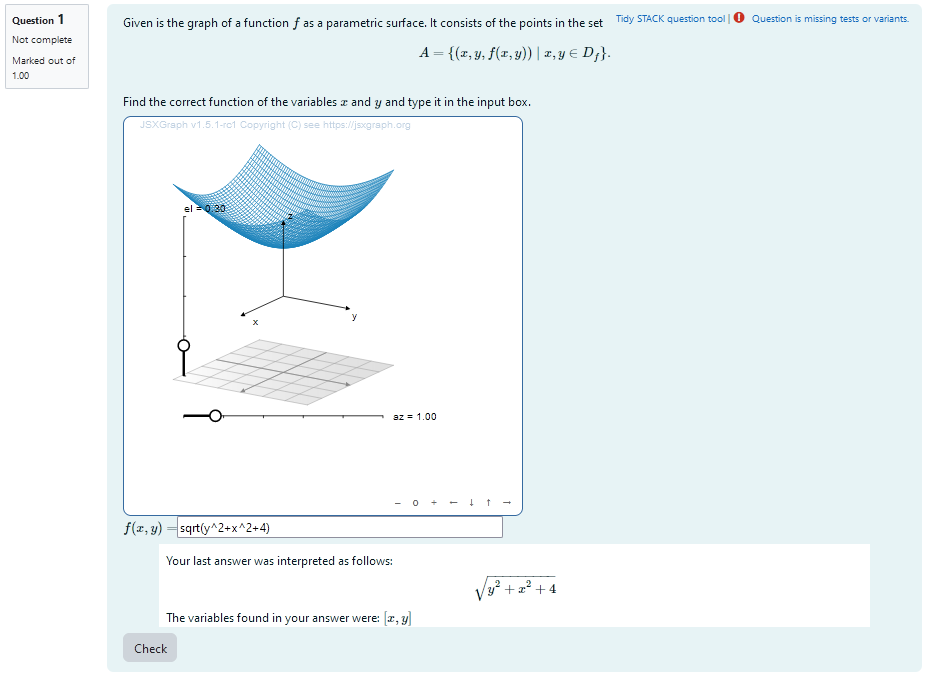
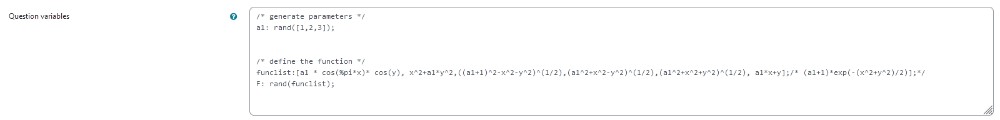
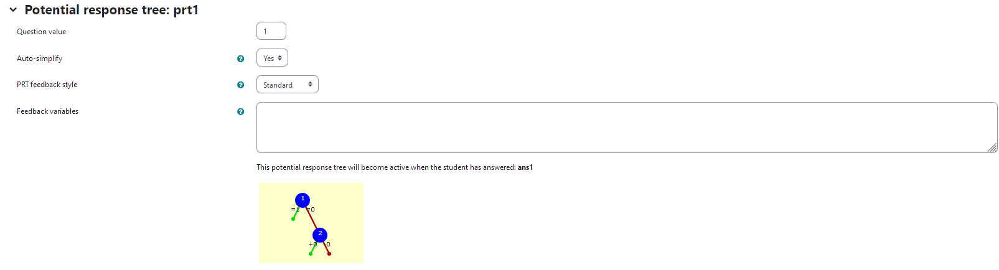
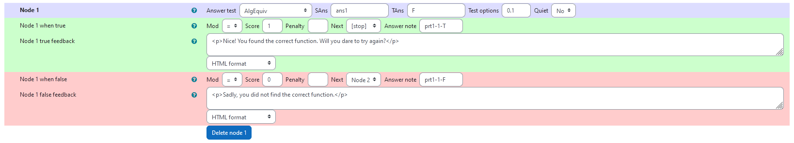
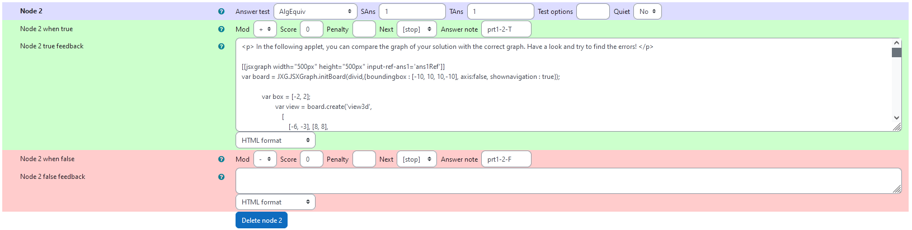
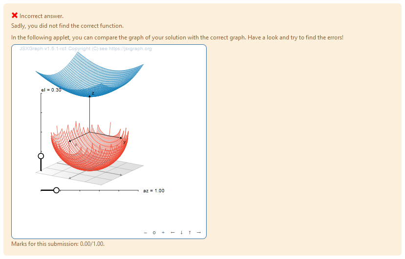

## Aim of task
+ Student knows multidimensional functions are stated  (Handling mathematical symbols and formalism)
+ Student knows how special 2D functions look like (Representing mathematical entities)
+ Using a visualization of multidimensional functions they reconstruct the given function (Making use of aids and tools)

|  |
|:--:|
| *First impression of the question* |

## Question description

A 2D function $f$ is plotted resulting in a surface embedded in 3D. This surface is the graph og the function an contains the points in the set $A= \{(x,y,f(x,y))\mid x,y \in D_f \}$. It is the task of the students to find a parametrisation of this surface or put differently: to reconstruct $f$. They will be provided with graphical feedback to help them solving problems with their inital ideas.
### Student perspective

A JSXGraph applet containing the plot is displayed. The students can rotate the plot and look at it from different perspectives and then give their answer as an algebraic expression.

|  |
|:--:|
| *When the student solves the problem* |


### Teacher perspective
The teacher is able to give a list of possible values for parameters of the function. In order to alter them, they simply need to modify the entries in the lists specified e.g. change `a1: rand([1,2,3]);` to `a1:rand([2,3,4,5,6,7,8])/5;`.

Furthermore the teacher is give a list of possible functions from which the task is randomized.
The current list is `funclist:[a1 * cos(%pi*x)* cos(y), x^2+a1*y^2,((a1+1)^2-x^2-y^2)^(1/2),(a1^2+x^2-y^2)^(1/2),(a1^2+x^2+y^2)^(1/2), a1*x+y];`
However, it might be necessary to define additional parameters analogous to the ones defined before.

|  |
|:--:|
| *The above image shows which values the teacher may wish to change* |


## Question code

### Question Variables
+	An integer number à1`is selected randomly`
+	a list of functions with parameters ` a1` dependent on variables `x`, `y` is given: 

    `funclist:[a1 * cos(%pi*x)* cos(y), x^2+a1*y^2,((a1+1)^2-x^2-y^2)^(1/2),(a1^2+x^2-y^2)^(1/2),(a1^2+x^2+y^2)^(1/2), a1*x+y];`
+   a function is randomly selected from the list:

    `F: rand(funclist);`

  


#### Question variable code
```
/* generate parameters */
a1: rand([1,2,3]);


/* define the function */
funclist:[a1 * cos(%pi*x)* cos(y), x^2+a1*y^2,((a1+1)^2-x^2-y^2)^(1/2),(a1^2+x^2-y^2)^(1/2),(a1^2+x^2+y^2)^(1/2), a1*x+y];/* (a1+1)*exp(-(x^2+y^2)/2)];*/
F: rand(funclist);

```
Note, that an additional function is commented out. This is because there seems to be some problem with the exponential function. Feel free to try and include it.

### Question Text
+	“Given is the graph of a function $f$ as a parametric surface. It consists of the points in the set $A= \{(x,y,f(x,y))\mid x,y \in D_f \} .$<br>
Find the correct function of the variables $x$ and $y$ and type it in the input box.
”
+	JSXGraph applet using the functions and variables defined in **Question variables** plotting the randomized function 
+	`[[input:ans1]]` at the end of JSXGraph code to allow input of an answer of the student
+	`[[validation:ans1]]` checking of answer

#### Question text code


```javascript
<p>Given is the graph of a function \(f\) as a parametric surface. It consists of the points in the set \[A= \{(x,y,f(x,y))\mid x,y \in D_f \} .\]<br>
Find the correct function of the variables \(x\) and \(y\) and type it in the input box. </p>


[[jsxgraph width="500px" height="500px" input-ref-ans1='ans1Ref']]
var board = JXG.JSXGraph.initBoard(divid,{boundingbox : [-10, 10, 10,-10], axis:false, shownavigation : true});

	    var box = [-3, 3];
		    var view = board.create('view3d',
		        [
		            [-6, -3], [8, 8],
		            [box, box, box]
		        ],
		        {
		            xPlaneRear: {visible: false},
		            xPlaneRearYAxis: {visible: false},
		            xPlaneRearZAxis: {visible: false},
		            yPlaneRear: {visible: false},
		            yPlaneRearXAxis: {visible: false},
		            yPlaneRearZAxis: {visible: false},
		        });

                               var txtraw = '{#F#}';
                               txtraw=txtraw.replace(/%pi/g, "PI");
                              txtraw=txtraw.replace(/%exp/g,"Math.exp");
                              var F =  board.jc.snippet(txtraw, true, 'x,y');

                              

    var c = view.create('functiongraph3d', [
        F,
        box,
        box,
    ], { strokeWidth: 1, strokeColor: "#1f84bc", stepU: 70, stepsV: 70 });

 
board.update(); 


/* axis labels*/
                       var xlabel=view.create('point3d',[0.9*box[1],0,(0.6*box[0]+0.4*box[1])], {size:0,name:"x"});
                       var ylabel=view.create('point3d',[0,0.9*box[1],(0.6*box[0]+0.4*box[1])], {size:0,name:"y"});
                       var zlabel=view.create('point3d',[
                           0.7*(0.6*box[0]+0.4*box[1]),
                           0.7*(0.6*box[0]+0.4*box[1]),
                           0.9*box[1]], 
                           {size:0,name:"z"});

[[/jsxgraph]]
<p>\(f(x,y)=\)[[input:ans1]] </p><p>[[validation:ans1]]</p>
```
## Answers
### Answer ans 1
|property | setting| 
|:---|:---|
|Input type | Algebraic Input |
|Model answer | `F` defined in **Question variables** |
| Forbidden words | none |
| Forbid float | Yes |
| Student must verify | Yes |
| Show the validation | Yes, with variable list|
--- 


## Potential response tree
### prt1

|  |
|:--:|
| *Visualization of **prt1*** |


|  |
|:--:|
| *Values of **node 1*** |
### Node 1
 |property | setting| 
|:---|:---|
|Answer Test | AlgEquiv|
|SAns | `ans1`|
|TAns | `F`| 
|Node 1 true feedback | `<p>Nice! You found the correct function. Will you dare to try again?</p>`|
|Node 1 false feedback | `<p>Sadly, you did not find the correct function.</p>`|

|  |
|:--:|
| *Values of **node 2*** |

### Node 2
 |property | setting| 
|:---|:---|
|Answer Test | AlgEquiv|
|SAns | `1`|
|TAns | `1`| 
|Node 2 true feedback | `<p> In the following applet, you can compare the graph of your solution with the correct graph. Have a look and try to find the errors! </p>` and the following JSXGraph applet|
|Node 2 false feedback | ` `|

### Graphical feedback code

```javascript
<p> In the following applet, you can compare the graph of your solution with the correct graph. Have a look and try to find the errors! </p>

[[jsxgraph width="500px" height="500px" input-ref-ans1='ans1Ref']]
var board = JXG.JSXGraph.initBoard(divid,{boundingbox : [-10, 10, 10,-10], axis:false, shownavigation : true});

	    var box = [-2, 2];
		    var view = board.create('view3d',
		        [
		            [-6, -3], [8, 8],
		            [box, box, box]
		        ],
		        {
		            xPlaneRear: {visible: false},
		            xPlaneRearYAxis: {visible: false},
		            xPlaneRearZAxis: {visible: false},
		            yPlaneRear: {visible: false},
		            yPlaneRearXAxis: {visible: false},
		            yPlaneRearZAxis: {visible: false},
		        });

                               var txtraw = '{#F#}';
                               txtraw=txtraw.replace(/%pi/g, "PI");
txtraw=txtraw.replace(/%exp/g,"Math.exp");
                              var F =  board.jc.snippet(txtraw, true, 'x,y');

                              var txtraw = '{#ans1#}';
                               txtraw=txtraw.replace(/%pi/g, "PI");
txtraw=txtraw.replace(/%exp/g,"Math.exp");
                              var F_student =  board.jc.snippet(txtraw, true, 'x,y');
                              

    var c = view.create('functiongraph3d', [
        F,
        box,
        box,
    ], { strokeWidth: 1, strokeColor: '#1f84bc', stepU: 70, stepsV: 70 });

  var c_student = view.create('functiongraph3d', [
        F_student,
        box,
        box,
    ], { strokeWidth: 1, strokeColor: '#EE442F', stepU: 70, stepsV: 70 });
 
board.update(); 


/* axis labels*/
                       var xlabel=view.create('point3d',[0.9*box[1],0,(0.6*box[0]+0.4*box[1])], {size:0,name:"x"});
                       var ylabel=view.create('point3d',[0,0.9*box[1],(0.6*box[0]+0.4*box[1])], {size:0,name:"y"});
                       var zlabel=view.create('point3d',[
                           0.7*(0.6*box[0]+0.4*box[1]),
                           0.7*(0.6*box[0]+0.4*box[1]),
                           0.9*box[1]], 
                           {size:0,name:"z"});

[[/jsxgraph]]
```
|  |
|:--:|
| *Graphical feedback* |


## Todo:

