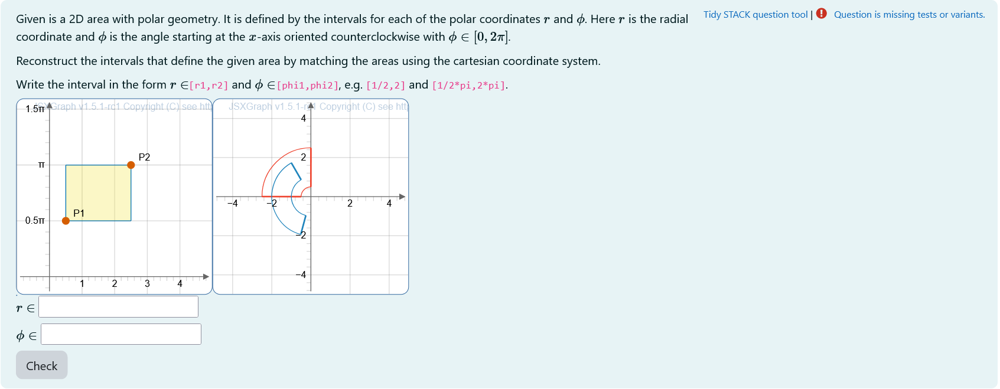
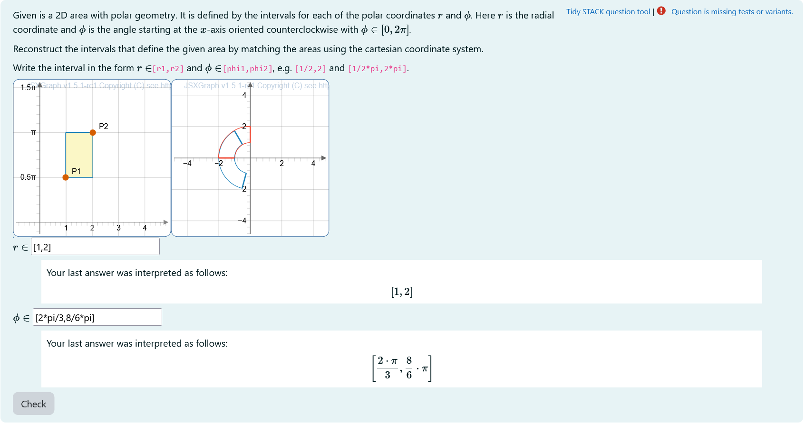
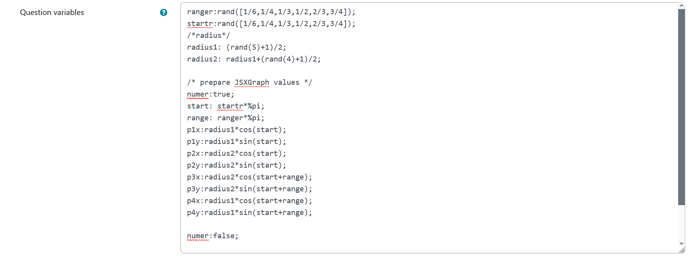
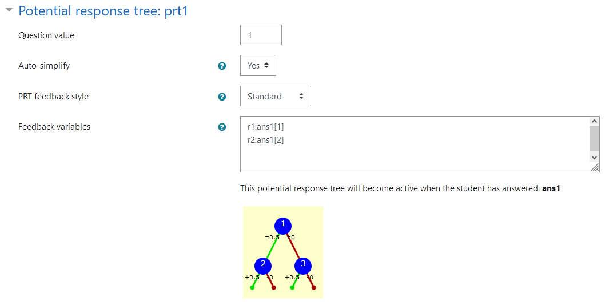
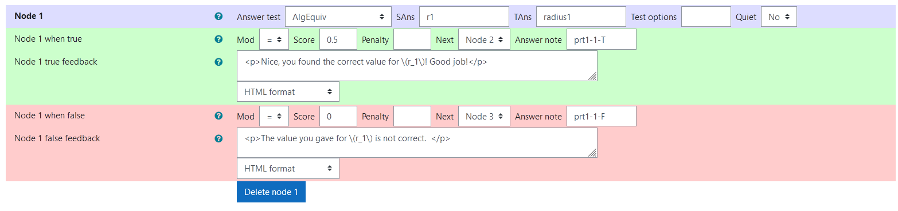
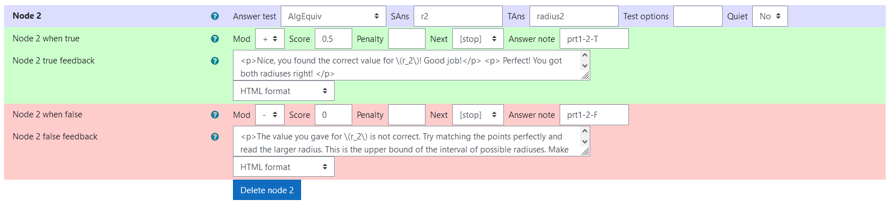
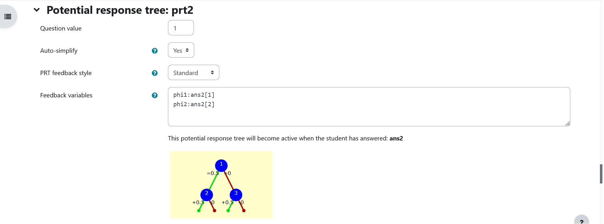
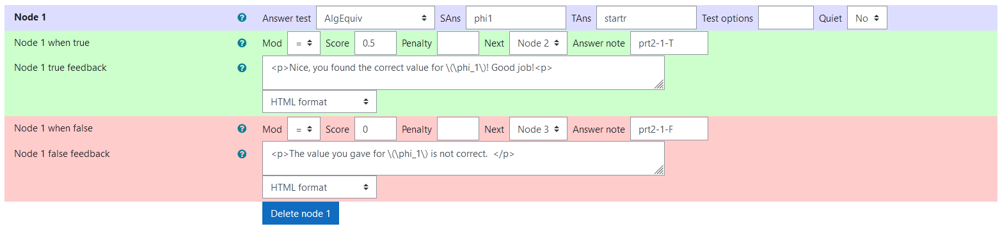
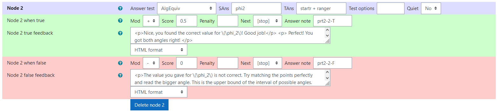
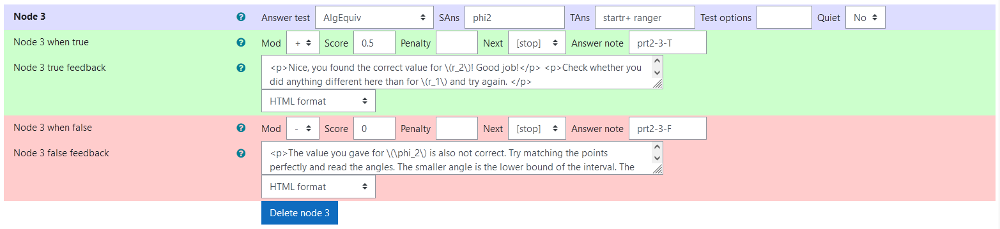

## Aim of task
+	Student knows the transformation from cartesian to polar coordinates  (Handling mathematical symbols and formalism)
+	Student can think of an area that is transformed to the given area in polar coordinates and check graphically (represent mathematical entities, posing and solving mathematical problems, making use of aids and tools )

|  |
|:--:|
| *First impression of the question* |

+ [XML Code](XML/quiz-IDIAM-Polar%20Coordinates%20Matching%20algebraic.xml)

## Question description

A 2D figure is plotted. It is a randomly generated section of a sphere in polar coordinates.

The task is to find the correct intervalls for $r$ and $\phi$ in real numbers that construct the generated figure in polar coordinates.


### Student perspective

The student will see two coordinate systems.

1. A polar coordinate system with a given area and another area they can modify.
1. A cartesian coordinate system with a rectangle defined by two points P1 and P2.

The rectangle in the cartesian coordinate system is transformed to polar coordinates and displayed in the polar coordinate system. By changing P1 and P2 the area in the polar coordinate system changes.

It is the aim to match the changing area to the given area. Then, the interval bounds can be read from the cartesian coordinate system and given as input.

|  |
|:--:|
| *When the student solves the problem* |


### Teacher perspective
The teacher is able to give a list of possible values for interval bounds. In order to do this, they simply need to modify the entries in the lists specified e.g. change `ranger:rand([1/6,1/4,1/3,1/2,2/3,3/4,5/6,1])` to `ranger:rand([1/2,1,3/2,2,5/2])`.

Another example - in the case of the radius - is the following: change `radius1:rand(6)/2` to `radius1: rand(8)/2` in order to select numbers from 0 to 4 in steps of 1/2.

**They should not change any of the values `p1x,...,p4y`!**

|  |
|:--:|
| *The above image shows which values the teacher may wish to change* |


## Question code

### Question Variables
+	`ranger` and `startr` take random values of a list containing possible values for phi (needs to be multiplied by pi later)
+	`radius1` and `radius2` are randomly selected in steps of 1/2 and `radius2` is always bigger than `radius1`  
+	`p1x`, `p1y`, `p2x`, `p2y`, `p3x`, `p3y`, `p4x`, `p4y` are defined as numerical value in between `numer:true` and `numer:false` using polar coordinate transformation and `radius1`, `radius2`, `startr` and `ranger`.
+ the variables `p1x`,…,`p4y` form a rectangle that is constructed in the code of **Question text** which is the correct solution of the task


#### Question variable code
```javascript
ranger:rand([1/6,1/4,1/3,1/2,2/3,3/4]);
startr:rand([1/6,1/4,1/3,1/2,2/3,3/4]);
/*radius*/
radius1: (rand(5)+1)/2;
radius2: radius1+(rand(4)+1)/2;


/* prepare JSXGraph values */
numer:true;
start: startr*%pi;
range: ranger*%pi;
p1x:radius1*cos(start);
p1y:radius1*sin(start);
p2x:radius2*cos(start);
p2y:radius2*sin(start);
p3x:radius2*cos(start+range);
p3y:radius2*sin(start+range);
p4x:radius1*cos(start+range);
p4y:radius1*sin(start+range);

numer:false;

/* symbolic values for checking*/
startr: startr*%pi;
ranger: ranger*%pi;
```

### Question Text
+	"Given is a 2D area with polar geometry. It is defined by the intervals for each of the polar coordinates $r$ and $\phi$. Here $r$ is the radial coordinate and $\phi$ is the angle starting at the $x$-axis oriented counterclockwise with $\phi\in [0, 2 \pi]$. 

    The area is contained in the interval between a smaller and a bigger value of the coordinates. 
    
    The point of view can be rotated with help of the sliders in the plot.

    **Reconstruct the intervals that define the given area by matching the areas using the lower coordinate system.** 
  
    Write the interval in the form $r\in$`[r1,r2]` and  $\phi\in$ `[phi1,phi2]`, e.g. `[1/2,2]` and `[1/2*pi,2*pi]`.”

+ Task explanation using LaTex
+	JSXGraph applet using the functions and variables defined in **Question variables** plotting the randomized points in polar coordinates
+	`[[input:ans1]]` , `[[input:ans2]]` at the end of JSXGraph code to allow input of an answer of the student for both the radius intervalls and the angle intervall respectively
+	`[[validation:ans1]]`,  `[[validation:ans2]]` checking of answer

#### Question text code


```javascript
<p>Given is a 2D area with polar geometry. It is defined by the intervals for each of the polar coordinates \(r\) and \(\phi\). Here \(r\) is the radial coordinate and \(\phi\) is the angle starting at the \(x\)-axis oriented counterclockwise with \(\phi\in [0, 2 \pi]\). </p>


<p> Reconstruct the intervals that define the given area by matching the areas using the right coordinate system. </p> 

<p> Write the interval in the form \(r\in\)<code>[r1,r2]</code> and  \(\phi\in\)<code>[phi1,phi2]</code>, e.g. <code>[1/2,2]</code> and <code>[1/2*pi,2*pi]</code>.</p>


<div style= 'float:left'> 
[[ jsxgraph width="250px" height="250px"]] [[/ jsxgraph ]]
</div>
[[ jsxgraph width="250px" height="250px"]] [[/ jsxgraph ]]

[[jsxgraph width='0px' height='0px' input-ref-ans1='ans1Ref']]

//handling divids
var divid3 = divid;
console.log(divid3);
var parts = divid.split('-');
console.log(parts);

parts[2] = parts[2] -1;
var divid2 = parts.join('-');
console.log(divid2);

parts[2] = parts[2] -1;
var divid1 = parts.join('-');
console.log(divid1);

//content
var board = JXG.JSXGraph.initBoard(divid2,{boundingbox : [-5, 5, 5,-5], axis:true, shownavigation : false});

var center =board.create("point",[0,0],{name : "",visible:false,fixed:true});
var p1 = board.create("point",[{#p1x#},{#p1y#}],{name : "P1",visible:false,fixed:true,});
var p2 = board.create("point",[{#p2x#},{#p2y#}],{name : "P2",visible:false,fixed:true});
var p3 = board.create("point",[{#p3x#},{#p3y#}],{name : "P3",visible:false,fixed:true});
var p4 = board.create("point",[{#p4x#},{#p4y#}],{name : "P4",visible:false,fixed:true});
var c1 = board.create("arc",[center,p1,p4],{frozen:true, strokeColor: "#1f84bc"});
var c2 = board.create("line",[p4,p3],{frozen:true, straightFirst:false, straightLast:false, strokeColor: "#1f84bc"});
var c3 = board.create("arc",[center,p2,p3],{frozen:true, strokeColor: "#1f84bc"});
var c4 = board.create("line",[p2,p1],{frozen:true, straightFirst:false, straightLast:false, strokeColor: "#1f84bc"});
//stack_jxg.bind_point(ans1Ref,p1);


var board2 = JXG.JSXGraph.initBoard(divid1,{boundingbox : [-1, 5, 5,-0.5], axis:true, 
  defaultAxes: {
    	y: {
      	ticks: {
        	scale: Math.PI,
          scaleSymbol: '\u03c0',
          ticksDistance: 0.5,
          beautifulScientificTickLabels:true,
          insertTicks: false
        }}}, 
      shownavigation : false});
  board2.addChild(board);
  board.suspendUpdate();
  board2.suspendUpdate();

// var center2 =board2.create("point",[0,0],{name : "",visible:false,fixed:true});
var p12 = board2.create("point",[0.5,1.57],{name : "P1",visible:true});
var p32 = board2.create("point",[2.5,3.14],{name : "P2",visible:true});

var p22 = board2.create("point",[function () {return p32.X()},function () {return p12.Y()}],{name : "P3",visible:false});
var p42 = board2.create("point",[function () {return p12.X()},function () {return p32.Y()}],{name : "P4",visible:false});
var polyg1 = board2.create("polygon",[p12,p22,p32,p42],{name : ""});

stack_jxg.bind_point_dual(ans3Ref,p12,p32);

var p1p = board.create("point",[function () {return p12.X()*Math.cos(p12.Y());},
                            function () {return p12.X()*Math.sin(p12.Y());}],
                            {name : "P1",visible:false});
var p2p = board.create("point",[function () {return p32.X()*Math.cos(p12.Y());},
                            function () {return p32.X()*Math.sin(p12.Y());}],
                            {name : "P2",visible:false});
var p3p = board.create("point",[function () {return p32.X()*Math.cos(p32.Y());},
                            function () {return p32.X()*Math.sin(p32.Y());}],
                            {name : "P3",visible:false});
var p4p = board.create("point",[function () {return p12.X()*Math.cos(p32.Y());},
                            function () {return p12.X()*Math.sin(p32.Y());}],
                            {name : "P4",visible:false});
var c1p = board.create("arc",[center,p1p,p4p],{frozen:true,strokeColor: '#EE442F'});
var c2p = board.create("line",[p4p,p3p],{frozen:true,strokeColor: '#EE442F', straightFirst:false, straightLast:false});
var c3p = board.create("arc",[center,p2p,p3p],{frozen:true,strokeColor: '#EE442F'});
var c4p = board.create("line",[p2p,p1p],{frozen:true,strokeColor: '#EE442F', straightFirst:false, straightLast:false});

board.unsuspendUpdate();
board2.unsuspendUpdate();

[[/ jsxgraph]]

<p>\(r\in\) [[input:ans1]] [[validation:ans1]]</p>
<p>\(\phi\in\) [[input:ans2]] [[validation:ans2]]</p>

<div id="storepoints" style="display:none">
<p>Lager P1 [[input:ans3]] [[validation:ans3]]</p>
</div>
```
## Answers
### Answer ans 1
|property | setting| 
|:---|:---|
|Input type | Algebraic input|
|Model answer | `[radius1, radius2]` defined in **Question variables** |
| Forbidden words | none |
| Forbid float | No |
| Student must verify | Yes |
| Show the validation | Yes, with variable list|
---
### Answer ans 2
|property | setting| 
|:---|:---|
|Input type | Algebraic input|
|Model answer | `[startr, startr+ranger]` defined in **Question variables** |
| Forbidden words | none |
| Forbid float | Yes |
| Student must verify | Yes |
| Show the validation | Yes, with variable list|
---

## General feedback
```
<hr>

<p> Once you know how to transform points from cartesian to polar coordinates graphically, you can have a look at the quantitative transformation from one system in the other. If you know this, it will be way easier to parametrize functions or solve problems with rotational symmetry. You can then use, what you used in this exercise to find suiting integration bounds and perform calculations you could not easily do with cartesian coordinates. </p>
```


## Potential response tree
### prt1

|  |
|:--:|
| *Display of **prt1*** |

Feedback variables:
```
r1:ans1[1]
r2:ans1[2]


```


### Node 1
 |property | setting| 
|:---|:---|
|Answer Test | AlgEquiv|
|SAns | `r1`|
|TAns | `radius1`| 
|Node 1 true feedback |`<p>Nice, you found the correct value for \(r_1\)! Good job!</p>`|
|Node 1 false feedback |`<p>The value you gave for \(r_1\) is not correct.  </p>`|

|  |
|:--:|
| *Values of **node 1 of prt 1*** |

### Node 2
 |property | setting| 
|:---|:---|
|Answer Test | AlgEquiv|
|SAns | r2|
|TAns | radius2| 
|Node 2 true feedback |`<p>Nice, you found the correct value for \(r_2\)! Good job!</p> <p> Perfect! You got both radiuses right! </p>`|
|Node 2 false feedback |`<p>The value you gave for \(r_2\) is not correct. Try matching the points perfectly and read the larger radius. This is the upper bound of the interval of possible radiuses. Make sure, you're giving the values in the format specified in the task explanation.</p> `|

|  |
|:--:|
| *Values of **node 2 of prt 1*** |

### Node 3
 |property | setting| 
|:---|:---|
|Answer Test | AlgEquiv|
|SAns | r2|
|TAns | radius2| 
|Node 3 true feedback |`<p>Nice, you found the correct value for \(r_2\)! Good job!</p> <p>Check whether you did anything different here than for \(r_1\) and try again. </p>`|
|Node 3 false feedback |`<p>The value you gave for \(r_2\) is also not correct. Try matching the points perfectly and read the radiuses. The smaller radius is the lower bound of the interval. The larger radius is the upper bound of the interval. Make sure, you're giving the values in the format specified in the task explanation.</p> `|

|  |
|:--:|
| *Values of **node 3 of prt 1*** |

### prt2

|  |
|:--:|
| *Display of **prt2*** |

Feedback variables:

```
phi1:ans2[1]
phi2:ans2[2]
``` 


### Node 1
 |property | setting| 
|:---|:---|
|Answer Test | AlgEquiv|
|SAns | `phi1`|
|TAns | `startr`| 
|Node 1 true feedback |`<p>Nice, you found the correct value for \(\phi_1\)! Good job!<p>`|
|Node 1 false feedback |`<p>The value you gave for \(\phi_1\) is not correct.  </p>`|

|  |
|:--:|
| *Values of **node 1 of prt 2*** |

### Node 2
 |property | setting| 
|:---|:---|
|Answer Test | AlgEquiv|
|SAns | `phi2`|
|TAns | `startr+ ranger`| 
|Node 2 true feedback |`<p>Nice, you found the correct value for \(\phi_2\)! Good job!</p> <p> Perfect! You got both angles right! </p>`|
|Node 2 false feedback |`<p>The value you gave for \(\phi_2\) is not correct. Try matching the points perfectly and read the bigger angle. This is the upper bound of the interval of possible angles. Make sure, you're giving the values in the format specified in the task explanation.</p>`|

|  |
|:--:|
| *Values of **node 2 of prt 2*** |

### Node 3
 |property | setting| 
|:---|:---|
|Answer Test | AlgEquiv|
|SAns | `phi2`|
|TAns | `startr+ ranger`| 
|Node 3 true feedback |`<p>Nice, you found the correct value for \(r_2\)! Good job!</p> <p>Check whether you did anything different here than for \(r_1\) and try again. </p>`|
|Node 3 false feedback |`<p>The value you gave for \(\phi_2\) is also not correct. Try matching the points perfectly and read the angles. The smaller angle is the lower bound of the interval. The larger angle is the upper bound of the interval. Make sure, you're giving the values in the format specified in the task explanation.</p> `|

|  |
|:--:|
| *Values of **node 3 of prt 2*** |

## Todo:
* [x] make sure variable names and code are consistent with other tasks
* [x] evaluate whether the JSXGraph values should be specified in Question variables or not
* [x] make sure random values fit nicely in applet
* [x] place applets side by side
* [x] change colours to colourblind palette
