## Aim of task
+	Student knows how a multidimensional curve is produced from varying a single parameter (Handling mathematical symbols and formalism).
+	Student can find other parameters of the curve using a 3D visualization (represent mathematical entities, posing and solving mathematical problems, making use of aids and tools).
+	Student understands geometrical implications of individual parameters in a multi-dimensional curve (representing mathematical entities).
+	Student understands that exact geometric features can be approximated numerically (modelling mathematically).

| 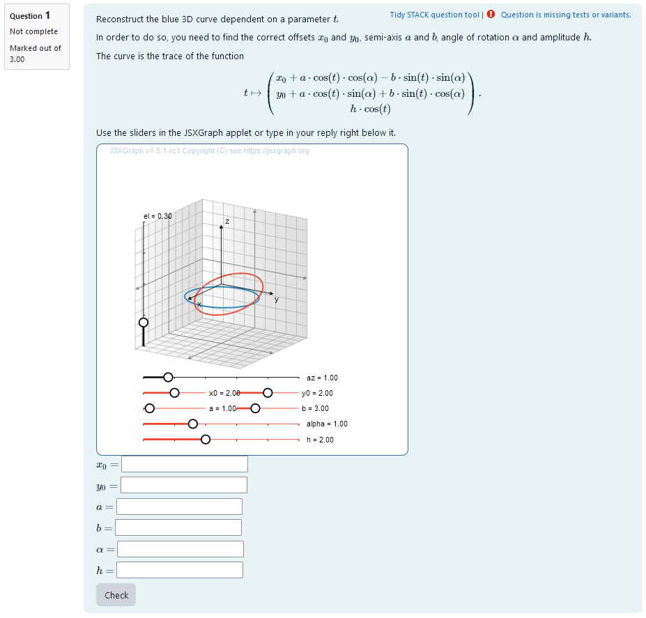 |
|:--:|
| *First impression of the question* |

+ [XML Code](XML/quiz-IDIAM-Parametric%20Curve%20Matching%20elliptic.xml)

## Question description


A 3D curve is plotted. It is a closed curve whose constant parameters are randomly selected upon starting the task. Its equation is
```math 
t \mapsto \begin{pmatrix} x_0+ a \cdot \cos(t) \cdot \cos(\alpha) - b \cdot \sin(t) \cdot \sin(\alpha) \\ y_0+ a \cdot \cos(t) \cdot \sin(\alpha) + b \cdot \sin(t) \cdot \cos(\alpha) \\h \cdot \cos(t)\end{pmatrix}.
```
A second curve given by the same equation is plotted that can be varied using sliders.
That way, by matching the two curves, the parameters can be interactively obtained.
The task is to find the correct values for $r$, $a$, $\phi$ and $n$ in real numbers or integer numbers.


### Student perspective

The student sees a cartesian coordinate system and a curve plotted in 3D.

It is the task to reconstruct the parameters of the 3D curve. In order to do this they have to find out the radius, amplitude, phase shift and number of oscillations by matching a second curve to the given one using sliders. If they overlap exactly, the parameter values can be read from the sliders and are automatically given as numerical values.

| 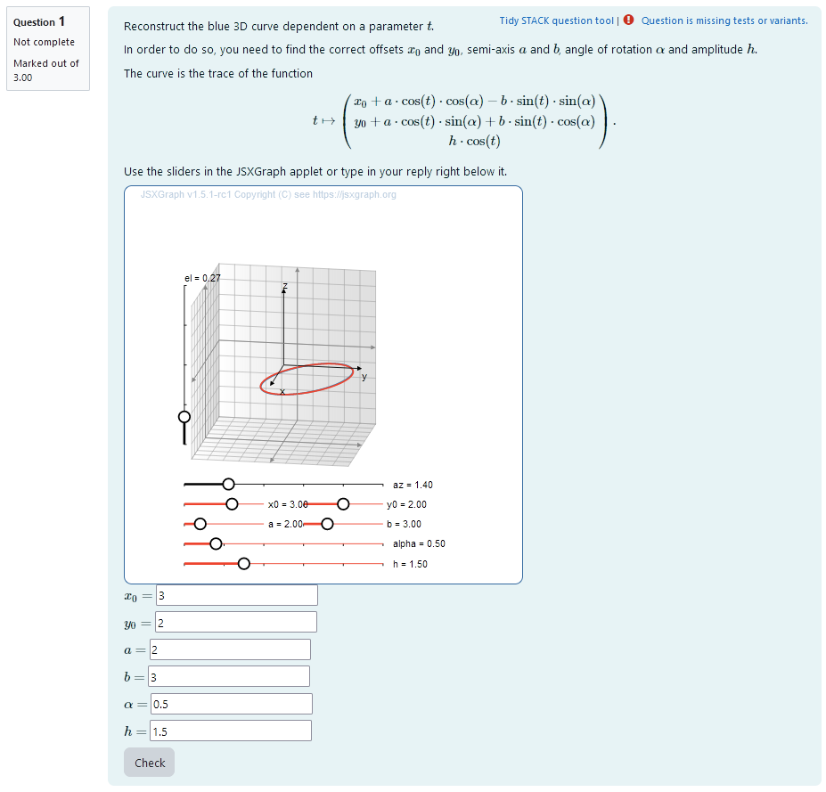 |
|:--:|
| *When the student solves the problem* |


### Teacher perspective
The teacher is able to give a list of possible values for parameters. In order to do this, they simply need to modify the entries in the lists specified e.g. change `alphar : rand([1/6, 1/4, 1/3, 1/2, 2/3, 3/4, 5/6 ,1]);` to `alphar : rand([1/6, 1/4, 1/3, 1/2]);`. 

Another example - in the case of the semiaxis - is the following: change `ar: 1+rand(6)/2` to `ar: 1+ rand(8)/2` in order to select numbers from 1 to 4.5 in steps of 1/2.

For an explanation of the processing of the values read **Question variables** and **Question text**.


| 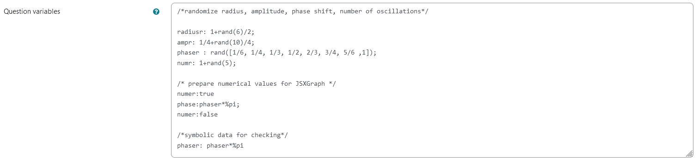 |
|:--:|
| *The above image shows which values the teacher may wish to change* |


## Question code

### Question Variables
+	`ar`, `br` ,`xr`, `yr` and `ampr` are randomly selected integer numbers created using `rand()`, they are divided by 2 and 4 respectively to allow for non-integer steps
+ `alphar`is randomly selected from a list of possible values using `rand()`
+ The value of `alphar` is multiplied by pi and saved to `alpha` as a numerical value. This is done in between `numer:true` and `numer:false`.
+ The value of `alphar` is multiplied by pi to use it for plotting in **Question text**.


#### Question variable code
```
/*randomize parameters*/

xr:  1+rand(6)/2;
yr:  1+rand(6)/2;
ar: 1+rand(6)/2;
br: 1+rand(6)/2;
ampr: 1/4+rand(10)/4; 
alphar : rand([1/6, 1/4, 1/3, 1/2, 2/3, 3/4, 5/6 ,1]);


/* prepare numerical values for JSXGraph */
numer:true
alpha: alphar*%pi;
numer:false

/*symbolic data for checking*/
alphar: alphar*%pi
```

### Question Text
Reconstruct the blue 3D curve dependent on a parameter $t$.

In order to do so, you need to find the correct offsets $x_0$ and $y_0$, semi-axis  $a$ and $b$, angle of rotation $\alpha$ and amplitude $h$.

The curve is the trace of the function 
```math
t \mapsto \begin{pmatrix} x_0+ a \cdot \cos(t) \cdot \cos(\alpha) - b \cdot \sin(t) \cdot \sin(\alpha) \\ y_0+ a \cdot \cos(t) \cdot \sin(\alpha) + b \cdot \sin(t) \cdot \cos(\alpha) \\h \cdot \cos(t)\end{pmatrix}.
```

Use the sliders in the JSXGraph applet or type in your reply right below it.
	


+ Task explanation using LaTex
+	JSXGraph applet using and variables defined in **Question variables** plotting the 3D curve
+	`[[input:ans1]]`, `[[input:ans2]]`, `[[input:ans3]]`, `[[input:ans4]]`, `[[input:ans5]]` and `[[input:ans6]]` at the end of JSXGraph code to allow input of  answers of the student for r, a and phi and n respectively
+	`[[validation:ans1]]`,  `[[validation:ans2]]` , `[[validation:ans3]]`, `[[validation:ans4]]`, `[[validation:ans5]]`and `[[validation:ans6]]`  are used for checking of answer

#### Question text code


```javascript
<p>Reconstruct the blue 3D curve dependent on a parameter \(t\).</p>
<p>In order to do so, you need to find the correct offsets \(x_0\) and \(y_0\), semi-axis  \(a\) and \(b\), angle of rotation \(\alpha\) and amplitude \(h\).</p>
<p> The curve is the trace of the function \[ t \mapsto \begin{pmatrix} 
x_0+ a \cdot \cos(t) \cdot \cos(\alpha) - b \cdot \sin(t) \cdot \sin(\alpha) \\
y_0+ a \cdot \cos(t) \cdot \sin(\alpha) + b \cdot \sin(t) \cdot \cos(\alpha) \\
h \cdot \cos(t)
\end{pmatrix}.\] </p>
<p>Use the sliders in the JSXGraph applet or type in your reply right below it.</p>

[[jsxgraph width="500px" height="500px" input-ref-ans1='ans1Ref' input-ref-ans2='ans2Ref' input-ref-ans3='ans3Ref' input-ref-ans4='ans4Ref' input-ref-ans5='ans5Ref' input-ref-ans6='ans6Ref']]
var board = JXG.JSXGraph.initBoard(divid,{boundingbox : [-10, 10, 10,-10], axis:false, shownavigation : false});
                       var box = [-5,5];
                       var view = board.create('view3d',
		                            [[-6, -3], [8, 8],
		                            [box, box, box]],
		                            {});

			//curve from STACK values
			var xrad = {#ar#};
			var yrad = {#br#};
			var ang = {#alpha#};
			var xoff = {#xr#};
			var yoff = {#yr#};
                        var amp = {#ampr#};
			var c_base = view.create('curve3d', [
				(t) => xoff + xrad* Math.cos(t)* Math.cos(ang) - yrad* Math.sin(t)* Math.sin(ang),
				(t) => yoff + xrad* Math.cos(t)* Math.sin(ang) + yrad* Math.sin(t)* Math.cos(ang),
				(t) => amp* Math.cos(t),
				[-Math.PI,Math.PI ]], {strokeWidth: 2, strokeColor: "#1f84bc"});
			
		
				
			//slider-based curve 
			
			var a = board.create('slider', [[-7,-7], [-3,-7], [0,1,10]], {name: "a",snapwidth:0.1, highline: {strokeColor: '#EE442F'}, baseline: {strokeColor: '#EE442F'}});
			var b = board.create('slider', [[-1,-7], [3,-7], [0,3,10]], {name: "b",snapwidth:0.1, highline: {strokeColor: '#EE442F'}, baseline: {strokeColor: '#EE442F'}});
			var y = board.create('slider', [[-1,-6],[3,-6],[-3,2,7]], {name: 'y0',snapwidth:0.1, highline: {strokeColor: '#EE442F'}, baseline: {strokeColor: '#EE442F'}});
			var x = board.create('slider', [[-7,-6],[-3,-6],[-3,2,7]], {name: 'x0',snapwidth:0.1, highline: {strokeColor: '#EE442F'}, baseline: {strokeColor: '#EE442F'}});
			var angle = board.create('slider', [[-7,-8], [3,-8], [0,1, Math.PI]], {name:"alpha", snapwidth:0.05, highline: {strokeColor: '#EE442F'}, baseline: {strokeColor: '#EE442F'}});
			var h = board.create("slider", [[-7,-9], [3,-9], [0,2,5]], {name: "h", snapwidth:0.05, highline: {strokeColor: '#EE442F'}, baseline: {strokeColor: '#EE442F'}});
			stack_jxg.bind_slider(ans1Ref,x);
			stack_jxg.bind_slider(ans2Ref,y);
			stack_jxg.bind_slider(ans3Ref,a);
			stack_jxg.bind_slider(ans4Ref,b);
			stack_jxg.bind_slider(ans5Ref,angle);
			stack_jxg.bind_slider(ans6Ref,h);

			var c = view.create('curve3d', [
				(t) => x.Value() + a.Value()* Math.cos(t)* Math.cos(angle.Value()) - b.Value()* Math.sin(t)* Math.sin(angle.Value()),
				(t) => y.Value() + a.Value()* Math.cos(t)* Math.sin(angle.Value()) + b.Value()* Math.sin(t)* Math.cos(angle.Value()),
				(t) => h.Value()*Math.cos(t),
				[-Math.PI, Math.PI]], {strokeWidth: 2, strokeColor: '#EE442F'}); 

                       /* axis labels*/
                       var xlabel=view.create('point3d',[0.9*box[1],0,(0.6*box[0]+0.4*box[1])], {size:0,name:"x"});
                       var ylabel=view.create('point3d',[0,0.9*box[1],(0.6*box[0]+0.4*box[1])], {size:0,name:"y"});
                       var zlabel=view.create('point3d',[
                           0.7*(0.6*box[0]+0.4*box[1]),
                           0.7*(0.6*box[0]+0.4*box[1]),
                           0.9*box[1]], 
                           {size:0,name:"z"});
board.update();
[[/ jsxgraph]]
<p>\(x_0=\) [[input:ans1]] [[validation:ans1]]</p>
<p>\(y_0=\) [[input:ans2]] [[validation:ans2]]</p>
<p>\(a=\) [[input:ans3]] [[validation:ans3]]</p>
<p>\(b=\) [[input:ans4]] [[validation:ans4]]</p>
<p>\(\alpha=\) [[input:ans5]] [[validation:ans5]]</p>
<p>\(h=\) [[input:ans6]] [[validation:ans6]]</p>
```
## Answers
### Answer ans 1
|property | setting| 
|:---|:---|
|Input type | Numerical|
|Model answer | `xr` defined in **Question variables** |
| Forbidden words | none |
| Forbid float | No |
| Student must verify | Yes |
| Show the validation | Yes, with variable list|
---
### Answer ans 2
|property | setting| 
|:---|:---|
|Input type | Numerical|
|Model answer | `yr` defined in **Question variables** |
| Forbidden words | none |
| Forbid float | No |
| Student must verify | Yes |
| Show the validation | Yes, with variable list|
---
### Answer ans 3
|property | setting| 
|:---|:---|
|Input type | Numerical|
|Model answer | `ar` defined in **Question variables** |
| Forbidden words | none |
| Forbid float | No |
| Student must verify | Yes |
| Show the validation | Yes, with variable list|
---
### Answer ans 4
|property | setting| 
|:---|:---|
|Input type | Numerical|
|Model answer | `br` defined in **Question variables** |
| Forbidden words | none |
| Forbid float | No |
| Student must verify | Yes |
| Show the validation | Yes, with variable list|
---
### Answer ans 5
|property | setting| 
|:---|:---|
|Input type | Numerical|
|Model answer | `alphar` defined in **Question variables** |
| Forbidden words | none |
| Forbid float | No |
| Student must verify | Yes |
| Show the validation | Yes, with variable list|
---
### Answer ans 6
|property | setting| 
|:---|:---|
|Input type | Numerical|
|Model answer | `ampr` defined in **Question variables** |
| Forbidden words | none |
| Forbid float | No |
| Student must verify | Yes |
| Show the validation | Yes, with variable list|
## Potential response tree
### prt1

Feedback variables:
```
xans: ans1
yans: ans2
```

| 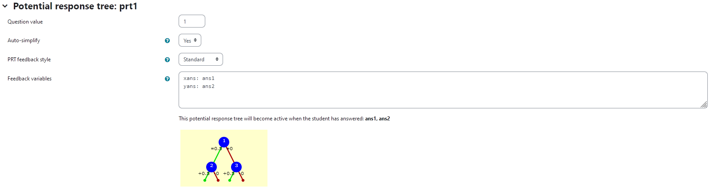 |
|:--:|
| *Visualization of **prt1*** |


### Node 1
|property | setting| 
|:---|:---|
|Answer Test | NumAbsolute|
|SAns | `xans`|
|TAns | `xr`| 
|Node 1 true feedback | `<p> Nice! You found the correct offset \(x_0\). Good job!</p>`|
|Node 1 false feedback |`<p>The offset \(x_0\) is not yet correct. Check, whether the curves' centres are aligned, when you slide "x0" to this value.</p>`|


| 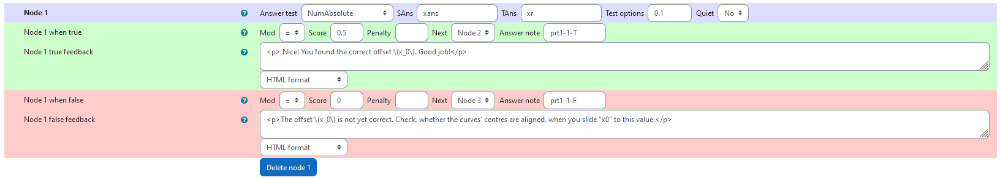 |
|:--:|
| *Values of **node 1*** |

### Node 2
 |property | setting| 
|:---|:---|
|Answer Test | NumAbsolute|
|SAns | `yans`|
|TAns | `yr`| 
|Node 2 true feedback | `<p> Nice! You also found the correct offset \(y_0\). That means you found the correct center! Good job!</p>`|
|Node 2 false feedback |`<p>The offset \(y_0\) is not yet correct. Check, whether the curves' centres are aligned, when you slide "y0" to this value.</p>`|

| 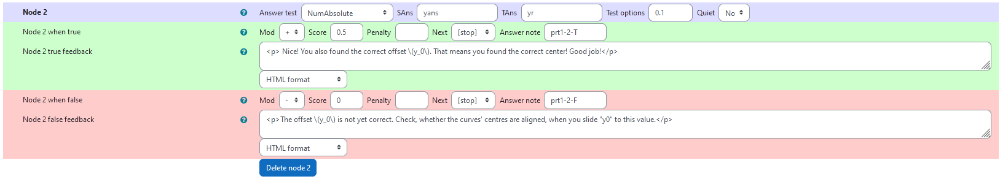 |
|:--:|
| *Values of **node 2*** |

### Node 3
 |property | setting| 
|:---|:---|
|Answer Test | NumAbsolute|
|SAns | `yans`|
|TAns | `yr`| 
|Node 3 true feedback | `<p> Nice! You found the correct offset \(y_0\). Good job! Check if the centers are aligned in \(x\)-direction as well!</p>`|
|Node 3 false feedback |`<p>The offset \(y_0\) is also not correct. The curves' centers are misaligned. Try to fix it by using the sliders. </p>`|

| 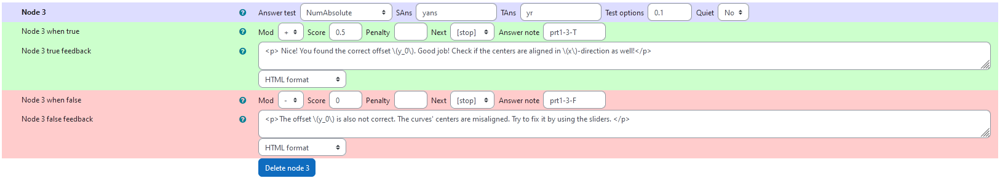 |
|:--:|
| *Values of **node 3*** |


### prt2

Feedback variables:
```
aans: ans3
bans: ans4

```

|  |
|:--:|
| *Visualization of **prt2*** |


### Node 1
|property | setting| 
|:---|:---|
|Answer Test | NumAbsolute|
|SAns | `aans`|
|TAns | `ar`| 
|Node 1 true feedback | `<p> Nice! You found the correct semi-axis length  \(a\). Good job!</p>`|
|Node 1 false feedback |`<p>The semi-axis length  \(a\) is not yet correct. Check, whether the curves have the same shape from above, when you slide "a" to this value.</p>`|


|  |
|:--:|
| *Values of **node 1*** |

### Node 2
 |property | setting| 
|:---|:---|
|Answer Test | NumAbsolute|
|SAns | `bans`|
|TAns | `br`| 
|Node 2 true feedback | `<p> Nice! You found the correct semi-axis length  \(b\). The ellipse has the right shape. Good job!</p>`|
|Node 2 false feedback |`<p>The semi-axis length  \(b\) is not yet correct. Check, whether the curves have the same shape from above, when you slide "b" to this value.</p>`|

| 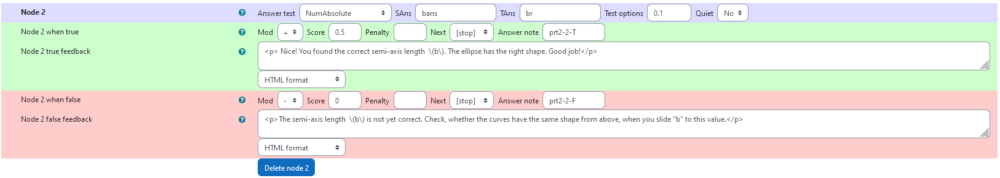|
|:--:|
| *Values of **node 2*** |

### Node 3
 |property | setting| 
|:---|:---|
|Answer Test | NumAbsolute|
|SAns | `bans`|
|TAns | `br`| 
|Node 3 true feedback | `<p> Nice! You found the correct semi-axis length  \(b\). Good job! Make sure to do the same with the other semi-axis.</p>`|
|Node 3 false feedback |`<p>The semi-axis length  \(b\) is not yet correct. Both axis are not correct. It might be that they look right, but are not due to an incorrect angle. Make sure the curves overlap from all perspectives and try again.</p>`|

| 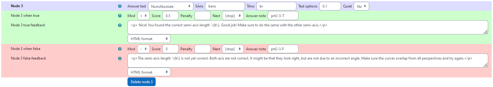|
|:--:|
| *Values of **node 3*** |
### prt3

Feedback variables:
```
alphaans: ans5
ampans: ans6
```

| 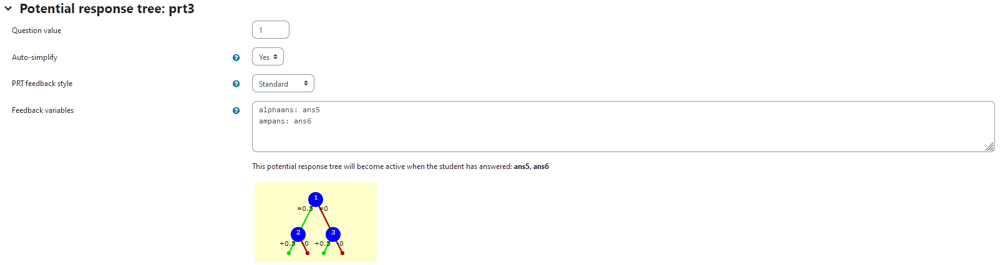 |
|:--:|
| *Visualization of **prt3*** |


### Node 1
|property | setting| 
|:---|:---|
|Answer Test | NumAbsolute|
|SAns | `alphaans`|
|TAns | `alphar`| 
|Node 1 true feedback | `<p> Nice! You found the correct angle \(\alpha\). Good job!</p>`|
|Node 1 false feedback |`<p>The angle \(\alpha\) is not yet correct. Check, whether the curves are oriented the same way from all perspectives, when you slide "alpha" to this value.</p>`|


| 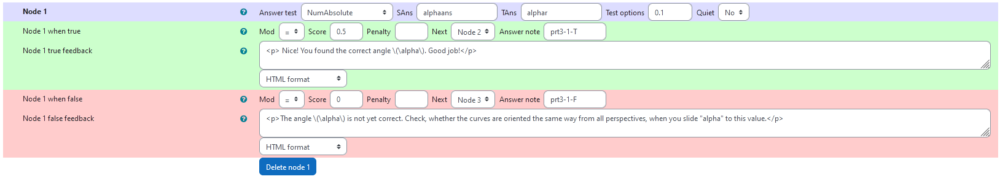 |
|:--:|
| *Values of **node 1*** |

### Node 2
 |property | setting| 
|:---|:---|
|Answer Test | NumAbsolute|
|SAns | `ampans`|
|TAns | `ampr`| 
|Node 2 true feedback | `<p> Nice! You found the correct amplitude \(h\). Good job!</p>`|
|Node 2 false feedback |`<p>The amplitude \(h\) is not yet correct. Check, whether the curves have the same height in \(z\)-direction, when you slide "h" to this value.</p>`|

| 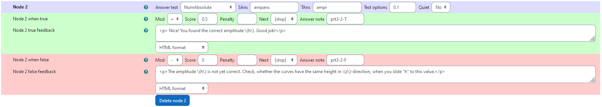 |
|:--:|
| *Values of **node 2*** |

### Node 3
 |property | setting| 
|:---|:---|
|Answer Test | NumAbsolute|
|SAns | `ampans`|
|TAns | `ampr`| 
|Node 3 true feedback | `<p> Nice! You found the correct amplitude \(h\). Good job!</p>`|
|Node 3 false feedback |`<p>The amplitude \(h\) is not yet correct. Check, whether the curves have the same height in \(z\)-direction, when you slide "h" to this value.</p>`|

|  |
|:--:|
| *Values of **node 3*** |


## Todo:
* [x] check grading
* [x] fix randomizing
* [x] change PRT 
* [x] update Aims of Task
* [x] update figures
* [x] add axis labels
