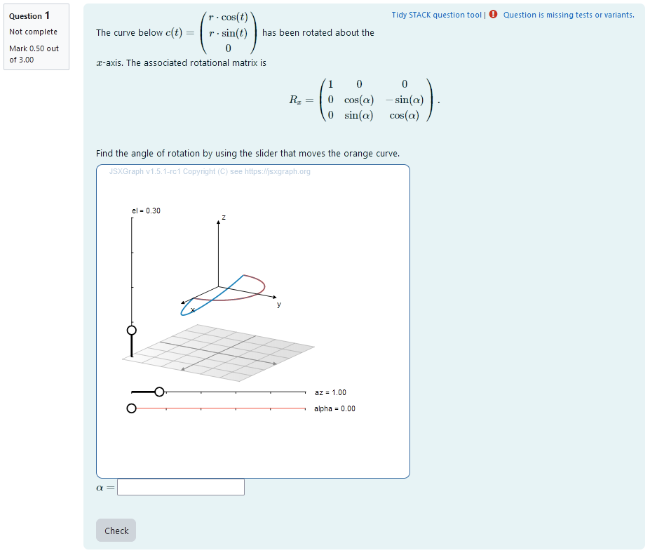
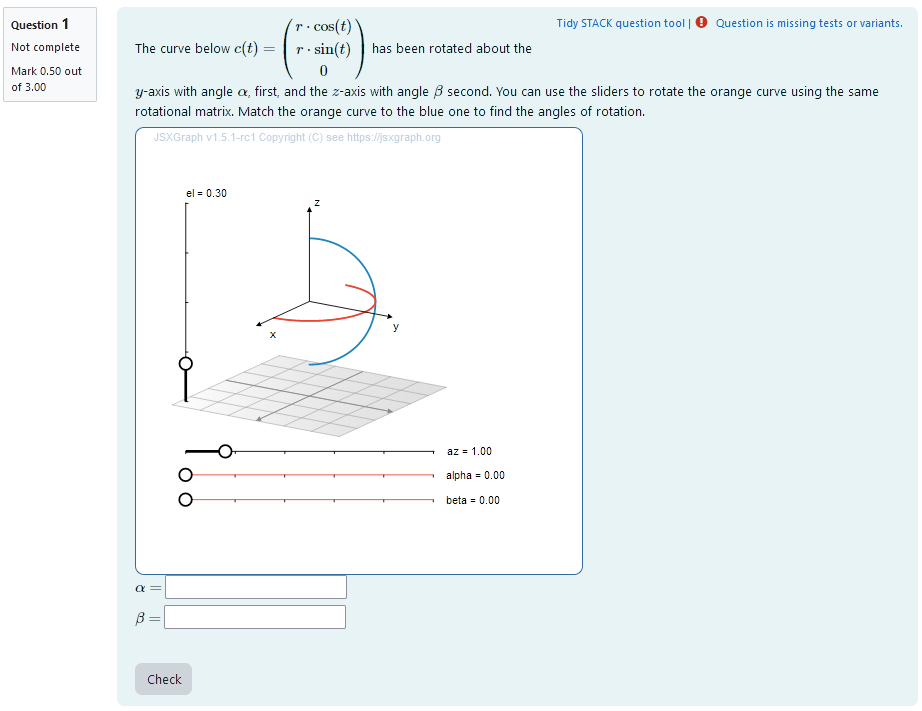

## Aim of task
+	Student knows how a multidimensional curve is produced from varying a single parameter. (Handling mathematical symbols and formalism)
+	Student knows how rotational matrices change vectors (Handling mathematical symbols and formalism)
+ Student knows that the outcome of rotations is dependent on the order of operations 
+ Student can predict how a curve will change graphically once a rotational matrix is applied (Representing mathematical entities, Making use of aids and tools)
+ Student can reconstruct the axis of rotation and the order of operations from a rotated curve (Representing mathematical entities)

## Exercise layout
This is an adaptive tutorial task. That means, a relatively hard task is presented. When the task is answered incorrectly, a series of other tasks is activated. These tasks cover the fundamentals necessary to solve the initial problem. The next figure depicts the scheme.
The tasks are documented seperately, but no in complete detail in this document. Some of the tasks are availabe as stand-alone exercises.


|  |
|:--:|
| *Overview of the task.* |

+ [XML Code](./XML/quiz-IDIAM-Rotating%20a%20curve%20about%20two%20axis%20adaptive.xml)

## Question Variables

The tasks are programmed in the same Question Text. However, they are each wrapped in a `<div>`-environment. That way, they can be accessed individually. For better legibility, in this documentation the individual tasks are presented as if they were seperate Question Texts sharing the same Question Variables.

The Question Variables set up a number of things:
+ the multiplication of matrices by converting lists to matrices, multpilying them and turning them to lists again for export
+ the randomization of the order of rotation for the initial task
+ the randomization of the angles $\alpha, \beta, \gamma$ provided 
+ the conversion of the randomized angles into mumerical values for plotting
+ the matrix mutliplication for the reference curve in the initial task
+ the matrix multiplication for the reference curve in task1
+ the matrix multiplication for the reference curve in task2a
+ the matrix multiplication for the reference curve in task2b
+ the randomization of the order of rotation for task3
+ the randomization of new angle `ap_betar` to use in task3
+ the matrix multiplication for the reference curve in task3

```


/* implement the creation of matrices from lists */

listtomat(L):=block(
 [i, M], 
 M:matrix(), 
 for i:1 thru length(L) do M:addrow(M,L[i]),
 return(M)
);
mattolist(M):=makelist(M[i],i,1,length(M));

/* specify the lists to be turnt into matrices */
r: 2;
L1: [[1,0,0],[0,cos(a),-sin(a)],[0, sin(a), cos(a)]];
L2: [[cos(b),0,sin(b)],[0,1,0],[-sin(b), 0, cos(b)]];
L3: [[cos(c),-sin(c),0],[sin(c),cos(c),0],[0, 0, 1]];
Lv: [[r*cos(t),0,0],[r*sin(t),0,0],[0,0,0]];

/* create matrices */

M1: listtomat(L1);
M2: listtomat(L2);
M3:listtomat(L3);
v: listtomat(Lv);

matlist: [M1,M2,M3];

/* randomize the order of operations for initial task */
indexr: 1+rand(6)
ta: [[string(x-y),false],[string(y-x),false],[string(x-z),false],[string(z-x),false],[string(y-z),false],[string(z-y), false]];
ta[indexr][2]:true;
tans: ta[indexr];

/* select matrices for multiplication for initial task */

indexlist:[[1,2],[2,1],[1,3],[3,1],[2,3],[3,2]];
indices: indexlist[indexr];

M1r: matlist[indices[1]];
M2r: matlist[indices[2]];

alphar: rand([1/6,1/4,1/3,1/2,2/3,3/4])*%pi;
betar:  rand([1/6,1/4,1/3,1/2,2/3,3/4])*%pi;
gammar: rand([1/6,1/4,1/3,1/2,2/3,3/4])*%pi;
deltar: rand([1/6,1/4,1/3,2/3,3/4,5/4,4/3])*%pi;

/* numerical values */
numer: true
alpha: alphar;
beta: betar;
gamma: gammar;
delta: deltar;
numer: false

/* calculate matrix product and evalutate angles for initial task */
matres: ev(M2r.M1r.v, a:alphar, b:betar, c: gammar);

/* turn matrix to list for export*/
res: [mattolist(matres)[1][1],mattolist(matres)[2][1],mattolist(matres)[3][1]];


/* Rotation about one axis */
or_matres: ev(M1.v, a:deltar);
or_res: [mattolist(or_matres)[1][1],mattolist(or_matres)[2][1],mattolist(or_matres)[3][1]];


/* Rotation about two axis matching */
trm_matres: ev(M3.M2.v, b:betar, c: gammar);
trm_res: [mattolist(trm_matres)[1][1],mattolist(trm_matres)[2][1],mattolist(trm_matres)[3][1]];

/* Rotation about two axis observing */
tro_matres: ev(M1.M3.v, a:alphar, c:gammar);
tro_res: [mattolist(tro_matres)[1][1],mattolist(tro_matres)[2][1],mattolist(tro_matres)[3][1]];

/* Rotation about two known axis in unknown order - "ap" is short for "axis pair"*/
ap_betar: rand([1/6,1/4,1/3,1/2,2/3,3/4])*%pi;
while ap_betar = alphar do ap_betar: rand([1/6,1/4,1/3,1/2,2/3,3/4])*%pi;
ap_in: rand([1,2]);
ap_matlist:[[M2,M3],[M3,M2]];
ap_M1r: ap_matlist[ap_in][1];
ap_M2r: ap_matlist[ap_in][2];

ap_ta: [[string(y-z),false],[string(z-y), false]];
ap_ta[ap_in][2]:true;
ap_tans: ap_ta[ap_in];
ap_matres: ev(ap_M2r.ap_M1r.v, b: alphar, c: ap_betar);
ap_res: [mattolist(ap_matres)[1][1],mattolist(ap_matres)[2][1],mattolist(ap_matres)[3][1]];

```


# Initial task (Rotating a curve about two unknown axis)

|  |
|:--:|
| *First impression of the question* |


## Question description

A 3D curve is plotted. It is a half circle so its orientation changes visibly after rotational matrices are applied. The curve can be parametrized as
```math
t \mapsto \begin{pmatrix} 
r \cdot \cos (t) \\
r \cdot \sin (t) \\
0
\end{pmatrix}.
```
A second curve of the same shape is plotted. Its orientation is different from the first curve. It has been rotated about two different coordinate axis. The student is provided the concrete angles of rotation for rotations about each of the coordinate axis.
They need to find out, what axis the curve was rotated about and in which order the rotations where executed.


### Student perspective

The student sees a cartesian coordinate system and a curve plotted in 3D.

They are presented with angles of rotation for each of the coordinate axis. They are asked to select the correct order of operations from a multiple choice selection.

|  |
|:--:|
| *When the student solves the problem* |


### Teacher perspective
The teacher is able to give a list of possible values for angles of rotation. In order to do this, they simply need to modify the entries in the lists specified e.g. change `alpahr : rand([1,2,3,4,5,6])/4*%pi;` to `phaser : rand([1/4,1/3,1/2,2/3])*%pi;`. 

Additionally, they can change the rotational matrices to the ones they desire. In order to do this, they need to change the entries of `L1`, `L2` and `L3`. The first entry is the first row of the matrix.
Also, they can change the curve that is rotated. To do this, they need to change the entries of `Lv`. Here the first entry is the first component, e.g. the $x$-coordinate.
They will need to change the question text as well to match the new curve and/or rotational matrices.

For an explanation of the processing of the values read **Question variables** and **Question text**.


### Question variables used

+ the possible answers are saved to list `ta` along with the information whether the answer is correct to allow for the radiobuttons (multiple choice) format
+ one possibility is randomly selected and assigned the bool `true` - this is the correct answer
+ `alphar`, `betar`, `gammar` are randomly selected rational multiples of $\pi$ created using `rand()`, division and multiplication
+ the rotational matrices for rotations about the $x$,$y$ and $z$-axis are given as lists of 3 lists with 3 elements each, resulting in the 9 elements of a matrix
+ the lists of lists are converted to matrices using the function "listtomat" in order to perform matrix multiplications
+ the parametrized curve is saved into a vector to be eligible for matrix multiplication
+ the matrices `M1r` and `M2r` are selected as the rotational matrices using the same index as the true answer 
+ the results are evaluated for the angles and saved to the variable `matres`
+ the matrix is converted to a list `res` in order to export the results to JSXGraph


### Question Text
+ Task explanation using LaTex, importing the random values from **Question variables**
+	JSXGraph applet using and variables defined in **Question variables** plotting the 3D curve
+	`[[input:ans1]]` at the end of JSXGraph code to allow input of  answers of the student for r, a and phi and n respectively
+	`[[validation:ans1]]`is used for checking of answer


## Answers
### Answer ans 1
|property | setting| 
|:---|:---|
|Input type | Radiobuttons|
|Model answer | `ta` defined in **Question variables** |
| Forbidden words | none |
| Forbid float | No |
| Student must verify | Yes |
| Show the validation | Yes, with variable list|
---

## Potential response tree
### prt1

In the following, the feedback variables are given. Here, the student answer is processed to be able to show them, how their incorrect answer would look like. That way, they can compare their result to the correct solution and reflect on their train of thought leading up to the error.

+ `checker` specifies what to look for in the list `ta`, namely the student's answer `ans1`
+ in the list, the position of `ans1` is saved as the variable `location`
+ from that, the corresponding matrices `M1s` and `M2s`can be found to depict the student's answer
+ the curve is calculated and exported like the reference solution and can later be displayed using JSXGraph

Feedback variables:
```
checker: ans1;
for i:1 thru length(ta) step 1 do(if member(checker, [ta[i][1]]) then location:i);
location;


studentindices: indexlist[location];

M1s: matlist[studentindices[1]];
M2s: matlist[studentindices[2]];

/* calculate matrix product and evalutate angles */
studentmatres: ev(M2s.M1s.v, a:alphar, b:betar, c: gammar);

/* turn matrix to list for export*/
studentres: [mattolist(studentmatres)[1][1],mattolist(studentmatres)[2][1],mattolist(studentmatres)[3][1]];

```

|  |
|:--:|
| *Visualization of **prt1*** |


### Node 1
|property | setting| 
|:---|:---|
|Answer Test | String|
|SAns | `ans1`|
|TAns | `tans[1]`| 
|Node 1 true feedback | `<p> Well done! You got the order of operations right! Will you dare to try again for a different set of angles?</p>`|

#### Node 1 false feedback:
```
<p> Unfortunately, this is not the correct order of operations. <br>  In the following applet, you can see, how your answer would have looked like with the angles provided. The blue and orange curves are the way they were presented before. Your solution is displayed in purple. </p>
<p> Note: sometimes there are other correct solutions. If there is only a purple curve, it overlaps with the orange and your answer is correct, as well.</p>
```
|  |
|:--:|
| *Values of **Node 1*** |


|  |
|:--:|
| *Feedback upon incorrect answer * |

# Input 1: Rotational matrices and 3D rotations

In case of answering the first task incorrectly, the student is presented the following sequence of tasks. The first step is an introductory text explaining rotations in 3D and rotational matrices. The text is as follows:
<hr>

Let's repeat, what exactly rotating a curve means. First of all, a curve is represented by a vector as a function of its parameter. As with any vector, it can be multiplied with a matrix to rotate. 

This matrix is called the rotational matrix. In a 3D vector-space with euklidian base, one can easily define 3 rotations $R_x ,R_y, R_z$ about the axis

```math
   
   R_x =\begin{pmatrix}
        1 &0 &0\\
        0& \cos(\alpha) & -\sin(\alpha)\\
        0& \sin(\alpha) &\cos(\alpha) 
    \end{pmatrix},
    \quad
    R_y =\begin{pmatrix}
        \cos(\alpha) &0 &\sin(\alpha)\\
        0&1  & 0\\
         -\sin(\alpha) &0&\cos(\alpha) 
    \end{pmatrix} ,
    \quad
    R_z =\begin{pmatrix}
        \cos(\alpha) & -\sin(\alpha) &0\\
         \sin(\alpha) &\cos(\alpha) &0\\
        0 &0&1
    \end{pmatrix} .
```
A rotation of angle $\alpha$ is performed by multiplying the vector $v$ with the desired rotational matrix in the form $v_\text{rotated} = R_i \cdot v$.
Go on to the next task to look at an easy rotation.
<hr>

# Task 1: Rotation about one axis


|  |
|:--:|
| *First impression of the question* |


## Question description

A 3D curve is plotted. It is a half circle so its orientation changes visibly after rotational matrices are applied. The curve can be parametrized as
```math
t \mapsto \begin{pmatrix} 
r \cdot \cos (t) \\
r \cdot \sin (t) \\
0
\end{pmatrix}.
```
A second curve of the same shape is plotted. Its orientation is different from the first curve. It has been rotated about a coordinate axis. The student is provided with the resulting rotated curve.
They need to find out, what angle of rotation is.


### Student perspective

The student sees a cartesian coordinate system and a curve plotted in 3D.

They are presented with two curves that can be changed into one another by rotation about a coordinate axis. They are asked to find the correct rotational angle with the help of a slider.
|  |
|:--:|
| *When the student solves the problem* |


### Teacher perspective
The teacher is able to give a list of possible values for the angle of rotation. In order to do this, they simply need to modify the entries in the list specified e.g. change `deltar : rand([1/6,1/4,1/3,2/3,3/4,5/4,4/3])*%pi;` to `deltar: rand([3/4,5/4,4/3])*%pi;`. 

For an explanation of the processing of the values read **Question variables** and **Question text**.


### Question variables used

+ `deltar` is a randomly selected rational multiple of $\pi$ created using `rand()`, division and multiplication
+ the matrix `M1` is used for the matrix product
+ the results are evaluated for the angle and saved to the variable `or_matres`
+ the matrix is converted to a list `or_res` in order to export the results to JSXGraph


### Question Text
+ Task explanation using LaTex, importing the random values from **Question variables**
+	JSXGraph applet using and variables defined in **Question variables** plotting the 3D curve
+	`[[input:ans2]]` at the end of JSXGraph code to allow input of  answers of the student for r, a and phi and n respectively
+	`[[validation:ans2]]`is used for checking of answer


## Answers
### Answer ans 2
|property | setting| 
|:---|:---|
|Input type | Numerical|
|Model answer | `deltar` defined in **Question variables** |
| Forbidden words | none |
| Forbid float | No |
| Student must verify | Yes |
| Show the validation | Yes, with variable list|
---

## Potential response tree
### prt2

Feedback variables:
```
ans2;
```

|  |
|:--:|
| *Visualization of **prt2*** |


### Node 1
|property | setting| 
|:---|:---|
|Answer Test | NumAbsolute|
|SAns | `ans2`|
|TAns | `deltar`| 
#### Node 1 true feedback 
```
 <p> Nice! You found the correct angle. Good job! </p>
 <p> Let's have a look at the mathematics of multiple rotations. Click the button to go on.</p>
 <p>
        <button type="button" onclick="hide('task1');show('input2');">Continue</button>
 </p>
 ```

#### Node 1 false feedback 
```
<p> You did not find the correct angle. The correct angle is {@deltar@}. Have a look, whether the curves really overlapped perfectly. </p>
 <p> Let's have a look at the mathematics of multiple rotations. Click the button to go on.</p>
 <p>
        <button type="button" onclick="hide('task1');show('input2');">Continue</button>
    </p> 
```
|  |
|:--:|
| *Values of **Node 1*** |
# Input 2: Rotations about multiple axis

Before rotations about two axis are object of the intermittent tasks, another text is presented. The text is as follows:
<hr>

 <p>If a rotation is performed about multiple, say 2 axis, the corresponding rotational axis are multiplied. To execute the first rotation, the matrix is multiplied to the vecotr from the left. All consecutive rotational matrices are multiplied from the left, as well. This way, if you have rotations 1,2 and 3, the resulting rotational matrix is $R_\text{res} = R_3\cdot R_2\cdot R_1$.
<br> However, since matrix multiplication is not commutative, the order of execution matters.
    <br>
    For example, for a rotation about the \(x\)-axis with an angle of $\alpha=60^\circ$ and a rotation about the $y$-axis with an angle of $\beta=45^\circ$, we get the following results

```math
 
 R_x(60^\circ) \cdot R_y(45^\circ) =
 \begin{pmatrix}
 \cos{\left(\beta \right)} & 0 & \sin{\left(\beta \right)}\\
 \sin{\left(\alpha \right)} \sin{\left(\beta \right)} & \cos{\left(\alpha \right)} & - \sin{\left(\alpha \right)} \cos{\left(\beta \right)}\\
 -\sin{\left(\beta \right)} \cos{\left(\alpha \right)} & \sin{\left(\alpha \right)} & \cos{\left(\alpha \right)} \cos{\left(\beta \right)}
 \end{pmatrix}= 
 \begin{pmatrix}
 \frac{\sqrt{2}}{2} & 0 & \frac{\sqrt{2}}{2}\\
 \frac{\sqrt{6}}{4} & \frac{1}{2} & - \frac{\sqrt{6}}{4}\\
 -\frac{\sqrt{2}}{4} & \frac{\sqrt{3}}{2} & \frac{\sqrt{2}}{4}
 \end{pmatrix}
```
    
and with the switched order of operation
    
```math
 R_y(45^\circ) \cdot R_x(60^\circ) =
 \begin{pmatrix}
 \cos{\left(\beta \right)} & \sin{\left(\alpha \right)} \sin{\left(\beta \right)} & \sin{\left(\beta \right)} \cos{\left(\alpha \right)}\\
 0 & \cos{\left(\alpha \right)} & -\sin{\left(\alpha \right)}\\
 -\sin{\left(\beta \right)} & \sin{\left(\alpha \right)} \cos{\left(\beta \right)} & \cos{\left(\alpha \right)} \cos{\left(\beta \right)}
 \end{pmatrix}= 
 \begin{pmatrix}
 \frac{\sqrt{2}}{2} & \frac{\sqrt{6}}{4} & \frac{\sqrt{2}}{4}\\
 0 & \frac{1}{2} & - \frac{\sqrt{3}}{2}\\
 -\frac{\sqrt{2}}{2} & \frac{\sqrt{6}}{4} & \frac{\sqrt{2}}{4}
 \end{pmatrix}
```
    
Therefore, the resulting vector will be different.
In the next task, you can get familiar with a rotation about two axis.

<hr>

# Task 2a: Rotation about two known axis with unknown angles

|  |
|:--:|
| *First impression of the question* |


## Question description

A 3D curve is plotted. It is a half circle so its orientation changes visibly after rotational matrices are applied. The curve can be parametrized as
```math
t \mapsto \begin{pmatrix} 
r \cdot \cos (t) \\
r \cdot \sin (t) \\
0
\end{pmatrix}.
```
A second curve of the same shape is plotted. Its orientation is different from the first curve. It has been rotated about two coordinate axis. The student is provided with the coordinate axis and the order of operation.
They need to find out, what the angles of rotation are.


### Student perspective

The student sees a cartesian coordinate system and a curve plotted in 3D.

They are presented with two curves that can be changed into one another by rotation about two coordinate axis. They are asked to find the correct rotational angles with the help of two sliders.
|  |
|:--:|
| *When the student solves the problem* |


### Teacher perspective
The teacher is able to give a list of possible values for the angle of rotation. They can add a new variable for the angle in the same manner the other angles are randomized. Otherwise, they can change the list of possible values for the variables `betar` and `gammar` used in this task.  In order to do this, they simply need to modify the entries in the list specified e.g. change `betar : rand([1/6,1/4,1/3,1/2,2/3,3/4])*%pi;` to `betar: rand([3/4,5/4,4/3])*%pi;`. 

For an explanation of the processing of the values read **Question variables** and **Question text**.


### Question variables used

+ `betar` and `gammar` are the same variables used in the initial task
+ the matrix `M2` and `M3` are used for the matrix product
+ the results are evaluated for the angle and saved to the variable `trm_matres`
+ the matrix is converted to a list `trm_res` in order to export the results to JSXGraph


### Question Text
+ Task explanation using LaTex, importing the random values from **Question variables**
+	JSXGraph applet using and variables defined in **Question variables** plotting the 3D curve
+	`[[input:ans3]]`, `[[input:ans4]]` at the end of JSXGraph code to allow input of  angles. This is done automatically by binding the slider.
+	`[[validation:ans3]]`, `[[validation:ans4]]` is used for checking of answer


## Answers
### Answer ans 3
|property | setting| 
|:---|:---|
|Input type | Numerical|
|Model answer | `betar` defined in **Question variables** |
| Forbidden words | none |
| Forbid float | No |
| Student must verify | Yes |
| Show the validation | Yes, with variable list|
---
### Answer ans 4
|property | setting| 
|:---|:---|
|Input type | Numerical|
|Model answer | `gammar` defined in **Question variables** |
| Forbidden words | none |
| Forbid float | No |
| Student must verify | Yes |
| Show the validation | Yes, with variable list|
---
## Potential response tree

### prt3

Feedback variables:
```
ans3;
ans4;
```

|  |
|:--:|
| *Visualization of **prt3*** |


### Node 1
|property | setting| 
|:---|:---|
|Answer Test | NumAbsolute|
|SAns | `ans3`|
|TAns | `beta`| 
|Node 1 true feedback |  <p> Nice! You found the correct angle \(\alpha\). Good job! </p>|
|Node 1 false feedback | <p> The value you gave for angle \(\alpha\) is not yet correct. The correct value is {@betar@}. </p>|


|  |
|:--:|
| *Node 1* |


### Node 2
|property | setting| 
|:---|:---|
|Answer Test | NumAbsolute|
|SAns | `ans4`|
|TAns | `gamma`| 

#### Node 2 true feedback 
```<p> Nice! You also found the correct angle \(\beta\). Good job! </p> <p> Perfect! You got both angles right! </p>
<br>
<p> In the next task, you can use your experience from this task, to find out the angles without sliders.
    
    <p>
        <button type="button" onclick="hide('task2a');show('task2b');">Continue</button>
    </p> </p>
```   
  
#### Node 2 false feedback 
```<p> The value you gave for angle \(\beta\) is not yet correct. The correct value is {@gammar@}.  Make sure the curves overlap perfectly.</p>
<br>

<p> In the next task, you can use your experience from this task, to find out the angles without sliders.
    
    <p>
        <button type="button" onclick="hide('task2a');show('task2b');">Continue</button>
    </p>not correct.<br></p>
```

|  |
|:--:|
| *Node 2* |
### Node 3
|property | setting| 
|:---|:---|
|Answer Test | NumAbsolute|
|SAns | `ans4`|
|TAns | `gamma`| 

#### Node 3 true feedback 
```<p> Nice! You found the correct angle \(\beta\). Good job! Check, whether you did anything differently for \(\alpha\). </p>
<br>
 <p> In the next task, you can use your experience from this task, to find out the angles without sliders.
    
    <p>
        <button type="button" onclick="hide('task2a');show('task2b');">Continue</button>
    </p>correct.<br></p>
```   
  
#### Node 3 false feedback 
```<p> The value you gave for angle \(\beta\) is also not yet correct. The correct value is {@gammar@}. Make sure the curves overlap perfectly using the sliders. This might take a bit of patience.</p>
<br>
<p> In the next task, you can use your experience from this task, to find out the angles without sliders.
    
    <p>
        <button type="button" onclick="hide('task2a');show('task2b');">Continue</button>
    </p>
```
|  |
|:--:|
| *Node 3* |

# Task 2b: Rotation about two known axis with unknown angles

|  |
|:--:|
| *First impression of the question* |


## Question description

A 3D curve is plotted. It is a half circle so its orientation changes visibly after rotational matrices are applied. The curve can be parametrized as
```math
t \mapsto \begin{pmatrix} 
r \cdot \cos (t) \\
r \cdot \sin (t) \\
0
\end{pmatrix}.
```
A second curve of the same shape is plotted. Its orientation is different from the first curve. It has been rotated about two coordinate axis. The student is provided with the coordinate axis and the order of operation.
They need to find out, what the angles of rotation are.


### Student perspective

The student sees a cartesian coordinate system and a curve plotted in 3D.

They are presented with two curves that can be changed into one another by rotation about two coordinate axis. They are asked to find the correct rotational angles. They give their answer in an algebraic manner.
|  |
|:--:|
| *When the student solves the problem* |


### Teacher perspective
The teacher is able to give a list of possible values for the angle of rotation. They can add a new variable for the angle in the same manner the other angles are randomized. Otherwise, they can change the list of possible values for the variables `alphar` and `gammar` used in this task.  In order to do this, they simply need to modify the entries in the list specified e.g. change `alphar : rand([1/6,1/4,1/3,1/2,2/3,3/4])*%pi;` to `alphar: rand([3/4,5/4,4/3])*%pi;`. 

For an explanation of the processing of the values read **Question variables** and **Question text**.


### Question variables used

+ `alphar` and `gammar` are the same variables used in the initial task
+ the matrix `M1` and `M3` are used for the matrix product
+ the results are evaluated for the angle and saved to the variable `tro_matres`
+ the matrix is converted to a list `tro_res` in order to export the results to JSXGraph


### Question Text
+ Task explanation using LaTex, importing the random values from **Question variables**
+	JSXGraph applet using and variables defined in **Question variables** plotting the 3D curve
+	`[[input:ans5]]`, `[[input:ans6]]` at the end of JSXGraph code to allow input of  angles
+	`[[validation:ans5]]`, `[[validation:ans6]]` is used for checking of answer


## Answers
### Answer ans 5
|property | setting| 
|:---|:---|
|Input type | Algebraic Input|
|Model answer | `alphar` defined in **Question variables** |
| Forbidden words | none |
| Forbid float | Yes |
| Student must verify | Yes |
| Show the validation | Yes, with variable list|
---
### Answer ans 6
|property | setting| 
|:---|:---|
|Input type | Algebraic Input|
|Model answer | `gammar` defined in **Question variables** |
| Forbidden words | none |
| Forbid float | Yes |
| Student must verify | Yes |
| Show the validation | Yes, with variable list|
---
## Potential response tree

### prt4

Feedback variables:
```
ans5;
ans6;
```

|  |
|:--:|
| *Visualization of **prt4*** |


### Node 1
|property | setting| 
|:---|:---|
|Answer Test | AlgEquiv|
|SAns | `ans5`|
|TAns | `gammar`| 
|Node 1 true feedback |  `<p> Nice! You found the correct angle \(\alpha\). Good job! </p>`|
|Node 1 false feedback | `<p> The value you gave for angle \(\alpha\) is not yet correct. The correct value is {@gammar@}. </p>`|


|  |
|:--:|
| *Node 1* |


### Node 2
|property | setting| 
|:---|:---|
|Answer Test | AlgEquiv|
|SAns | `ans6`|
|TAns | `alphar`| 

#### Node 2 true feedback 
```<p> Nice! You also found the correct angle \(\beta\). Good job! </p> <p> Perfect! You got both angles right! </p>
<br>

<p> Now that you have a feel for the angles, let's look at the dependance of the result on the order of operations.
    <p>
        <button type="button" onclick="hide('task2b');show('task3');">Continue</button>
    </p>
```   
  
#### Node 2 false feedback 
```<p> The value you gave for angle \(\beta\) is not yet correct. The correct value is {@alphar@}.</p>
<br> In the following applet, you can see, how your answer would have looked. The blue and orange curves are the way they were presented before. Your solution is displayed in purple. </p>
```
+ JSXGraph Applet

|  |
|:--:|
| *Node 2* |

### Node 3
|property | setting| 
|:---|:---|
|Answer Test | AlgEquiv|
|SAns | `ans6`|
|TAns | `alphar`| 

#### Node 3 true feedback 
```<<p> Nice! You found the correct angle \(\beta\). Good job! Check, whether you did anything differently for \(\alpha\). </p>
<br> In the following applet, you can see, how your answer would have looked. The blue and orange curves are the way they were presented before. Your solution is displayed in purple. </p>
```   
+ JSXGraph Applet
  
#### Node 3 false feedback 
```<p> The value you gave for angle \(\beta\) is also not yet correct. The correct value is {@alphar@}. </p>
<br> In the following applet, you can see, how your answer would have looked. The blue and orange curves are the way they were presented before. Your solution is displayed in purple. </p>
```
|  |
|:--:|
| *Node 3* |


Here, the student's answer is evaluated as a rotated curve and plotted for them to compare it to the correct answer.

|  |
|:--:|
| *Feedback upon incorrect answer * |


# Task 3: Rotation of a curve about two known axis in unknown order


|  |
|:--:|
| *First impression of the question* |


## Question description

A 3D curve is plotted. It is a half circle so its orientation changes visibly after rotational matrices are applied. The curve can be parametrized as
```math
t \mapsto \begin{pmatrix} 
r \cdot \cos (t) \\
r \cdot \sin (t) \\
0
\end{pmatrix}.
```
A second curve of the same shape is plotted. Its orientation is different from the first curve. It has been rotated about two different coordinate axis. The student is provided the concrete angles of rotation for rotations about each of the coordinate axis and the two axis used.
They need to find out, in which order the rotations where executed.


### Student perspective

The student sees a cartesian coordinate system and a curve plotted in 3D.

They are presented with angles of rotation for each of the coordinate axis. They are asked to select the correct order of operations from a multiple choice selection.

|  |
|:--:|
| *When the student solves the problem* |


### Teacher perspective
The teacher is able to give a list of possible values for angles of rotation. In order to do this, they simply need to modify the entries in the lists specified e.g. change `alphar : rand([1,2,3,4,5,6])/4*%pi;` to `phaser : rand([1/4,1/3,1/2,2/3])*%pi;`. 

For an explanation of the processing of the values read **Question variables** and **Question text**.


### Question variables used

+ the possible answers are saved to list `ap_ta` along with the information whether the answer is correct to allow for the radiobuttons (multiple choice) format
+ one possibility is randomly selected and assigned the bool `true` - this is the correct answer
+ `alphar`, `ap_betar` are randomly selected rational multiples of $\pi$ created using `rand()`, division and multiplication
+ the matrices `M2` and `M3` are the possible matrices 
+ `ap_in` is a random value for the election of the order of operations
+ the matrices `ap_M1r` and `ap_M2r` are a random tuple of the possible matrices, where no duplicates are allowed 
+ the results are evaluated for the angles and saved to the variable `ap_matres`
+ the matrix is converted to a list `ap_res` in order to export the results to JSXGraph


### Question Text
+ Task explanation using LaTex, importing the random values from **Question variables**
+	JSXGraph applet using and variables defined in **Question variables** plotting the 3D curve
+	`[[input:ans7]]` at the end of JSXGraph code to allow input of  answers of the student for the order of operations
+	`[[validation:ans7]]`is used for checking of answer


## Answers
### Answer ans 7
|property | setting| 
|:---|:---|
|Input type | Radiobuttons|
|Model answer | `ap_ta` defined in **Question variables** |
| Forbidden words | none |
| Forbid float | No |
| Student must verify | Yes |
| Show the validation | Yes, with variable list|
---

## Potential response tree
### prt5

In the following, the feedback variables are given. Here, the student answer is processed to be able to show them how their incorrect answer would look like. That way, they can compare their result to the correct solution and reflect on their train of thought leading up to the error.

+ `ap_checker` specifies what to look for in the list `ap_ta`, namely the student's answer `ans7`
+ in the list, the position of `ans7` is saved as the variable `ap_location`
+ from that, the corresponding matrices `ap_M1s` and `ap_M2s`can be found to depict the student's answer
+ the curve is calculated and exported like the reference solution and can later be displayed using JSXGraph

Feedback variables:
```
ans7;

ap_checker: ans7;
for i:1 thru length(ap_ta) step 1 do(if member(ap_checker, [ap_ta[i][1]]) then ap_location:i);
ap_location;

ap_M1s: ap_matlist[ap_location][1];
ap_M2s: ap_matlist[ap_location][2];

/* calculate matrix product and evalutate angles */
ap_studentmatres: ev(ap_M2s.ap_M1s.v,  b:alphar, c: ap_betar);

/* turn matrix to list for export*/
ap_studentres: [mattolist(ap_studentmatres)[1][1],mattolist(ap_studentmatres)[2][1],mattolist(ap_studentmatres)[3][1]];

```

|  |
|:--:|
| *Visualization of **prt5*** |


### Node 1
|property | setting| 
|:---|:---|
|Answer Test | String|
|SAns | `ans7`|
|TAns | `ap_tans[1]`| 
#### Node 1 true feedback 
```
<p> Well done! You got the order of operations right! </p>
<br>
<p> You are now presented with the same task as in the beginning. Good luck trying it again!
  <p>
        <button type="button" onclick="hide('task3');show('taskagain');">Continue</button>
    </p>`|
```

#### Node 1 false feedback:
```
<p> Unfortunately, this is not the correct order of operations.  A correct answer is {@ap_tans[1]@}. </p><br>
<br> In the following applet, you can see, how your answer would have looked like with the angles provided. The blue and orange curves are the way they were presented before. Your solution is displayed in purple. </p>
```
|  |
|:--:|
| *Node 1* |


Here, the student's answer is evaluated as a rotated curve and plotted for them to compare it to the correct answer.


|  |
|:--:|
| *Feedback upon incorrect answer * |

# Repetition of initial task

Analogous to the initial task, it is presented again. This time, some of the variables are named slightly different to prevent ambiguities in the code. The answer is `ans8`.
Another JSXGrap applet is presented upon answering incorrectly.


