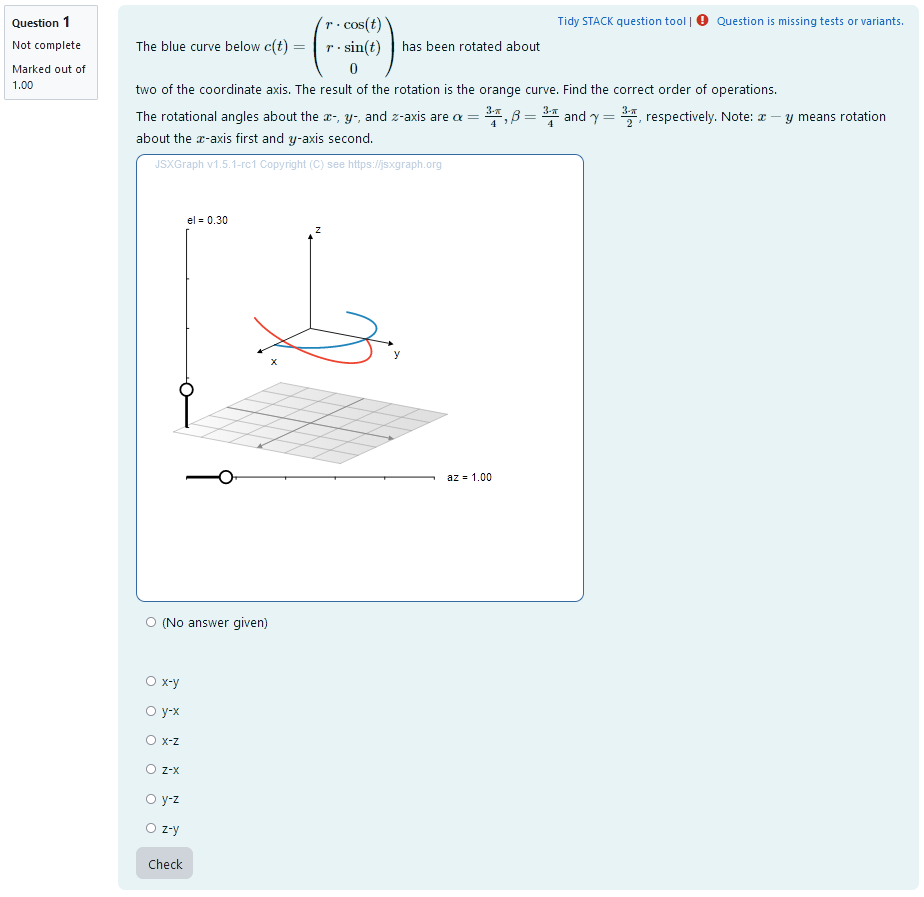
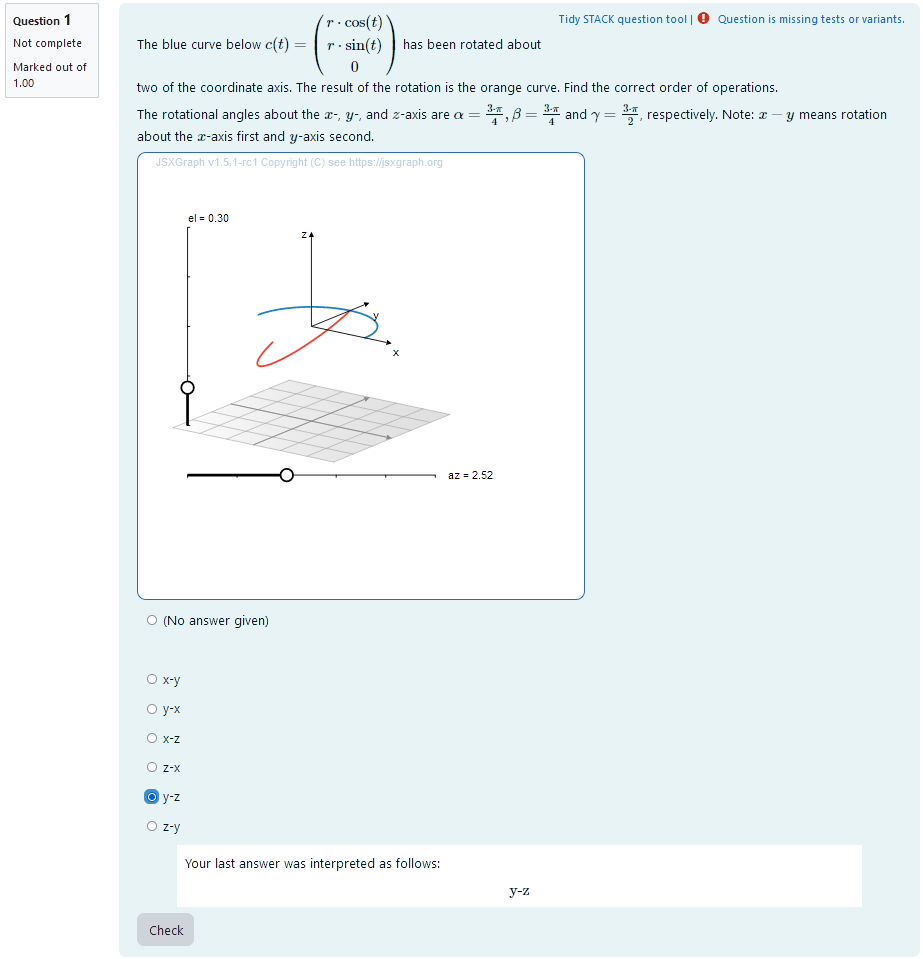
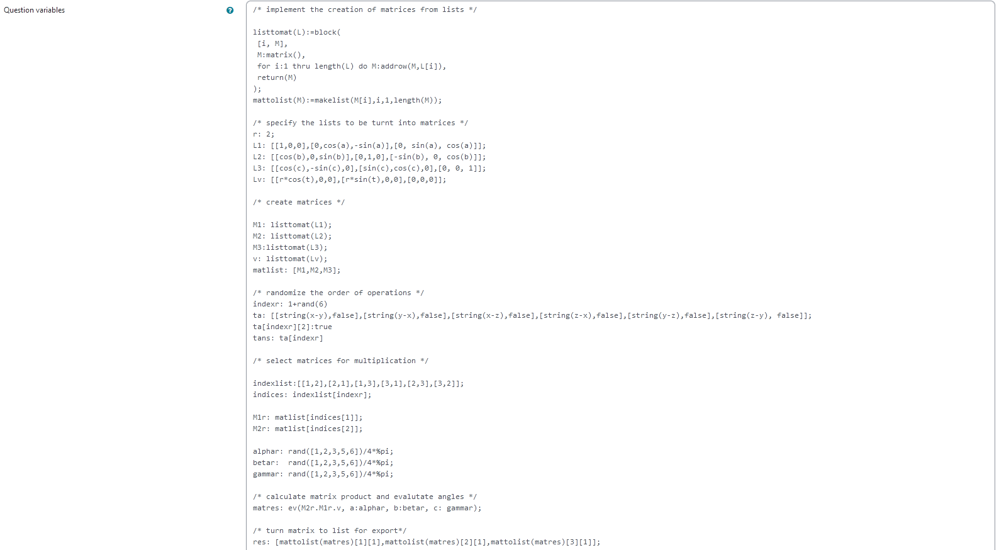
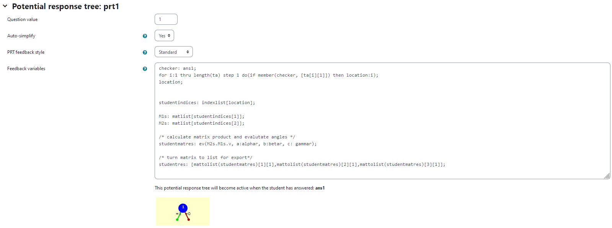
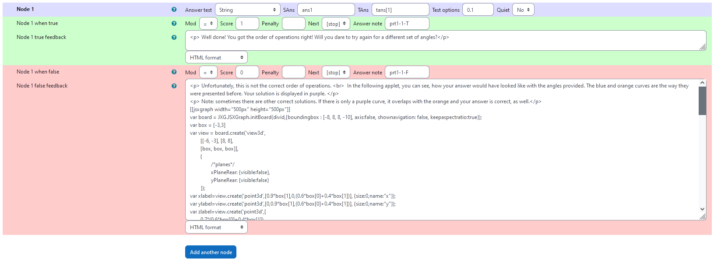
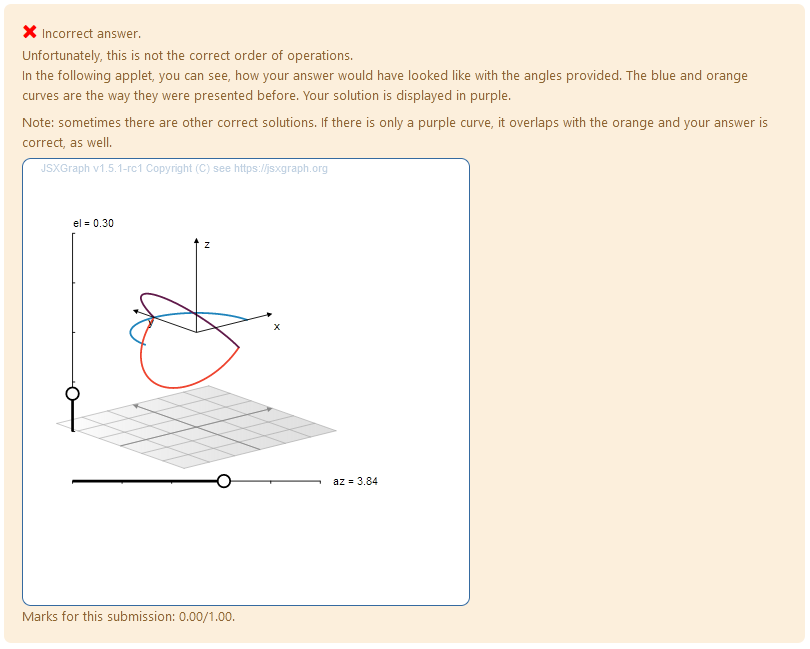

## Aim of task
+	Student knows how a multidimensional curve is produced from varying a single parameter. (Handling mathematical symbols and formalism)
+	Student knows how rotational matrices change vectors (Handling mathematical symbols and formalism)
+ Student knows that the outcome of rotations is dependent on the order of operations 
+ Student can predict how a curve will change graphically once a rotational matrix is applied (Representing mathematical entities, Making use of aids and tools)
+ Student can reconstruct the axis of rotation and the order of operations from a rotated curve (Representing mathematical entities)

|  |
|:--:|
| *First impression of the question* |

+ [XML Code](XML/quiz-IDIAM-Rotating%20a%20curve%20about%20two%20axis%20solo.xml)


## Question description

A 3D curve is plotted. It is a half circle so its orientation changes visibly after rotational matrices are applied. The curve can be parametrized as
```math
t \mapsto \begin{pmatrix} 
r \cdot \cos(t) \\
r\cdot \sin(t) \\
0
\end{pmatrix}.
```
A second curve of the same shape is plotted. Its orientation is different from the first curve. It has been rotated about two different coordinate axis. The student is provided the concrete angles of rotation for rotations about each of the coordinate axis.
They need to find out, what axis the curve was rotated about and in which order the rotations where executed.


### Student perspective

The student sees a cartesian coordinate system and a curve plotted in 3D.

They are presented with angles of rotation for each of the coordinate axis. They are asked to select the correct order of operations from a multiple choice selection.

|  |
|:--:|
| *When the student solves the problem* |


### Teacher perspective
The teacher is able to give a list of possible values for angles of rotation. In order to do this, they simply need to modify the entries in the lists specified e.g. change `alpahr : rand([1,2,3,4,5,6])/4*%pi;` to `phaser : rand([1/4,1/3,1/2,2/3])*%pi;`. 

Additionally, they can change the rotational matrices to the ones they desire. In order to do this, they need to change the entries of `L1`, `L2` and `L3`. The first entry is the first row of the matrix.
Also, they can change the curve that is rotated. To do this, they need to change the entries of `Lv`. Here the first entry is the first component, e.g. the $x$-coordinate.
They will need to change the question text as well to match the new curve and/or rotational matrices.

For an explanation of the processing of the values read **Question variables** and **Question text**.


|  |
|:--:|
| *The above image shows which values the teacher may wish to change* |


## Question code

### Question Variables
+ the possible answers are saved to a list along with the information whether the answer is correct to allow for the radiobuttons (multiple choice) format
+ one possibility is randomly selected and assigned the bool `true` - this is the correct answer
+ `alphar`, `betar`, `gammar` are randomly selected rational multiples of $\pi$ created using `rand()`, division and multiplication
+ the rotational matrices for rotations about the $x$,$y$ and $z$-axis are given as lists of 3 lists with 3 elements each, resulting in the 9 elements of a matrix
+ the lists of lists are converted to matrices using the function "listtomat" in order to perform matrix multiplications
+ the parametrized curve is saved into a vector to be eligible for matrix multiplication
+ the matrices `M1r` and `M2r` are selected as the rotational matrices using the same index as the true answer 
+ the results are evaluated for the angles and saved to the variable `matres`
+ the matrix is converted to a list `res` in order to export the results to JSXGraph


#### Question variable code
```jacascript
/* randomize the order of operations */
indexr: 1+rand(6)
ta: [[string(x-y),false],[string(y-x),false],[string(x-z),false],[string(z-x),false],[string(y-z),false],[string(z-y), false]];
ta[indexr][2]:true
tans: ta[indexr]

/* implement the creation of matrices from lists */

listtomat(L):=block(
 [i, M], 
 M:matrix(), 
 for i:1 thru length(L) do M:addrow(M,L[i]),
 return(M)
);
mattolist(M):=makelist(M[i],i,1,length(M));

/* specify the lists to be turnt into matrices */
r: 2;
L1: [[1,0,0],[0,cos(a),-sin(a)],[0, sin(a), cos(a)]];
L2: [[cos(b),0,sin(b)],[0,1,0],[-sin(b), 0, cos(b)]];
L3: [[cos(c),-sin(c),0],[sin(c),cos(c),0],[0, 0, 1]];
Lv: [[r*cos(t),0,0],[r*sin(t),0,0],[0,0,0]];

/* create matrices */

M1: listtomat(L1);
M2: listtomat(L2);
M3:listtomat(L3);
v: listtomat(Lv);

matlist: [M1,M2,M3];

/* select matrices for multiplication */

indexlist:[[1,2],[2,1],[1,3],[3,1],[2,3],[3,2]];
indices: indexlist[indexr];

M1r: matlist[indices[1]];
M2r: matlist[indices[2]];

alphar: rand([1,2,3,5,6])/4*%pi;
betar:  rand([1,2,3,5,6])/4*%pi;
gammar: rand([1,2,3,5,6])/4*%pi;

/* calculate matrix product and evalutate angles */
matres: ev(M2r.M1r.v, a:alphar, b:betar, c: gammar);

/* turn matrix to list for export*/
res: [mattolist(matres)[1][1],mattolist(matres)[2][1],mattolist(matres)[3][1]];


```

### Question Text
+ Task explanation using LaTex, importing the random values from **Question variables**
+	JSXGraph applet using and variables defined in **Question variables** plotting the 3D curve
+	`[[input:ans1]]` at the end of JSXGraph code to allow input of  answers of the student for r, a and phi and n respectively
+	`[[validation:ans1]]`is used for checking of answer

#### Question text code


```javascript
<p>The blue curve below \(c(t) = \begin{pmatrix} r\cdot \cos(t) \\ r\cdot \sin(t) \\ 0 \end{pmatrix}\) has been rotated about two of the coordinate axis. The result of the rotation is the orange curve. Find the correct order of operations.</p><p> The rotational angles about the \(x\)-, \(y\)-, and \(z\)-axis are \(\alpha = {@alphar@}, \beta = {@betar@}\) and \(\gamma = {@gammar@}\), respectively. Note: \(x-y\) means rotation about the \(x\)-axis first and \(y\)-axis second. </p>
[[jsxgraph width="500px" height="500px"]]
var board = JXG.JSXGraph.initBoard(divid,{boundingbox : [-8, 8, 8, -10], axis:false, shownavigation: false, keepaspectratio:true});
var box = [-3,3]
var view = board.create('view3d',
	[[-6, -3], [8, 8],
	[box, box, box]],
	{
		/*planes*/
		xPlaneRear: {visible:false},
		yPlaneRear: {visible:false}	
	});
var xlabel=view.create('point3d',[0.9*box[1],0,(0.6*box[0]+0.4*box[1])], {size:0,name:"x"});
var ylabel=view.create('point3d',[0,0.9*box[1],(0.6*box[0]+0.4*box[1])], {size:0,name:"y"});
var zlabel=view.create('point3d',[
        0.7*(0.6*box[0]+0.4*box[1]),
        0.7*(0.6*box[0]+0.4*box[1]),
        0.9*box[1]], 
        {size:0,name:"z"});    
       

/* define curve */

var c_base = view.create('curve3d', [
	(t) =>2* Math.cos(t),
	(t) =>2*  Math.sin(t),
	(t)=> 0,
	[0, Math.PI]], {strokeWidth: 2, strokeColor: '#1f84bc'});    
var xcoordraw =  '{#res[1]#}';
var ycoordraw =  '{#res[2]#}';
var zcoordraw =  '{#res[3]#}';	
			
var xcurve = board.jc.snippet(xcoordraw, true, 't');
var ycurve = board.jc.snippet(ycoordraw, true, 't');
var zcurve = board.jc.snippet(zcoordraw, true, 't'); 

var c_result = view.create('curve3d', [
(t) => xcurve(t),
(t) => ycurve(t),
(t) => zcurve(t),
[0, Math.PI]], {strokeWidth:2, strokeColor: '#EE442F'}); 


[[/jsxgraph]]

<p>[[input:ans1]] [[validation:ans1]]</p>
```
## Answers
### Answer ans 1
|property | setting| 
|:---|:---|
|Input type | Radiobuttons|
|Model answer | `ta` defined in **Question variables** |
| Forbidden words | none |
| Forbid float | No |
| Student must verify | Yes |
| Show the validation | Yes, with variable list|
---

## Potential response tree
### prt1

In the following, the feedback variables are given. Here, the student answer is processed to be able to show them, how their incorrect answer would look like. That way, they can compare their result to the correct solution and reflect on their train of thought leading up to the error.

+ `checker` specifies what to look for in the list `ta`, namely the student's answer `ans1`
+ in the list, the position of `ans1` is saved as the variable `location`
+ from that, the corresponding matrices `M1s` and `M2s`can be found to depict the student's answer
+ the curve is calculated and exported like the reference solution and can later be displayed using JSXGraph

Feedback variables:
```
checker: ans1;
for i:1 thru length(ta) step 1 do(if member(checker, [ta[i][1]]) then location:i);
location;


studentindices: indexlist[location];

M1s: matlist[studentindices[1]];
M2s: matlist[studentindices[2]];

/* calculate matrix product and evalutate angles */
studentmatres: ev(M2s.M1s.v, a:alphar, b:betar, c: gammar);

/* turn matrix to list for export*/
studentres: [mattolist(studentmatres)[1][1],mattolist(studentmatres)[2][1],mattolist(studentmatres)[3][1]];

```

|  |
|:--:|
| *Visualization of **prt1*** |


### Node 1
|property | setting| 
|:---|:---|
|Answer Test | String|
|SAns | `ans1`|
|TAns | `tans[1]`| 
|Node 1 true feedback | `<p> Well done! You got the order of operations right! Will you dare to try again for a different set of angles?</p>`|

#### Node 1 false feedback:

Here, the student's answer is evaluated as a rotated curve and plotted for them to compare it to the correct answer.

Code:

```JavaScript
<p> Unfortunately, this is not the correct order of operations. <br>  In the following applet, you can see, how your answer would have looked like with the angles provided. The blue and orange curves are the way they were presented before. Your solution is displayed in purple. </p>
<p> Note: sometimes there are other correct solutions. If there is only a purple curve, it overlaps with the orange and your answer is correct, as well.</p>
[[jsxgraph width="500px" height="500px"]]
var board = JXG.JSXGraph.initBoard(divid,{boundingbox : [-8, 8, 8, -10], axis:false, shownavigation: false, keepaspectratio:true});
var box = [-3,3]
var view = board.create('view3d',
	[[-6, -3], [8, 8],
	[box, box, box]],
	{
		/*planes*/
		xPlaneRear: {visible:false},
		yPlaneRear: {visible:false}	
	});
var xlabel=view.create('point3d',[0.9*box[1],0,(0.6*box[0]+0.4*box[1])], {size:0,name:"x"});
var ylabel=view.create('point3d',[0,0.9*box[1],(0.6*box[0]+0.4*box[1])], {size:0,name:"y"});
var zlabel=view.create('point3d',[
        0.7*(0.6*box[0]+0.4*box[1]),
        0.7*(0.6*box[0]+0.4*box[1]),
        0.9*box[1]], 
        {size:0,name:"z"});    
       

/* define curve */

var c_base = view.create('curve3d', [
	(t) =>2* Math.cos(t),
	(t) =>2*  Math.sin(t),
	(t)=> 0,
	[0, Math.PI]], {strokeWidth: 2, strokeColor: '#1f84bc'});    


/*curve in original applet*/

var xcoordraw =  '{#res[1]#}';
var ycoordraw =  '{#res[2]#}';
var zcoordraw =  '{#res[3]#}';	
			
var xcurve = board.jc.snippet(xcoordraw, true, 't');
var ycurve = board.jc.snippet(ycoordraw, true, 't');
var zcurve = board.jc.snippet(zcoordraw, true, 't'); 

var c_result = view.create('curve3d', [
(t) => xcurve(t),
(t) => ycurve(t),
(t) => zcurve(t),
[0, Math.PI]], {strokeWidth:2, strokeColor: '#EE442F'}); 

/* curve based on student answer */

var sxcoordraw =  '{#studentres[1]#}';
var sycoordraw =  '{#studentres[2]#}';
var szcoordraw =  '{#studentres[3]#}';	
			
var sxcurve = board.jc.snippet(sxcoordraw, true, 't');
var sycurve = board.jc.snippet(sycoordraw, true, 't');
var szcurve = board.jc.snippet(szcoordraw, true, 't'); 

var c_student = view.create('curve3d', [
(t) => sxcurve(t),
(t) => sycurve(t),
(t) => szcurve(t),
[0, Math.PI]], {strokeWidth:2, strokeColor: '#601A4A'}); 

[[/jsxgraph]]
``` 
|  |
|:--:|
| *Values of **node 1*** |

|  |
|:--:|
| *Feedback upon incorrect answer* |

