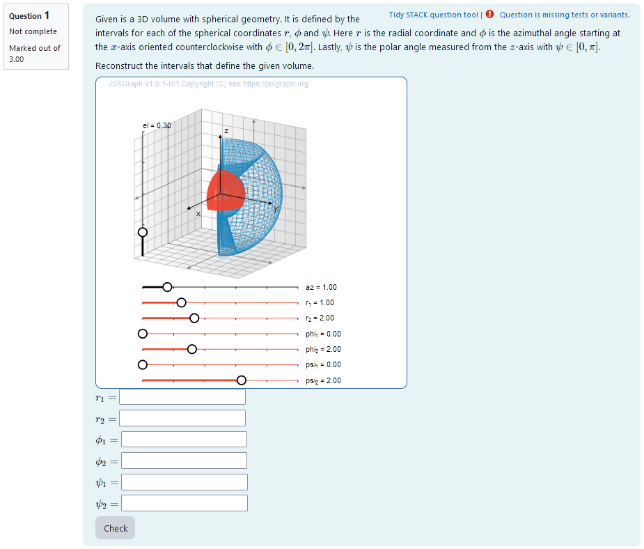
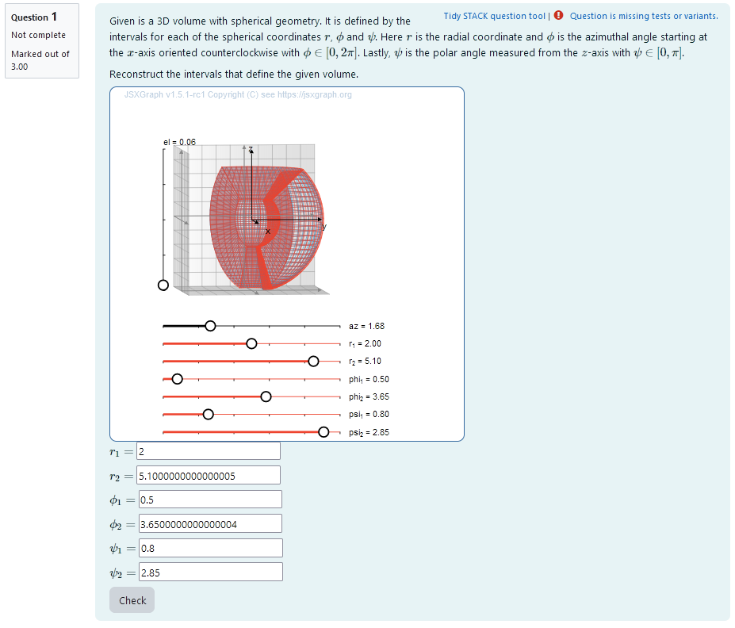
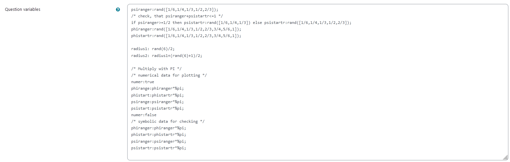
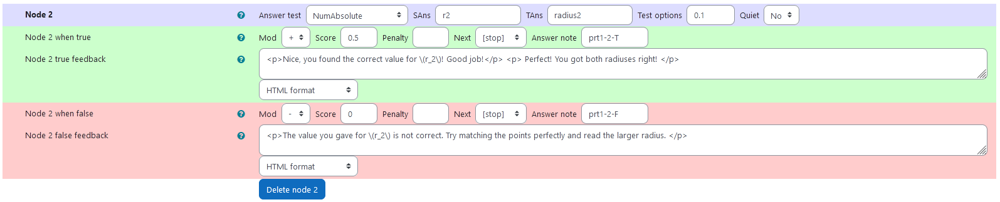
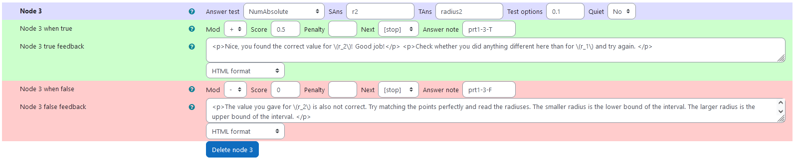
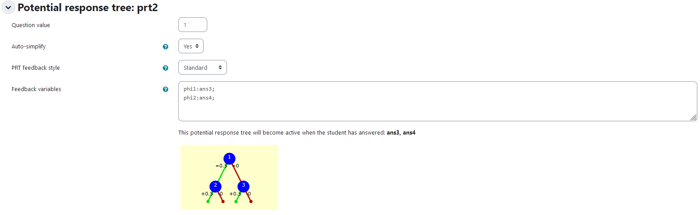
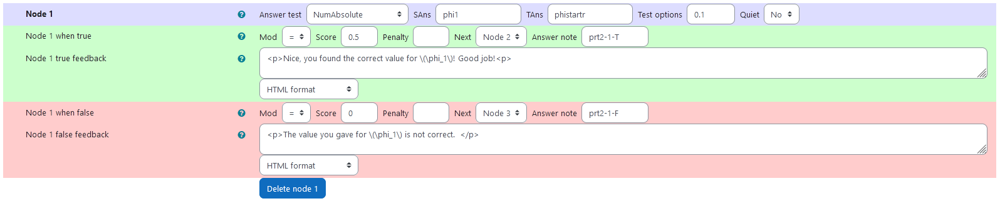
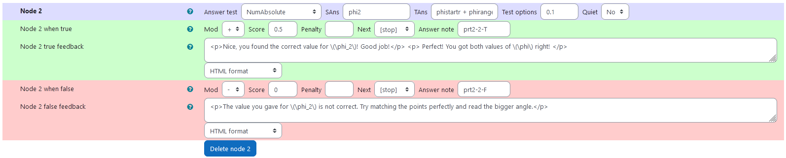
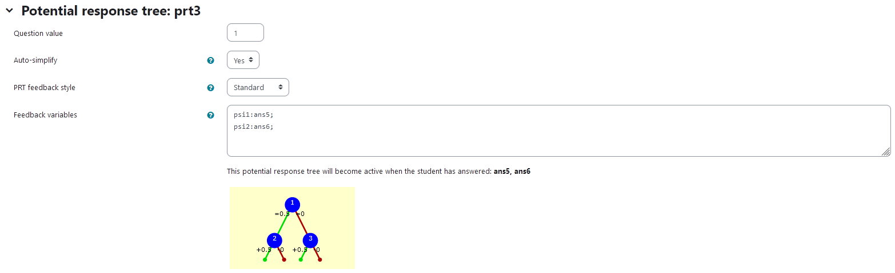
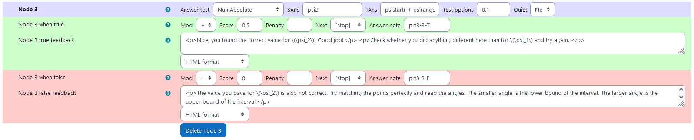

## Aim of task
+	Student knows the transformation from cartesian to spherical coordinates  (Handling mathematical symbols and formalism)
+	Student can take a volume with spherical geometry and reconstruct the limits of its radius and angles (represent mathematical entities, posing and solving mathematical problems, making use of aids and tools  )

|  |
|:--:|
| *First impression of the question* |

+ [XML Code](XML/quiz-IDIAM-Spherical%20Coordinates%20Matching.xml)

## Question description

A 3D volume is plotted. It is a randomly generated section of a ball in spherical coordinates.
An additional 3D section of a ball is plotted that can be varied using sliders.
That way, by matching the two volumes, the intervalls of radius and angles can be interactively obtained.
The task is to find the correct intervalls for $r$, $\phi$ and $\psi$ in real numbers that construct the generated volume in sperical coordinates.


### Student perspective

The student sees a cartesian coordinate system and a volume with spherical geometry.

It is the task to reconstruct the intervals of a 3D integration in spherical coordinates that results in the volume given. In order to do this they have to find out the radius and angles by matching a second volume to the given one using sliders. If they overlap exactly, the interval bounds can be read from the sliders. The values have to be given in an exact algebraic manner.

|  |
|:--:|
| *When the student solves the problem* |


### Teacher perspective
The teacher is able to give a list of possible values for interval bounds. In order to do this, they simply need to modify the entries in the lists specified e.g. change `psiranger:rand([1/6,1/4,1/3,1/2,2/3])` to `psiranger:rand([1/8,1/7,1/3])`. However, if they change this, they have to make sure $\psi$, composed by `phistartr+phiranger` is not larger than 1, since it will be multiplied by $\pi$.

Another example - in the case of the radius - is the following: change `radius1:rand(6)/2` to `radius1: rand(8)/2` in order to select numbers from 0 to 4 in steps of 1/2.

For an explanation of the processing of the values read **Question variables** and **Question text**.

**It is important to make sure that $\psi \le \pi$ and $\phi \le 2 \pi$, when changing values!** 

|  |
|:--:|
| *The above image shows which values the teacher may wish to change* |


## Question code

### Question Variables
+	phiranger and phistartr take random values of a list containing possible values for phi (needs to be multiplied by pi later)
+	psiranger and psistartr take random values of a list containing possible values for phi (needs to be multiplied by pi later)
+	radius1 and radius2 are randomly selected in steps of 1/2 and radius2 is always bigger than radius1  
+	psiranger, phiranger, psistartr and phistartr are multiplied by pi and saved as numerical values. This is done in between `numer:true` and `numer:false`.


#### Question variable code
```
psiranger:rand([1/6,1/4,1/3,1/2,2/3]);
/* check, that psiranger+psistartr<=1 */
if psiranger>=1/2 then psistartr:rand([1/6,1/4,1/3]) else psistartr:rand([1/6,1/4,1/3,1/2,2/3]);
phiranger:rand([1/6,1/4,1/3,1/2,2/3,3/4,5/6,1]);
phistartr:rand([1/6,1/4,1/3,1/2,2/3,3/4,5/6,1]);

radius1: rand(6)/2;
radius2: radius1+(rand(6)+1)/2;

/* Multiply with PI */
/* numerical data for plotting */
numer:true
phirange:phiranger*%pi;
phistart:phistartr*%pi;
psirange:psiranger*%pi;
psistart:psistartr*%pi;
numer:false
/* symbolic data for checking */
phiranger:phiranger*%pi;
phistartr:phistartr*%pi;
psiranger:psiranger*%pi;
psistartr:psistartr*%pi;
```

### Question Text
+	"Given is a 3D volume with spherical geometry. It is defined by the intervals for each of the spherical coordinates $r$, $\phi$ and $\psi$. Here $r$ is the radial coordinate and $\phi$ is the azimuthal angle starting at the $x$-axis oriented counterclockwise with $\phi\in [0, 2 \pi]$. Lastly, $\psi$ is the polar angle measured from the $z$-axis with $\psi\in [0, \pi]$. 

	Reconstruct the intervals that define the given volume."

+ Task explanation using LaTex
+	JSXGraph applet using the functions and variables defined in **Question variables** plotting the 3D volume given by the coordinates phi, psi and r
+	`[[input:ans1]]`, `[[input:ans2]]`, `[[input:ans3]]`,`[[input:ans4]]`, `[[input:ans5]]`, `[[input:ans6]]` at the end of JSXGraph code to allow input of  answers of the student for r, phi and psi respectively
+	`[[validation:ans1]]`,  `[[validation:ans2]]` , `[[validation:ans3]]`,`[[validation:ans4]]`,  `[[validation:ans5]]` , `[[validation:ans6]]`  checking of answer

#### Question text code


```javascript
<p>Given is a 3D volume with spherical geometry. It is defined by the intervals for each of the spherical coordinates \(r\), \(\phi\) and \(\psi\). Here \(r\) is the radial coordinate and \(\phi\) is the azimuthal angle starting at the \(x\)-axis oriented counterclockwise with \(\phi\in [0, 2 \pi]\). Lastly, \(\psi\) is the polar angle measured from the \(z\)-axis with \(\psi\in [0, \pi]\). </p>

<p> Reconstruct the intervals that define the given volume.  </p> 

[[jsxgraph width="500px" height="500px"  input-ref-ans1='ans1Ref' input-ref-ans2='ans2Ref' input-ref-ans3='ans3Ref' input-ref-ans4='ans4Ref' input-ref-ans5='ans5Ref' input-ref-ans6='ans6Ref']]
var board = JXG.JSXGraph.initBoard(divid,{boundingbox : [-10, 10, 10,-10], axis:false, shownavigation : false});
			var view = board.create('view3d',
		        [[-6, -1.5], [8, 8],
		        [[-5, 5], [-5, 5], [-5, 5]]],
		        {});
			// Transform components of the vector function
							
			var TF1 = (u,v,w) => u * Math.cos(v) * Math.sin(w) ;
		    var TF2 = (u,v,w) => u * Math.sin(v) * Math.sin(w) ;
		    var TF3 = (u,v,w) => u * Math.cos(w) ;

		    // define Variables init=[xlower, xinit, xupper]

		    var u1init = [0,1,4];
		    var u2init = [0,2,6];
		    var v1init = [0, 0, 6.28];
		    var v2init = [0, 2, 6.28];
		    var w1init = [0, 0, 3.14];
		    var w2init = [0, 2, 3.14];

			// Generate box, !!!! slider adjusted to the init of the board above//
		    // Create Slider for control object for student
            var u1s = board.create('slider', [[-7, -4.5], [3, -4.5], u1init], { name: 'r_1',snapwidth:0.1, highline: {strokeColor: '#EE442F'}, baseline: {strokeColor: '#EE442F'}});
            var u2s = board.create('slider', [[-7, -5.5], [3, -5.5], u2init], { name: 'r_2',snapwidth:0.1, highline: {strokeColor: '#EE442F'}, baseline: {strokeColor: '#EE442F'}});
            var v1s = board.create('slider', [[-7, -6.5], [3, -6.5], v1init], { name: '\phi_1',snapwidth:0.05, highline: {strokeColor: '#EE442F'}, baseline: {strokeColor: '#EE442F'}});
            var v2s = board.create('slider', [[-7, -7.5], [3, -7.5], v2init], { name: '\phi_2',snapwidth:0.05, highline: {strokeColor: '#EE442F'}, baseline: {strokeColor: '#EE442F'}});
            var w1s = board.create('slider', [[-7, -8.5], [3, -8.5], w1init], { name: '\psi_1',snapwidth:0.05, highline: {strokeColor: '#EE442F'}, baseline: {strokeColor: '#EE442F'}});
            var w2s = board.create('slider', [[-7, -9.5], [3, -9.5], w2init], { name: '\psi_2',snapwidth:0.05, highline: {strokeColor: '#EE442F'}, baseline: {strokeColor: '#EE442F'}});

		    

            var u1 = {#radius1#};
		    var u2 = {#radius2#};
		    var v1 = {#phistart#};
		    var v2 = {#phistart#}+{#phirange#};
		    var w1 = {#psistart#};
		    var w2 = {#psistart#}+{#psirange#};
			
			// Create transformed box
		    var c1 = view.create('parametricsurface3d', [
		        (u, v) => TF1(u,v,w1),
		        (u, v) => TF2(u,v,w1),
		        (u, v) => TF3(u,v,w1),
		        () => [u1, u2],
		        () => [v1, v2]
		        ], { strokeColor: "#1f84bc",strokeWidth: 1, strokeOpacity: 0.6,
					mesh3d: { visible: true }});

		    var c2 = view.create('parametricsurface3d', [
		        (u, v) => TF1(u,v,w2),
		        (u, v) => TF2(u,v,w2),
		        (u, v) => TF3(u,v,w2),
		        () => [u1, u2],
		        () => [v1, v2]
		        ], { strokeColor: "#1f84bc",strokeWidth: 1, strokeOpacity: 0.6,
					mesh3d: { visible: false } });

		    var c3 = view.create('parametricsurface3d', [
		        (u, w) => TF1(u,v1,w),
		        (u, w) => TF2(u,v1,w),
		        (u, w) => TF3(u,v1,w),
		        () => [u1, u2],
		        () => [w1, w2]
		        ], { strokeColor: "#1f84bc",strokeWidth: 1, strokeOpacity: 0.6,
					mesh3d: { visible: false } });
		                    
			var c4 = view.create('parametricsurface3d', [
		        (u, w) => TF1(u,v2,w),
		        (u, w) => TF2(u,v2,w),
		        (u, w) => TF3(u,v2,w),
		        () => [u1, u2],
		        () => [w1, w2]
		        ], { strokeColor: "#1f84bc",strokeWidth: 1, strokeOpacity: 0.6, mesh3d: { visible: false } });
		                        
			var c5 = view.create('parametricsurface3d', [
		        (v, w) => TF1(u1,v,w),
		        (v, w) => TF2(u1,v,w),
		        (v, w) => TF3(u1,v,w),
		        () => [v1, v2],
		        () => [w1, w2]
		        ], { strokeColor: "#1f84bc",strokeWidth: 1, strokeOpacity: 0.6, mesh3d: { visible: false } });
		                
			var c6 = view.create('parametricsurface3d', [
		        (v, w) => TF1(u2,v,w),
		        (v, w) => TF2(u2,v,w),
		        (v, w) => TF3(u2,v,w),
		        () => [v1, v2],
		        () => [w1, w2]
		        ], { strokeColor: "#1f84bc",strokeWidth: 1, strokeOpacity: 0.6, mesh3d: { visible: false } });
			
			
		    // Create transformed box - student

		    var c1s = view.create('parametricsurface3d', [
		        (u, v) => TF1(u,v,w1s.Value()),
		        (u, v) => TF2(u,v,w1s.Value()),
		        (u, v) => TF3(u,v,w1s.Value()),
		        () => [u1s.Value(), u2s.Value()],
		        () => [v1s.Value(), v2s.Value()]
		        ], {strokeColor: "#EE442F",
                    strokeWidth: 1, strokeOpacity: 0.6, mesh3d: { visible: true } });

		    var c2s = view.create('parametricsurface3d', [
		        (u, v) => TF1(u,v,w2s.Value()),
		        (u, v) => TF2(u,v,w2s.Value()),
		        (u, v) => TF3(u,v,w2s.Value()),
		        () => [u1s.Value(), u2s.Value()],
		        () => [v1s.Value(), v2s.Value()]
		        ], {strokeColor: "#EE442F",
                    strokeWidth: 1, strokeOpacity: 0.6, mesh3d: { visible: false } });

		    var c3s = view.create('parametricsurface3d', [
		        (u, w) => TF1(u,v1s.Value(),w),
		        (u, w) => TF2(u,v1s.Value(),w),
		        (u, w) => TF3(u,v1s.Value(),w),
		        () => [u1s.Value(), u2s.Value()],
		        () => [w1s.Value(), w2s.Value()]
		        ], { strokeColor: "#EE442F",
                    strokeWidth: 1, strokeOpacity: 0.6, mesh3d: { visible: false } });
		                        
			var c4s = view.create('parametricsurface3d', [
		        (u, w) => TF1(u,v2s.Value(),w),
		        (u, w) => TF2(u,v2s.Value(),w),
		        (u, w) => TF3(u,v2s.Value(),w),
		        () => [u1s.Value(), u2s.Value()],
		        () => [w1s.Value(), w2s.Value()]
		        ], { strokeColor: "#EE442F",
                    strokeWidth: 1, strokeOpacity: 0.6, mesh3d: { visible: false } });
		                        
			var c5s = view.create('parametricsurface3d', [
		        (v, w) => TF1(u1s.Value(),v,w),
		        (v, w) => TF2(u1s.Value(),v,w),
		        (v, w) => TF3(u1s.Value(),v,w),
		        () => [v1s.Value(), v2s.Value()],
		        () => [w1s.Value(), w2s.Value()]
		        ], {strokeColor: "#EE442F",
                    strokeWidth: 1, strokeOpacity: 0.6, mesh3d: { visible: false } });
		                        
			var c6s = view.create('parametricsurface3d', [
		        (v, w) => TF1(u2s.Value(),v,w),
		        (v, w) => TF2(u2s.Value(),v,w),
		        (v, w) => TF3(u2s.Value(),v,w),
		        () => [v1s.Value(), v2s.Value()],
		        () => [w1s.Value(), w2s.Value()]
		        ], { strokeColor: "#EE442F",
                    strokeWidth: 1, strokeOpacity: 0.6, mesh3d: { visible: false } });

		        stack_jxg.bind_slider(ans1Ref,u1s);
			stack_jxg.bind_slider(ans2Ref,u2s);
			stack_jxg.bind_slider(ans3Ref,v1s);
			stack_jxg.bind_slider(ans4Ref,v2s);
			stack_jxg.bind_slider(ans5Ref,w1s);
			stack_jxg.bind_slider(ans6Ref,w2s);	

/* axis labels*/
                       var xlabel=view.create('point3d',[0.9*box[1],0,(0.6*box[0]+0.4*box[1])], {size:0,name:"x"});
                       var ylabel=view.create('point3d',[0,0.9*box[1],(0.6*box[0]+0.4*box[1])], {size:0,name:"y"});
                       var zlabel=view.create('point3d',[
                           0.7*(0.6*box[0]+0.4*box[1]),
                           0.7*(0.6*box[0]+0.4*box[1]),
                           0.9*box[1]], 
                           {size:0,name:"z"});
			board.update(); 
[[/jsxgraph]]
<p>\(r_1=\) [[input:ans1]] [[validation:ans1]]</p>
<p>\(r_2=\) [[input:ans2]] [[validation:ans2]]</p>
<p>\(\phi_1 =\) [[input:ans3]] [[validation:ans3]]</p>
<p>\(\phi_2 =\) [[input:ans4]] [[validation:ans4]]</p>
<p>\(\psi_1=\)  [[input:ans5]] [[validation:ans5]]</p>
<p>\(\psi_2=\)  [[input:ans6]] [[validation:ans6]]</p>
```
## Answers
### Answer ans 1
|property | setting| 
|:---|:---|
|Input type | Numerical|
|Model answer | `radius1` defined in **Question variables** |
| Forbidden words | none |
| Forbid float | No |
| Student must verify | Yes |
| Show the validation | Yes, with variable list|
---
### Answer ans 2
|property | setting| 
|:---|:---|
|Input type | Numerical|
|Model answer | `radius2` defined in **Question variables** |
| Forbidden words | none |
| Forbid float | No |
| Student must verify | Yes |
| Show the validation | Yes, with variable list|
---
### Answer ans 3
|property | setting| 
|:---|:---|
|Input type | Numerical|
|Model answer | `phistartr` defined in **Question variables** |
| Forbidden words | none |
| Forbid float | No |
| Student must verify | Yes |
| Show the validation | Yes, with variable list|
### Answer ans 4
|property | setting| 
|:---|:---|
|Input type | Numerical|
|Model answer | `phistartr+phiranger` defined in **Question variables** |
| Forbidden words | none |
| Forbid float | No |
| Student must verify | Yes |
| Show the validation | Yes, with variable list|
---
### Answer ans 5
|property | setting| 
|:---|:---|
|Input type | Numerical|
|Model answer | `psistartr` defined in **Question variables** |
| Forbidden words | none |
| Forbid float | No |
| Student must verify | Yes |
| Show the validation | Yes, with variable list|
---
### Answer ans 6
|property | setting| 
|:---|:---|
|Input type | Numerical|
|Model answer | `psistartr+psiranger` defined in **Question variables** |
| Forbidden words | none |
| Forbid float | No |
| Student must verify | Yes |
| Show the validation | Yes, with variable list|

## Potential response tree
### prt1

Feedback variables:
```
r1:ans1
r2:ans2

```

|  |
|:--:|
| *Visualization of **prt1*** |


### Node 1
|property | setting| 
|:---|:---|
|Answer Test | NumAbsolute|
|SAns | `r1`|
|TAns | `radius1`| 
|Node 1 true feedback | `<p>Nice, you found the correct value for \(r_1\)! Good job!</p>`|
|Node 1 false feedback |`<p>The value you gave for \(r_1\) is not correct.  </p>`|


|  |
|:--:|
| *Values of **node 1*** |

### Node 2
 |property | setting| 
|:---|:---|
|Answer Test | NumAbsolute|
|SAns | `r2`|
|TAns | `radius2`| 
|Node 2 true feedback | `<p>Nice, you found the correct value for \(r_2\)! Good job!</p> <p> Perfect! You got both radiuses right! </p>`|
|Node 2 false feedback |`<p>The value you gave for \(r_2\) is not correct. Try matching the points perfectly and read the larger radius. </p>`|

|  |
|:--:|
| *Values of **node 2*** |


### Node 3
 |property | setting| 
|:---|:---|
|Answer Test | NumAbsolute|
|SAns | `r2`|
|TAns | `radius2`| 
|Node 3 true feedback | `<p>Nice, you found the correct value for \(r_2\)! Good job!</p> <p>Check whether you did anything different here than for \(r_1\) and try again. </p>`|
|Node 3 false feedback |`<p>The value you gave for \(r_2\) is also not correct. Try matching the points perfectly and read the radiuses. The smaller radius is the lower bound of the interval. The larger radius is the upper bound of the interval. </p>`|

|  |
|:--:|
| *Values of **node 3*** |


### prt2

Feedback variables:
```
phi1:ans3;
phi2:ans4;

```

|  |
|:--:|
| *Visualization of **prt2*** |


### Node 1
|property | setting| 
|:---|:---|
|Answer Test | NumAbsolute|
|SAns | `phi1`|
|TAns | `phistartr`| 
|Node 1 true feedback | `<p>Nice, you found the correct value for \(\phi_1\)! Good job!<p>`|
|Node 1 false feedback |`<p>The value you gave for \(\phi_1\) is not correct.  </p>`|

|  |
|:--:|
| *Values of **node 1*** |


### Node 2
 |property | setting| 
|:---|:---|
|Answer Test | NumAbsolute|
|SAns | `phi2`|
|TAns | `phistartr + phiranger`| 
|Node 2 true feedback | `<p>Nice, you found the correct value for \(\phi_2\)! Good job!</p> <p> Perfect! You got both values of \(\phi\) right! </p>`|
|Node 2 false feedback |`<p>The value you gave for \(\phi_2\) is not correct. Try matching the points perfectly and read the bigger angle.</p>`|

|  |
|:--:|
| *Values of **node 2*** |

### Node 3
 |property | setting| 
|:---|:---|
|Answer Test | NumAbsolute|
|SAns | `phi2`|
|TAns | `phistartr + phiranger`| 
|Node 3 true feedback | `<p>Nice, you found the correct value for \(\phi_2\)! Good job!</p> <p>Check whether you did anything different here than for \(\phi_1\) and try again. </p>`|
|Node 3 false feedback |`<p>The value you gave for \(\phi_2\) is also not correct. Try matching the points perfectly and read the angles. The smaller angle is the lower bound of the interval. The larger angle is the upper bound of the interval.</p>`|

|  |
|:--:|
| *Values of **node 3*** |

### prt3

Feedback variables:
```
psi1:ans5;
psi2:ans6;

```

|  |
|:--:|
| *Visualization of **prt3*** |


### Node 1
|property | setting| 
|:---|:---|
|Answer Test | NumAbsolute|
|SAns | `psi1`|
|TAns | `psistartr`| 
|Node 1 true feedback | `<p>Nice, you found the correct value for \(\psi_1\)! Good job!<p>`|
|Node 1 false feedback |`<p>The value you gave for \(\psi_1\) is not correct.  </p>`|

|  |
|:--:|
| *Values of **node 1*** |

### Node 2
 |property | setting| 
|:---|:---|
|Answer Test | NumAbsolute|
|SAns | `psi2`|
|TAns | `psistartr + psiranger`| 
|Node 2 true feedback | `<p>Nice, you found the correct value for \(\psi_2\)! Good job!</p> <p> Perfect! You got both values of \(\psi\) right! </p>`|
|Node 2 false feedback |`<p>The value you gave for \(\psi_2\) is not correct. Try matching the points perfectly and read the bigger angle. </p>`|

|  |
|:--:|
| *Values of **node 2*** |

### Node 3
 |property | setting| 
|:---|:---|
|Answer Test | NumAbsolute|
|SAns | `psi2`|
|TAns | `psistartr + psiranger`| 
|Node 3 true feedback | `<p>Nice, you found the correct value for \(\psi_2\)! Good job!</p> <p>Check whether you did anything different here than for \(\psi_1\) and try again. </p>`|
|Node 3 false feedback |`<p>The value you gave for \(\psi_2\) is also not correct. Try matching the points perfectly and read the angles. The smaller angle is the lower bound of the interval. The larger angle is the upper bound of the interval.</p>`|

|  |
|:--:|
| *Values of **node 3*** |
