## Aim of task
+	Student knows the transformation from cartesian to spherical coordinates  (Handling mathematical symbols and formalism)
+	Student can reconstruct the limits of the radius and angles from a 3D model of a volume with spherical geometry (represent mathematical entities, posing and solving mathematical problems, making use of aids and tools  )

| 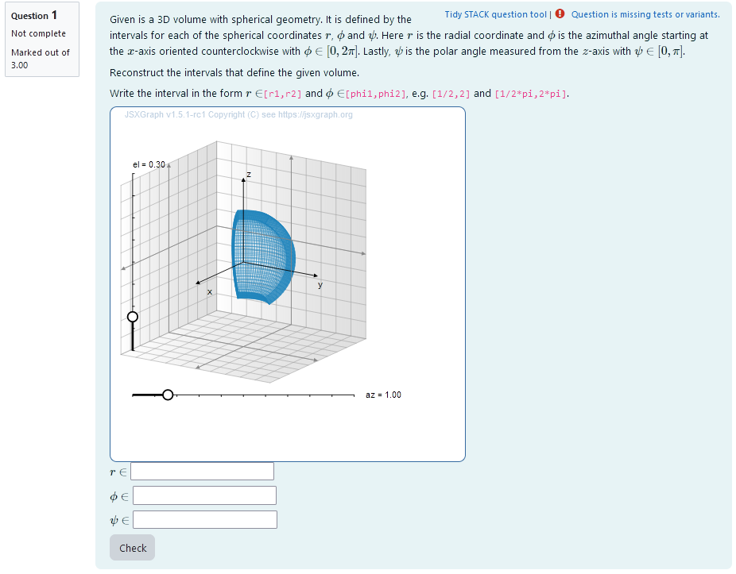 |
|:--:|
| *First impression of the question* |

## Question description

A 3D volume is plotted. It is a randomly generated section of a ball in spherical coordinates.

The task is to find the correct intervalls for $r$, $\phi$ and $\psi$ in real numbers that construct the generated volume in sperical coordinates.


### Student perspective


The student sees a cartesian coordinate system and a volume with spherical geometry.

It is the task to reconstruct the intervals of a 3D integration in spherical coordinates that results in the volume given. In order to do this they have to find out the radius and angles by rotating the volume with the sliders. That way they can look at different projections of the volume and deduce the limits.

| 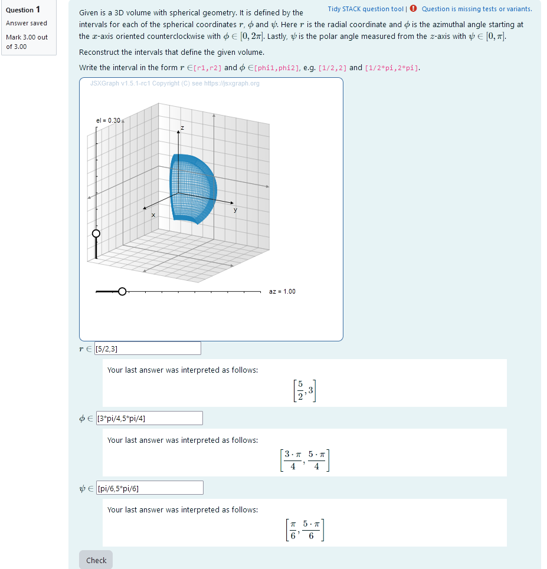 |
|:--:|
| *When the student solves the problem* |

### Teacher perspective
The teacher is able to give a list of possible values for interval bounds. In order to do this, they simply need to modify the entries in the lists specified e.g. change `psiranger:rand([1/6,1/4,1/3,1/2,2/3])` to `psiranger:rand([1/8,1/7,1/3])`. However, if they change this, they have to make sure $\psi$, composed by `phistartr+phiranger` is not larger than 1, since it will be multiplied by $\pi$.

Another example - in the case of the radius - is the following: change `radius1:rand(6)/2` to `radius1: rand(8)/2` in order to select numbers from 0 to 4 in steps of 1/2.

For an explanation of the processing of the values read **Question variables** and **Question text**.

**It is important to make sure that $\psi \le \pi$ and $\phi \le 2 \pi$, when changing values!** 


| 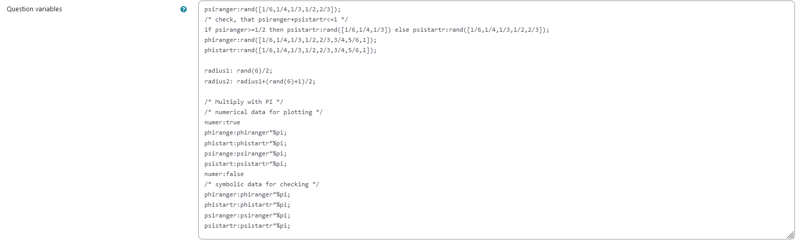 |
|:--:|
| *The above image shows which values the teacher may wish to change* |


## Question code

### Question Variables
+	phiranger and phistartr take random values of a list containing possible values for phi (needs to be multiplied by pi later)
+	psiranger and psistartr take random values of a list containing possible values for phi (needs to be multiplied by pi later)
+	radius1 and radius2 are randomly selected in steps of 1/2 and radius2 is always bigger than radius1  
+	psiranger, phiranger, psistartr and phistartr are multiplied by pi and saved as numerical values. This is done in between `numer:true` and `numer:false`.


#### Question variable code
```jacascript
psiranger:rand([1/6,1/4,1/3,1/2,2/3]);
/* check, that psiranger+psistartr<=1 */
if psiranger>=1/2 then psistartr:rand([1/6,1/4,1/3]) else psistartr:rand([1/6,1/4,1/3,1/2,2/3]);
phiranger:rand([1/6,1/4,1/3,1/2,2/3,3/4,5/6,1]);
phistartr:rand([1/6,1/4,1/3,1/2,2/3,3/4,5/6,1]);

radius1: rand(6)/2;
radius2: radius1+(rand(6)+1)/2;

/* Multiply with PI */
/* numerical data for plotting */
numer:true
phirange:phiranger*%pi;
phistart:phistartr*%pi;
psirange:psiranger*%pi;
psistart:psistartr*%pi;
numer:false
/* symbolic data for checking */
phiranger:phiranger*%pi;
phistartr:phistartr*%pi;
psiranger:psiranger*%pi;
psistartr:psistartr*%pi;
```

### Question Text
+	"Given is a 3D volume with spherical geometry. It is defined by the intervals for each of the spherical coordinates $r$, $\phi$ and $\psi$. Here $r$ is the radial coordinate and $\phi$ is the azimuthal angle starting at the $x$-axis oriented counterclockwise with $\phi\in [0, 2 \pi]$. Lastly, $\psi$ is the polar angle measured from the $z$-axis with $\psi\in [0, \pi]$. 

	Reconstruct the intervals that define the given volume.

	 Write the interval in the form $r\in$`[r1,r2]` and  $\phi\in$ `[phi1,phi2]`, e.g. `[1/2,2]` and `[1/2*pi,2*pi]`.
”
+ Task explanation using LaTex
+	JSXGraph applet using the functions and variables defined in **Question variables** plotting the 3D volume given by the coordinates phi, psi and r
+	`[[input:ans1]]`, `[[input:ans2]]`, `[[input:ans3]]` at the end of JSXGraph code to allow input of  answers of the student for r, phi and psi respectively
+	`[[validation:ans1]]`,  `[[validation:ans2]]` , `[[validation:ans3]]`  checking of answer

#### Question text code


```javascript
<p>Given is a 3D volume with spherical geometry. It is defined by the intervals for each of the spherical coordinates \(r\), \(\phi\) and \(\psi\). Here \(r\) is the radial coordinate and \(\phi\) is the azimuthal angle starting at the \(x\)-axis oriented counterclockwise with \(\phi\in [0, 2 \pi]\). Lastly, \(\psi\) is the polar angle measured from the \(z\)-axis with \(\psi\in [0, \pi]\). </p>

<p> Reconstruct the intervals that define the given volume.  </p> 

<p> Write the interval in the form \(r\in\)<code>[r1,r2]</code> and  \(\phi\in\)<code>[phi1,phi2]</code>, e.g. <code>[1/2,2]</code> and <code>[1/2*pi,2*pi]</code>.</p>

[[jsxgraph width="500px" height="500px" input-ref-ans1='ans1Ref']]
var board = JXG.JSXGraph.initBoard(divid,{boundingbox : [-8, 8, 8,-8], axis:false, shownavigation : false});
                        var box = [-5,5];
                        var view = board.create('view3d',
		                            [[-6, -3], [8, 8],
		                            [box, box, box]],
		                            {});

		                       // Transform components of the vector function

		                       var TF1 = (u,v,w) => u * Math.cos(v)* Math.sin(w) ;
		                       var TF2 = (u,v,w) => u * Math.sin(v)* Math.sin(w) ;
		                       var TF3 = (u,v,w) => u * Math.cos(w);

		                
	
		                      // Create Slider
		                       var u1ref = {#radius1#};
		                       var u2ref = {#radius2#};
		                       var v1ref = {#phistart#};
		                       var v2ref = {#phistart#}+{#phirange#};
		                       var w1ref = {#psistart#};
		                       var w2ref = {#psistart#}+{#psirange#};

// create volume

              var c1,c2,c3,c4,c5,c6; 
              createRefVolume ();

//define function
		                                       function createRefVolume () {
                                            // Create transformed box
                    c1 = view.create('parametricsurface3d', [
                        (u, v) => TF1(u,v,w1ref),
                        (u, v) => TF2(u,v,w1ref),
                        (u, v) => TF3(u,v,w1ref),
                        () => [u1ref, u2ref],
                        () => [v1ref, v2ref]
                    ], { strokeWidth: 1, strokeOpacity: 0.6, mesh3d: { visible: true }, strokeColor: "#1f84bc" });

                    c2 = view.create('parametricsurface3d', [
                        (u, v) => TF1(u,v,w2ref),
                        (u, v) => TF2(u,v,w2ref),
                        (u, v) => TF3(u,v,w2ref),
                        () => [u1ref, u2ref],
                        () => [v1ref, v2ref]
                    ], { strokeWidth: 1, strokeOpacity: 0.6, mesh3d: { visible: false }, strokeColor: "#1f84bc" });

                    c3 = view.create('parametricsurface3d', [
                        (u, w) => TF1(u,v1ref,w),
                        (u, w) => TF2(u,v1ref,w),
                        (u, w) => TF3(u,v1ref,w),
                        () => [u1ref, u2ref],
                        () => [w1ref, w2ref]
                    ], { strokeWidth: 1, strokeOpacity: 0.6, mesh3d: { visible: false }, strokeColor: "#1f84bc" });
                    c4 = view.create('parametricsurface3d', [
                        (u, w) => TF1(u,v2ref,w),
                        (u, w) => TF2(u,v2ref,w),
                        (u, w) => TF3(u,v2ref,w),
                        () => [u1ref, u2ref],
                        () => [w1ref, w2ref]
                    ], { strokeWidth: 1, strokeOpacity: 0.6, mesh3d: { visible: false }, strokeColor: "#1f84bc" });
                    c5 = view.create('parametricsurface3d', [
                        (v, w) => TF1(u1ref,v,w),
                        (v, w) => TF2(u1ref,v,w),
                        (v, w) => TF3(u1ref,v,w),
                        () => [v1ref, v2ref],
                        () => [w1ref, w2ref]
                    ], { strokeWidth: 1, strokeOpacity: 0.6, mesh3d: { visible: false }, strokeColor: "#1f84bc" });
                    c6 = view.create('parametricsurface3d', [
                        (v, w) => TF1(u2ref,v,w),
                        (v, w) => TF2(u2ref,v,w),
                        (v, w) => TF3(u2ref,v,w),
                        () => [v1ref, v2ref],
                        () => [w1ref, w2ref]
                    ], { strokeWidth: 1, strokeOpacity: 0.6, mesh3d: { visible: false }, strokeColor: "#1f84bc" });

                    }
board.update();

/* axis labels*/
                       var xlabel=view.create('point3d',[0.9*box[1],0,(0.6*box[0]+0.4*box[1])], {size:0,name:"x"});
                       var ylabel=view.create('point3d',[0,0.9*box[1],(0.6*box[0]+0.4*box[1])], {size:0,name:"y"});
                       var zlabel=view.create('point3d',[
                           0.7*(0.6*box[0]+0.4*box[1]),
                           0.7*(0.6*box[0]+0.4*box[1]),
                           0.9*box[1]], 
                           {size:0,name:"z"});

[[/jsxgraph]]
<p>\(r\in\) [[input:ans1]] [[validation:ans1]]</p>
<p>\(\phi \in\) [[input:ans2]] [[validation:ans2]]</p>
<p>\(\psi\in\)  [[input:ans3]] [[validation:ans3]]</p>
```
## Answers
### Answer ans 1
|property | setting| 
|:---|:---|
|Input type | Algebraic input|
|Model answer | `[radius1, radius2]` defined in **Question variables** |
| Forbidden words | none |
| Forbid float | No |
| Student must verify | Yes |
| Show the validation | Yes, with variable list|
---
### Answer ans 2
|property | setting| 
|:---|:---|
|Input type | Algebraic input|
|Model answer | `[phistartr,phistartr+phiranger]` defined in **Question variables** |
| Forbidden words | none |
| Forbid float | Yes |
| Student must verify | Yes |
| Show the validation | Yes, with variable list|
---
### Answer ans 3
|property | setting| 
|:---|:---|
|Input type | Algebraic input|
|Model answer | `[psistartr,psistartr+psiranger]` defined in **Question variables** |
| Forbidden words | none |
| Forbid float | Yes |
| Student must verify | Yes |
| Show the validation | Yes, with variable list|

## Potential response tree
### prt1

Feedback variables:
```
r1:ans1[1]
r2:ans1[2]

```

|  |
|:--:|
| *Visualization of **prt1*** |


### Node 1
|property | setting| 
|:---|:---|
|Answer Test | AlgEquiv|
|SAns | `r1`|
|TAns | `radius1`| 
|Node 1 true feedback | `<p>Nice, you found the correct value for \(r_1\)! Good job!</p>`|
|Node 1 false feedback |`<p>The value you gave for \(r_1\) is not correct.  </p>`|


|  |
|:--:|
| *Values of **node 1*** |

### Node 2
 |property | setting| 
|:---|:---|
|Answer Test | AlgEquiv|
|SAns | `r2`|
|TAns | `radius2`| 
|Node 2 true feedback | `<p>Nice, you found the correct value for \(r_2\)! Good job!</p> <p> Perfect! You got both radiuses right! </p>`|
|Node 2 false feedback |`<p>The value you gave for \(r_2\) is not correct. Make sure, you're giving the values in the format specified in the task explanation.</p>`|

| 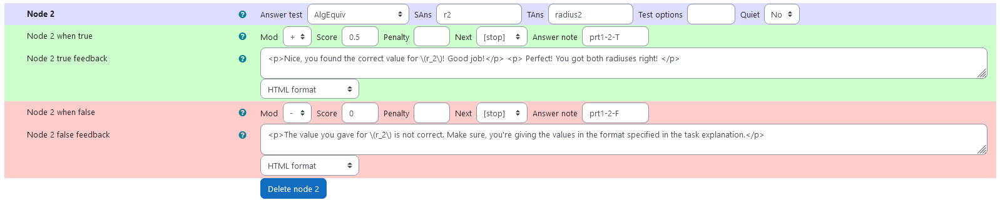 |
|:--:|
| *Values of **node 2*** |


### Node 3
 |property | setting| 
|:---|:---|
|Answer Test | AlgEquiv|
|SAns | `r2`|
|TAns | `radius2`| 
|Node 3 true feedback | `<p>Nice, you found the correct value for \(r_2\)! Good job!</p> <p>Check whether you did anything different here than for \(r_1\) and try again. </p>`|
|Node 3 false feedback |`<p>The value you gave for \(r_2\) is also not correct. Make sure, you're giving the values in the format specified in the task explanation.</p>`|

| 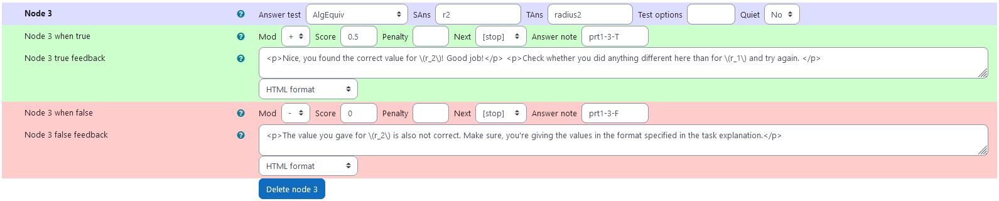 |
|:--:|
| *Values of **node 3*** |


### prt2

Feedback variables:
```
phi1:ans2[1]
phi2:ans2[2]

```

|  |
|:--:|
| *Visualization of **prt2*** |


### Node 1
|property | setting| 
|:---|:---|
|Answer Test | AlgEquiv|
|SAns | `phi1`|
|TAns | `phistartr`| 
|Node 1 true feedback | `<p>Nice, you found the correct value for \(\phi_1\)! Good job!<p>`|
|Node 1 false feedback |`<p>The value you gave for \(\phi_1\) is not correct.  </p>`|

| 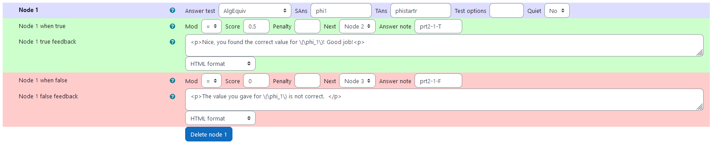 |
|:--:|
| *Values of **node 1*** |

### Node 2
 |property | setting| 
|:---|:---|
|Answer Test | AlgEquiv|
|SAns | `phi2`|
|TAns | `phistartr + phiranger`| 
|Node 2 true feedback | `<p>Nice, you found the correct value for \(\phi_2\)! Good job!</p> <p> Perfect! You got both values of \(\phi\) right! </p>`|
|Node 2 false feedback |`<p>The value you gave for \(\phi_2\) is not correct. Make sure, you're giving the values in the format specified in the task explanation.</p>`|

| 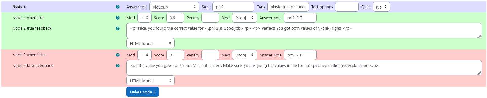 |
|:--:|
| *Values of **node 2*** |

### Node 3
 |property | setting| 
|:---|:---|
|Answer Test | AlgEquiv|
|SAns | `phi2`|
|TAns | `phistartr + phiranger`| 
|Node 3 true feedback | `<p>Nice, you found the correct value for \(\phi_2\)! Good job!</p> <p>Check whether you did anything different here than for \(\phi_1\) and try again. </p>`|
|Node 3 false feedback |`<p>The value you gave for \(\phi_2\) is also not correct. Make sure, you're giving the values in the format specified in the task explanation.</p>`|

| 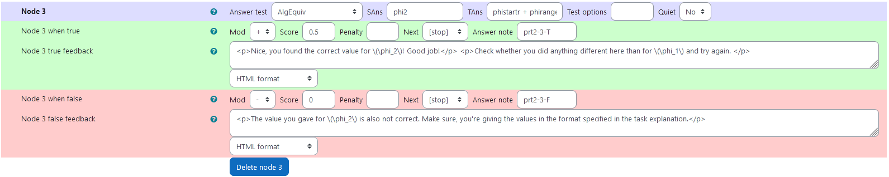 |
|:--:|
| *Values of **node 3*** |

### prt3

Feedback variables:
```
psi1:ans3[1]
psi2:ans3[2]

```

|  |
|:--:|
| *Visualization of **prt3*** |


### Node 1
|property | setting| 
|:---|:---|
|Answer Test | AlgEquiv|
|SAns | `psi1`|
|TAns | `psistartr`| 
|Node 1 true feedback | `<p>Nice, you found the correct value for \(\psi_1\)! Good job!<p>`|
|Node 1 false feedback |`<p>The value you gave for \(\psi_1\) is not correct.  </p>`|

| 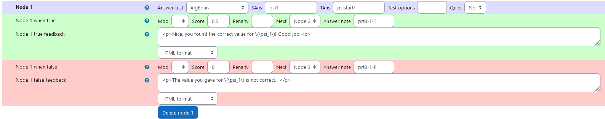 |
|:--:|
| *Values of **node 1*** |


### Node 2
 |property | setting| 
|:---|:---|
|Answer Test | AlgEquiv|
|SAns | `psi2`|
|TAns | `psistartr + psiranger`| 
|Node 2 true feedback | `<p>Nice, you found the correct value for \(\psi_2\)! Good job!</p> <p> Perfect! You got both values of \(\psi\) right! </p>` + Applet|
|Node 2 false feedback |`<p>The value you gave for \(\psi_2\) is not correct.  Make sure, you're giving the values in the format specified in the task explanation.</p>` + Applet|


| 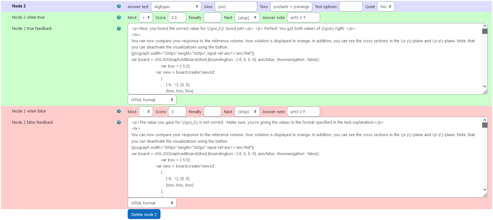 |
|:--:|
| *Values of **node 2*** |

### Node 3
 |property | setting| 
|:---|:---|
|Answer Test | AlgEquiv|
|SAns | `psi2`|
|TAns | `psistartr + psiranger`| 
|Node 3 true feedback | `<p>Nice, you found the correct value for \(\psi_2\)! Good job!</p> <p>Check whether you did anything different here than for \(\psi_1\) and try again. </p>` + Applet|
|Node 3 false feedback |`<p>The value you gave for \(\psi_2\) is also not correct. Make sure, you're giving the values in the format specified in the task explanation.</p>` + Applet|

| 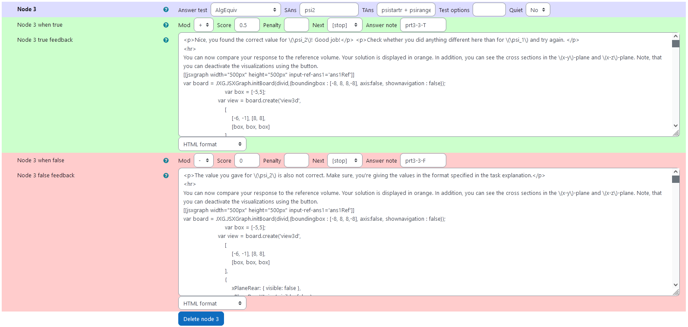 |
|:--:|
| *Values of **node 3*** |


## PRT 3 Visual feedback
Additionally to the written feedback, there is a graphical feedback provided within PRT 3. The intervals are taken from the student's answer and the corresponding volume is plotted. Also, to facilitate comparing both of the columes, their cross sections with the x-y, and x-z plane are depicted. All of the visualizations can be toggled by clicking on the respective button in the applet.

### Feedback applet code
 
```javascrpict
[[jsxgraph width="500px" height="500px" input-ref-ans1='ans1Ref']]
var board = JXG.JSXGraph.initBoard(divid,{boundingbox : [-8, 8, 8,-8], axis:false, shownavigation : false});
                        var box = [-5,5];
                    var view = board.create('view3d',
                        [
                            [-6, -1], [8, 8],
                            [box, box, box]
                        ],
                        {
                            xPlaneRear: { visible: false },
                            xPlaneRearYAxis: { visible: false },
                            xPlaneRearZAxis: { visible: false },
                            yPlaneRear: { visible: false },
                            yPlaneRearXAxis: { visible: false },
                            yPlaneRearZAxis: { visible: false },
                        });
 
                    // axis labels
                       var xlabel=view.create('point3d',[0.9*box[1],0,(0.6*box[0]+0.4*box[1])], {size:0,name:"x"});
                       var ylabel=view.create('point3d',[0,0.9*box[1],(0.6*box[0]+0.4*box[1])], {size:0,name:"y"});
                       var zlabel=view.create('point3d',[
                           0.7*(0.6*box[0]+0.4*box[1]),
                           0.7*(0.6*box[0]+0.4*box[1]),
                           0.9*box[1]], 
                           {size:0,name:"z"}); 
                    
                    var vector = []; 
                    var objectListXYPlane = []; 
                    var objectListXZPlane = []; 
                    var listRefVolume= []; 
                    var listStudVolume = [];
                    var scaleVec = 0.5;
                    var c1,c2,c3,c4,c5,c6;
                    var cs1,cs2,cs3,cs4,cs5,cs6;

		            // Transform components of the vector function

		            var TF1 = (u,v,w) => u * Math.cos(v)* Math.sin(w) ;
		            var TF2 = (u,v,w) => u * Math.sin(v)* Math.sin(w) ;
		            var TF3 = (u,v,w) => u * Math.cos(w);

		                
	
		            // Create Slider
		                        var u1ref = {#radius1#};
		                        var u2ref = {#radius2#};
		                        var v1ref = {#phistart#};
		                        var v2ref = {#phistart#}+{#phirange#};
		                        var w1ref = {#psistart#};
		                        var w2ref = {#psistart#}+{#psirange#};

                                var u1raw = '{#ans1[1]#}';
                                var u1stud = eval(u1raw.replace(/%pi/g, "Math.PI"));
                                var u2raw = '{#ans1[2]#}';
                                var u2stud = eval(u2raw.replace(/%pi/g, "Math.PI"));
                                var v1raw = '{#ans2[1]#}';
                                var v1stud = eval(v1raw.replace(/%pi/g, "Math.PI"));
                                var v2raw = '{#ans2[2]#}';
                                var v2stud = eval(v2raw.replace(/%pi/g, "Math.PI"));
                                var w1raw = '{#ans3[1]#}';
                                var w1stud = eval(w1raw.replace(/%pi/g, "Math.PI"));
                                var w2raw = '{#ans3[2]#}';
                                var w2stud = eval(w2raw.replace(/%pi/g, "Math.PI"));

                                createRefVolume ();
                    createStudVolume();

                    // list for toggeling
                    listRefVolume.push(c1.element2D,c2.element2D,c3.element2D,c4.element2D,c5.element2D,c6.element2D);
                    listStudVolume.push(cs1.element2D,cs2.element2D,cs3.element2D,cs4.element2D,cs5.element2D,cs6.element2D); 

                        

                    var XYPlane = view.create('plane3d', [
                          [0,0,0],[1,0,0], [0,1,0],
                    ], {
                        fillOpacity: 0.5, fillColor: "#1f84bc", visible:true
                    });

                    var XZPlane = view.create('plane3d', [
                          [0,0,0],[1,0,0], [0,0,1],
                    ], {
                        fillOpacity: 0.5, fillColor: "#1f84bc", visible:true
                    });

                    // curves in xy plane
                var curveRef1= view.create('curve3d', [
                    (t) => TF1(t,v1ref,Math.PI/2),
                    (t) => TF2(t,v1ref,Math.PI/2),
		            (t) => TF3(t,v1ref,Math.PI/2),
		            [u1ref, u2ref]
		            ], { strokeWidth: 3, visible: true, strokeColor: "#1f84bc" });

                var curveStud1= view.create('curve3d', [
                    (t) => TF1(t,v1stud,Math.PI/2),
                    (t) => TF2(t,v1stud,Math.PI/2),
                    (t) => TF3(t,v1stud,Math.PI/2),
                    () => [u1stud, u2stud]
                    ], { strokeWidth: 3, strokeColor:'#EE442F', visible: true });

                var curveRef2= view.create('curve3d', [
                    (t) => TF1(t,v2ref,Math.PI/2),
                    (t) => TF2(t,v2ref,Math.PI/2),
		            (t) => TF3(t,v2ref,Math.PI/2),
		            [u1ref, u2ref]
		            ], { strokeWidth: 3, visible: true, strokeColor: "#1f84bc" });

                var curveStud2= view.create('curve3d', [
                    (t) => TF1(t,v2stud,Math.PI/2),
                    (t) => TF2(t,v2stud,Math.PI/2),
                    (t) => TF3(t,v2stud,Math.PI/2),
                    () => [u1stud, u2stud]
                    ], { strokeWidth: 3, strokeColor:'#EE442F', visible: true });

                var curveRef3= view.create('curve3d', [
                    (t) => TF1(u1ref,t,Math.PI/2),
                    (t) => TF2(u1ref,t,Math.PI/2),
		            (t) => TF3(u1ref,t,Math.PI/2),
		            [v1ref, v2ref]
		            ], { strokeWidth: 3, visible: true, strokeColor: "#1f84bc" });

                var curveStud3= view.create('curve3d', [
                    (t) => TF1(u1stud,t,Math.PI/2),
                    (t) => TF2(u1stud,t,Math.PI/2),
                    (t) => TF3(u1stud,t,Math.PI/2),
                    () => [v1stud, v2stud]
                    ], { strokeWidth: 3, strokeColor:'#EE442F', visible: true });
    
                var curveRef4= view.create('curve3d', [
                    (t) => TF1(u2ref,t,Math.PI/2),
                    (t) => TF2(u2ref,t,Math.PI/2),
		            (t) => TF3(u2ref,t,Math.PI/2),
		            [v1ref, v2ref]
		            ], { strokeWidth: 3, visible: true, strokeColor: "#1f84bc" });

                var curveStud4 = view.create('curve3d', [
                    (t) => TF1(u2stud,t,Math.PI/2),
                    (t) => TF2(u2stud,t,Math.PI/2),
                    (t) => TF3(u2stud,t,Math.PI/2),
                    () => [v1stud, v2stud]
                    ], { strokeWidth: 3, strokeColor:'#EE442F', visible: true });
    
// curves in xz plane
                var curveRefXZ1= view.create('curve3d', [
                    (t) => TF1(t,0,w1ref),
                    (t) => TF2(t,0,w1ref),
		            (t) => TF3(t,0,w1ref),
		            [u1ref, u2ref]
		            ], { strokeWidth: 3, visible: true, strokeColor: "#1f84bc" });

                var curveStudXZ1= view.create('curve3d', [
                    (t) => TF1(t,0,w1stud),
                    (t) => TF2(t,0,w1stud),
                    (t) => TF3(t,0,w1stud),
                    () => [u1stud, u2stud]
                    ], { strokeWidth: 3, strokeColor:'#EE442F', visible: true });

                var curveRefXZ2= view.create('curve3d', [
                    (t) => TF1(t,0,w2ref),
                    (t) => TF2(t,0,w2ref),
		            (t) => TF3(t,0,w2ref),
		            [u1ref, u2ref]
		            ], { strokeWidth: 3, visible: true, strokeColor: "#1f84bc" });

                var curveStudXZ2= view.create('curve3d', [
                    (t) => TF1(t,0,w2stud),
                    (t) => TF2(t,0,w2stud),
                    (t) => TF3(t,0,w2stud),
                    () => [u1stud, u2stud]
                    ], { strokeWidth: 3, strokeColor:'#EE442F', visible: true });

                var curveRefXZ3= view.create('curve3d', [
                    (t) => TF1(u1ref,0,t),
                    (t) => TF2(u1ref,0,t),
		            (t) => TF3(u1ref,0,t),
		            [w1ref, w2ref]
		            ], { strokeWidth: 3, visible: true, strokeColor: "#1f84bc" });

                var curveStudXZ3= view.create('curve3d', [
                    (t) => TF1(u1stud,0,t),
                    (t) => TF2(u1stud,0,t),
                    (t) => TF3(u1stud,0,t),
                    () => [w1stud, w2stud]
                    ], { strokeWidth: 3, strokeColor: '#EE442F', visible: true });
    
                var curveRefXZ4= view.create('curve3d', [
                    (t) => TF1(u2ref,0,t),
                    (t) => TF2(u2ref,0,t),
		            (t) => TF3(u2ref,0,t),
		            [w1ref, w2ref]
		            ], { strokeWidth: 3, visible: true, strokeColor: "#1f84bc" });

                var curveStudXZ4 = view.create('curve3d', [
                    (t) => TF1(u2stud,0,t),
                    (t) => TF2(u2stud,0,t),
                    (t) => TF3(u2stud,0,t),
                    () => [w1stud, w2stud]
                    ], { strokeWidth: 3, strokeColor: '#EE442F', visible: true });

        // generate info for xy-plane
                    objectListXYPlane.push(XYPlane.element2D,curveRef1.element2D,
                        curveRef2.element2D,curveRef3.element2D,curveRef4.element2D,
                        curveStud1.element2D,curveStud2.element2D,curveStud3.element2D,
                        curveStud4.element2D);
                    objectListXZPlane.push(XZPlane.element2D,curveRefXZ1.element2D,
                        curveRefXZ2.element2D,curveRefXZ3.element2D,curveRefXZ4.element2D,
                        curveStudXZ1.element2D,curveStudXZ2.element2D,curveStudXZ3.element2D,
                        curveStudXZ4.element2D);
                    var button1 = board.create('button', [-7, -6, 'XY-plane', 
                        function() {toggleList(objectListXYPlane);}], {fixed:true});
                    var button2 = board.create('button', [-5, -6, 'XZ-plane', 
                        function() {toggleList(objectListXZPlane);}], {fixed:true});
                    var button3 = board.create('button', [-3, -6, 'Reference Volume', 
                    function() {toggleList(listRefVolume);}], {fixed:true});
                    var button4 = board.create('button', [0.5 , -6, 'Student Volume',  
                    function() {toggleList(listStudVolume);}], {fixed:true});
// function to toggle visible attribute given in a list
                    function toggleList(inputList){
                        for (let iloop=0; iloop < inputList.length; iloop++)
                        {
                            if (JXG.exists(inputList[iloop]))
                            {
                                if (inputList[iloop].getAttribute('visible')){
                                    inputList[iloop].setAttribute({visible:false});
                                }
                                else {
                                    inputList[iloop].setAttribute({visible:true});
                                    inputList[iloop].show();
                                }
                                inputList[iloop].update();
                            }
                        }
                    }
                    function createRefVolume () {
                                            // Create transformed box
                    c1 = view.create('parametricsurface3d', [
                        (u, v) => TF1(u,v,w1ref),
                        (u, v) => TF2(u,v,w1ref),
                        (u, v) => TF3(u,v,w1ref),
                        () => [u1ref, u2ref],
                        () => [v1ref, v2ref]
                    ], { strokeWidth: 1, strokeOpacity: 0.6, mesh3d: { visible: true }, strokeColor: "#1f84bc" });

                    c2 = view.create('parametricsurface3d', [
                        (u, v) => TF1(u,v,w2ref),
                        (u, v) => TF2(u,v,w2ref),
                        (u, v) => TF3(u,v,w2ref),
                        () => [u1ref, u2ref],
                        () => [v1ref, v2ref]
                    ], { strokeWidth: 1, strokeOpacity: 0.6, mesh3d: { visible: false }, strokeColor: "#1f84bc" });

                    c3 = view.create('parametricsurface3d', [
                        (u, w) => TF1(u,v1ref,w),
                        (u, w) => TF2(u,v1ref,w),
                        (u, w) => TF3(u,v1ref,w),
                        () => [u1ref, u2ref],
                        () => [w1ref, w2ref]
                    ], { strokeWidth: 1, strokeOpacity: 0.6, mesh3d: { visible: false }, strokeColor: "#1f84bc" });
                    c4 = view.create('parametricsurface3d', [
                        (u, w) => TF1(u,v2ref,w),
                        (u, w) => TF2(u,v2ref,w),
                        (u, w) => TF3(u,v2ref,w),
                        () => [u1ref, u2ref],
                        () => [w1ref, w2ref]
                    ], { strokeWidth: 1, strokeOpacity: 0.6, mesh3d: { visible: false }, strokeColor: "#1f84bc" });
                    c5 = view.create('parametricsurface3d', [
                        (v, w) => TF1(u1ref,v,w),
                        (v, w) => TF2(u1ref,v,w),
                        (v, w) => TF3(u1ref,v,w),
                        () => [v1ref, v2ref],
                        () => [w1ref, w2ref]
                    ], { strokeWidth: 1, strokeOpacity: 0.6, mesh3d: { visible: false }, strokeColor: "#1f84bc" });
                    c6 = view.create('parametricsurface3d', [
                        (v, w) => TF1(u2ref,v,w),
                        (v, w) => TF2(u2ref,v,w),
                        (v, w) => TF3(u2ref,v,w),
                        () => [v1ref, v2ref],
                        () => [w1ref, w2ref]
                    ], { strokeWidth: 1, strokeOpacity: 0.6, mesh3d: { visible: false }, strokeColor: "#1f84bc" });

                    }
                    function createStudVolume () {
                                        // Create transformed box
                        cs1 = view.create('parametricsurface3d', [
                        (u, v) => TF1(u,v,w1stud),
                        (u, v) => TF2(u,v,w1stud),
                        (u, v) => TF3(u,v,w1stud),
                        () => [u1stud, u2stud],
                        () => [v1stud, v2stud]
                    ], { strokeWidth: 1, strokeOpacity: 1, strokeColor: '#EE442F', mesh3d: { visible: true } });

                        cs2 = view.create('parametricsurface3d', [
                        (u, v) => TF1(u,v,w2stud),
                        (u, v) => TF2(u,v,w2stud),
                        (u, v) => TF3(u,v,w2stud),
                        () => [u1stud, u2stud],
                        () => [v1stud, v2stud]
                    ], { strokeWidth: 1, strokeOpacity: 1, strokeColor: '#EE442F', mesh3d: { visible: false } });

                        cs3 = view.create('parametricsurface3d', [
                        (u, w) => TF1(u,v1stud,w),
                        (u, w) => TF2(u,v1stud,w),
                        (u, w) => TF3(u,v1stud,w),
                        () => [u1stud, u2stud],
                        () => [w1stud, w2stud]
                    ], { strokeWidth: 1, strokeOpacity: 1, strokeColor: '#EE442F', mesh3d: { visible: false } });
                        cs4 = view.create('parametricsurface3d', [
                        (u, w) => TF1(u,v2stud,w),
                        (u, w) => TF2(u,v2stud,w),
                        (u, w) => TF3(u,v2stud,w),
                        () => [u1stud, u2stud],
                        () => [w1stud, w2stud]
                    ], { strokeWidth: 1, strokeOpacity: 1, strokeColor: '#EE442F', mesh3d: { visible: false } });
                        cs5 = view.create('parametricsurface3d', [
                        (v, w) => TF1(u1stud,v,w),
                        (v, w) => TF2(u1stud,v,w),
                        (v, w) => TF3(u1stud,v,w),
                        () => [v1stud, v2stud],
                        () => [w1stud, w2stud]
                    ], { strokeWidth: 1, strokeOpacity: 1, strokeColor: '#EE442F', mesh3d: { visible: false } });
                        cs6 = view.create('parametricsurface3d', [
                        (v, w) => TF1(u2stud,v,w),
                        (v, w) => TF2(u2stud,v,w),
                        (v, w) => TF3(u2stud,v,w),
                        () => [v1stud, v2stud],
                        () => [w1stud, w2stud]
                    ], { strokeWidth: 1, strokeOpacity: 1, strokeColor: '#EE442F', mesh3d: { visible: false } });


                    }       
board.update();


[[/jsxgraph]]
```
| 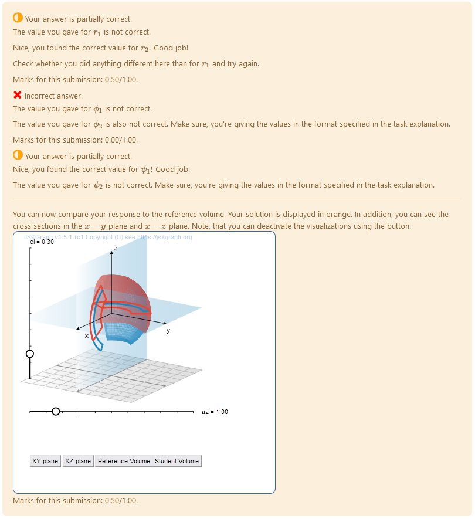 |
|:--:|
| *Feedback applet with the reference volume, student volume and cross sections with coordinate planes.* |


## Todo:
* [x] Improve PRT
