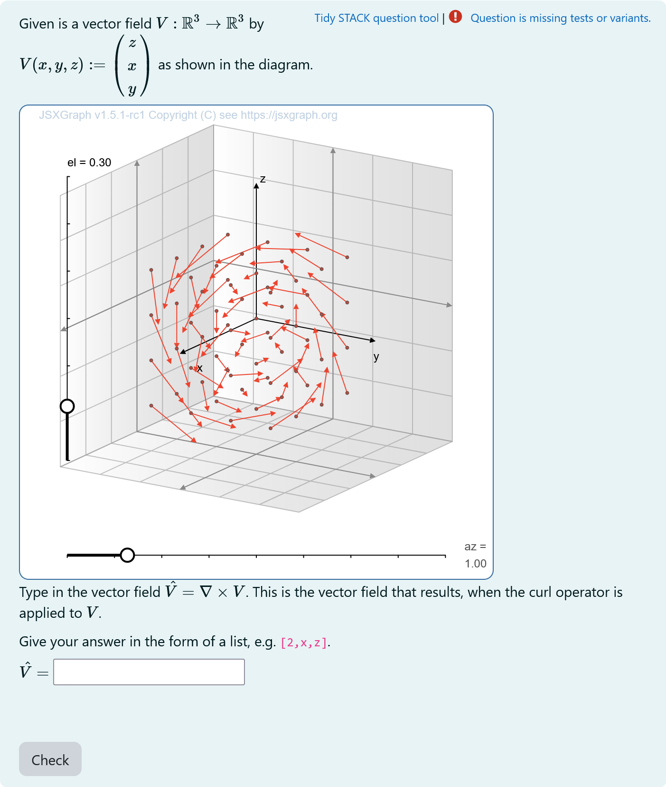
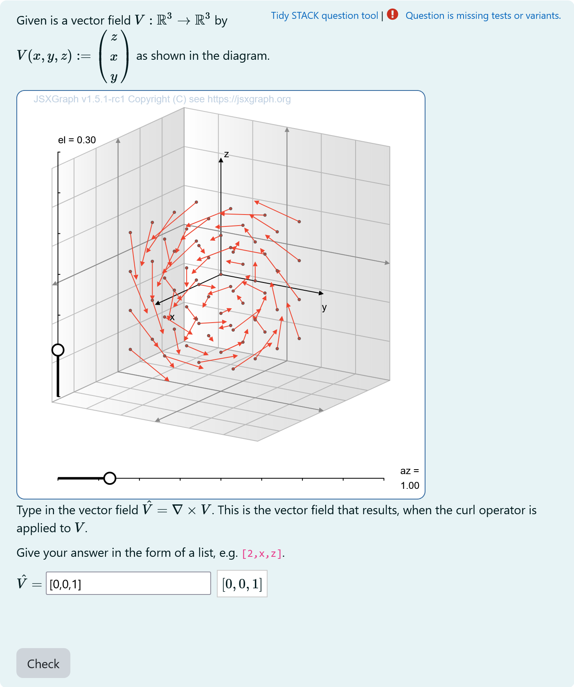
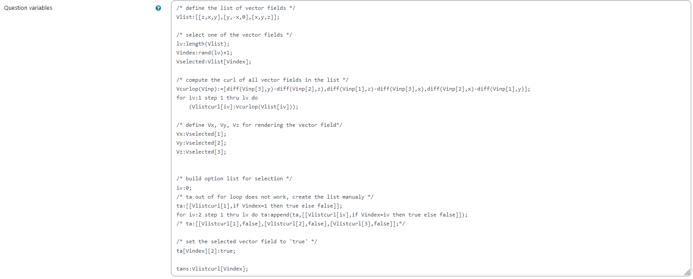
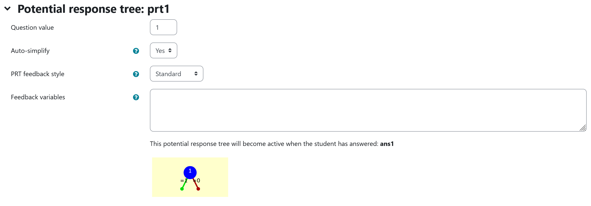
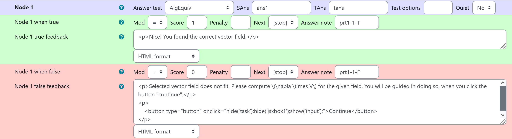
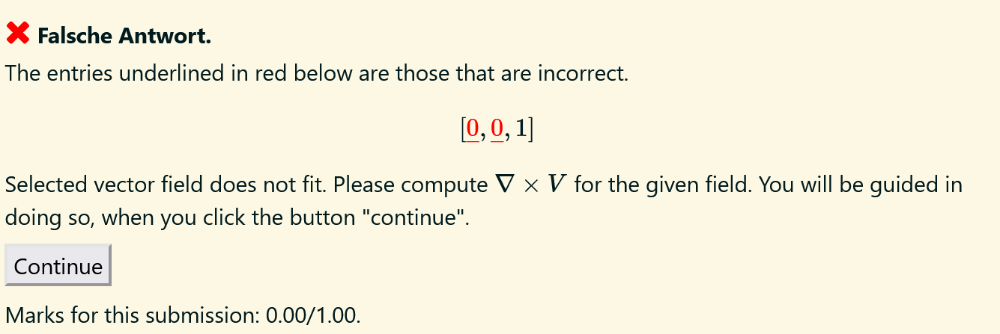
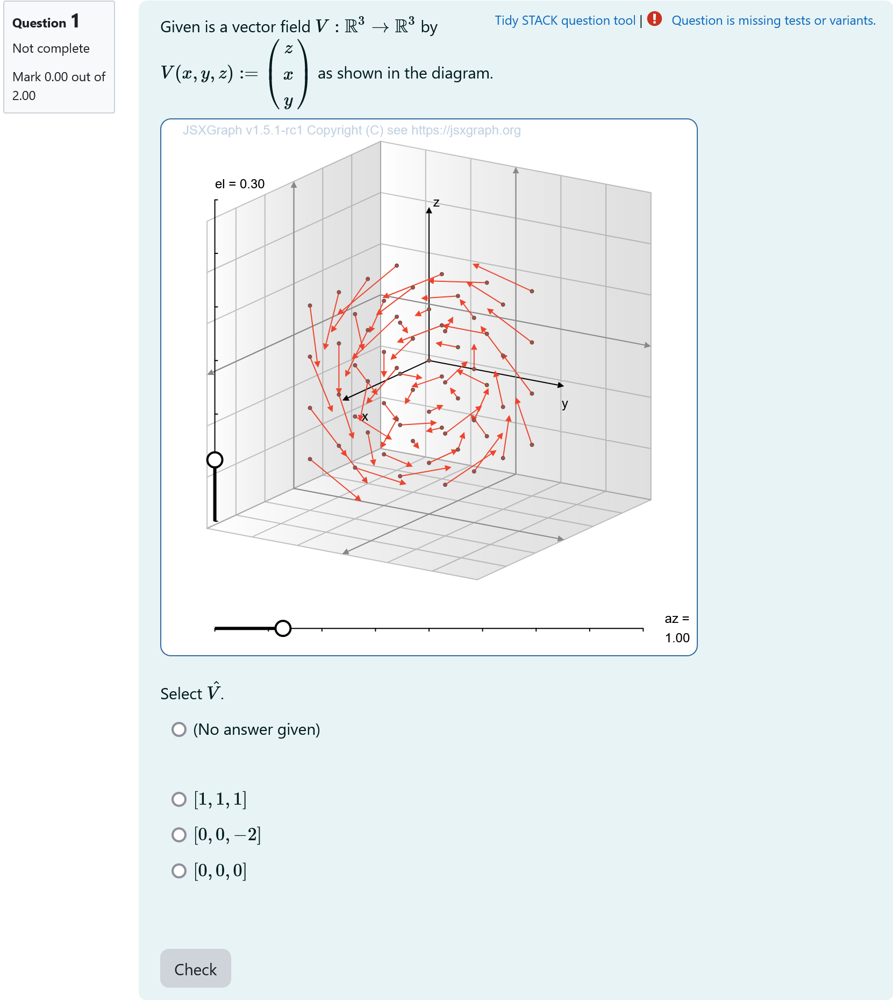
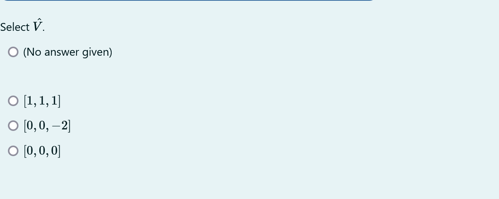
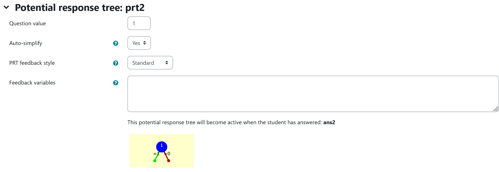

## Aim of task
+	Student knows how to calculate partial derivatives, vector products and curls of 3D vector fields  (Handling mathematical symbols and formalism)
+	Student understands, how a vector field and its curl are connected graphically (Representing mathematical entities)
+ 	Using a visualization of vector field and its curl the student can graphically check whether his calculations are correct (Making use of aids and tools)

|  |
|:--:|
| *First impression of the question* |

## Exercise layout
This is an adaptive tutorial task. If the answer the student has given is not correct, an section explaining the curl will appear. Afterwards the task is shown again. The second version of the question is a multiple choice question.

## Question description

A 3D vector field is plotted. The student has to enter the vector field, which represents the curl.

+ [XML Code](XML/quiz-IDIAM-Curl%20of%20a%20vector%20field%20(Curl%20given).xml)

### Student perspective

The student sees a plot of the 3D vector field. They can rotate their point of view using the sliders and get a better idea of the vector field.


|  |
|:--:|
| *When the student solves the problem* |


### Teacher perspective
The teacher can remove entries from or add entries to the list `Vlist` that contains the vector fields. Possible vector fields need to contain only the variables `x`, `y` and `z`. The coordinates are saved in the shape [x-component, y-component, z-component]. Each of the components can be dependent on all variables.

**The rest of the Question variables should not be altered.**

|  |
|:--:|
| *The above image shows which values the teacher may wish to change* |


## Question code

### Question Variables
+	Vlist is a list of 3D vector fields dependent on x,y,z and constants given in format [f_x,f_y,f_z]  to randomly select from
+	Select one of the vector fields by randomizing the index Vindex of the list and evaluating Vlist via Vselected: Vlist[Vindex]
+	Define Variables Vx, Vy, Vz as the vector field components in order to plot it in Question text
+	Save the curls of all of the vector fields with attribute false to a list in order to access it in Question text
+	Set attribute of curl of selected vector field to true in order to be able to check answer


#### Question variable code
```
/* define the list of vector fiels */
Vlist:[[z,x,y],[y,-x,0],[x,y,z]];

/* select one of the vector fields */
lv:length(Vlist);
Vindex:rand(lv)+1;
Vselected:Vlist[Vindex];

/* compute the curl of all vector fields in the list */
Vcurlop(Vinp):=[diff(Vinp[3],y)-diff(Vinp[2],z),diff(Vinp[1],z)-diff(Vinp[3],x),diff(Vinp[2],x)-diff(Vinp[1],y)];
for iv:1 step 1 thru lv do   
    (Vlistcurl[iv]:Vcurlop(Vlist[iv])); 

/* define Vx, Vy, Vz for rendering the vector field*/
Vx:Vselected[1];
Vy:Vselected[2];
Vz:Vselected[3];


/* build option list for selection */
iv:0;
/* ta out of for loop does not work, create the list manualy */
ta:[[Vlistcurl[1],if Vindex=1 then true else false]];
for iv:2 step 1 thru lv do ta:append(ta,[[Vlistcurl[iv],if Vindex=iv then true else false]]);
/* ta:[[Vlistcurl[1],false],[Vlistcurl[2],false],[Vlistcurl[3],false]];*/

/* set the selected vector field to 'true' */
ta[Vindex][2]:true;

tans:Vlistcurl[Vindex];
```
### JSXGraph applet
Here the general text is given.
+ ``` <div id="jsxbox1"> ```
+	Given is a vector field  $$V:\mathbb{R}^3\to\mathbb{R}^3$$ by $$V(x,y,z):=\begin{pmatrix}{@Vx@}\\{@Vy@}\\{@Vz@}\end{pmatrix}$$ as shown in the diagram. Select the vector fields $$\hat V$$, so that $$\hat V = \nabla \times V$$ is valid.

+	JSXGraph applet using the functions and variables defined in **Question variables** plotting the 3D vector field and its curl in a projected plane, the angle of projection can be changed such that the vector fields can be viewed from multiple directions.
+ The answers are placed in the tasks parts. This `<div>` is (un)hided using the "Continue" button.

#### Question text code

``` javascript
<div id="jsxbox1">
<p>Given is a vector field  \(V:\mathbb{R}^3\to\mathbb{R}^3\) by \( V(x,y,z) := \begin{pmatrix}{@Vx@} \\ {@Vy@} \\ {@Vz@}\end{pmatrix} \) as shown in the diagram.</p>

<p>Select the vector fields \(\hat V\), so that \(\hat V = \nabla \times V\) is valid.</p>

[[jsxgraph width="500px" height="500px" input-ref-ans1='ans1Ref']]
var board = JXG.JSXGraph.initBoard(divid,{boundingbox : [0, 10, 10,0], axis:false, shownavigation : false});
var box = [-3,3]
var view = board.create('view3d',
            [[2,2.5], [6, 6],
            [box, box, box]],
            {});
// Transform components of the vector function
var TF1 = board.jc.snippet('{#Vx#}', true, 'x,y,z');
var TF2 = board.jc.snippet('{#Vy#}', true, 'x,y,z');
var TF3 = board.jc.snippet('{#Vz#}', true, 'x,y,z');

var vector=[];
var scaleVec = 0.5;

/* Funktionen zum Plotten der Vektorfelder */
function clearVectorField(){
    board.removeObject(vector);
    vector=[];
}

function vectorField(){
    clearVectorField();
    board.suspendUpdate();
    var i,j,k,vx,vy;
    var pout=[];
    for(k=-2; k<2; k+=1){
        for(i=-2; i<2; i+=1){
            for(j=-2;j<2; j+=1){
                                //var norm = Math.max((i*i+ j*j ),0.001);
                               var norm =1;
                 vector.push(view.create('line3d',[[i, j,k ],
                                [TF1(i,j,k),TF2(i,j,k),TF3(i,j,k)],[0,scaleVec]],
                                {point: { withLabel: false},
                                point1: {visible: true, size: 1, color: '#EE442F',strokeColor: '#EE442F', withLabel: false},
                                point2: {visible: false, withLabel: false},
                                lastArrow:true, fixed: true, strokeColor:'#EE442F', highlight:false})
                            );

            }
        }
    }
board.unsuspendUpdate();
}
/* end helper functions */
vectorField();

board.update();

                      /* axis labels*/
                       var xlabel=view.create('point3d',[0.9*box[1],0,(0.6*box[0]+0.4*box[1])], {size:0,name:"x"});
                       var ylabel=view.create('point3d',[0,0.9*box[1],(0.6*box[0]+0.4*box[1])], {size:0,name:"y"});
                       var zlabel=view.create('point3d',[
                           0.7*(0.6*box[0]+0.4*box[1]),
                           0.7*(0.6*box[0]+0.4*box[1]),
                           0.9*box[1]], 
                           {size:0,name:"z"});

[[/jsxgraph]]
</div>

```

### Question Text (Task 1)
+ ` <div id="task"> `
+ The question ist stated the first time here. Give your answer in the form of a list, e.g. <code>[2,x,z]</code>.
+	$\hat V=$ `[[input:ans1]]` at the end of JSXGraph code to allow input of an answer of the student
+	`[[validation:ans1]]` checking of answer

#### Question text code


``` javascript
<div id ="task">
<p>Type in the vector field \(\hat V= \nabla \times V\). This is the vector field that results, when the curl operator is applied to \(V\).</p>
<p> Give your answer in the form of a list, e.g. <code>[2,x,z]</code>.
<p>\(\hat V=\) [[input:ans1]] [[validation:ans1]]</p>
[[feedback:prt1]]
</div>
```

### Answers
#### Answer ans 1
|property | setting| 
|:---|:---|
|Input type |Algebraic input|
|Model answer | `tans` defined in **Question variables** |
| Forbidden words | none |
| Forbid float | Yes |
| Student must verify | Yes |
| Show the validation | Yes, compact|
--- 
## General feedback

none

### Potential response tree
#### prt1

|  |
|:--:|
| *Visualization of **prt1*** |

Feedback variables:

None needed, since `ans1` is selected by ticking a button.


|  |
|:--:|
| *Values of **node 1*** |
### Node 1

 |property | setting| 
|:---|:---|
|Answer Test | AlgEquiv|
|SAns | `ans1`|
|TAns | `tans`| 
|Node 1 true feedback | `<p>Nice! You found the correct vector field.</p>`|
|Node 1 false feedback | ```<p>Selected vector field does not fit. Please compute \\(\nabla \times V\\) for the given field. You will be guided in doing so, when you click the button "continue". </p> <p> <button type="button" onclick="hide('task');hide('jsxbox1');show('input');">Continue</button1></p>```|

### Explanation Curl
+ ``` <div id="input"> ```
If the students answer is not correct, the computation of the curl is shown.

||
|:--:|
| *Feedback **node 1*** |

The curl is a measure for infinitesimal circulatios in a vector field. If a vector field has some kind of "swirlyness" to it, the curl operator will result in a non-zero vector field again. This has applications in flow of liquids, but also quite prominently in the theory of classical electrodynamics. This can be condensed to the famous Maxwell's equations, where the curl of the elctric and magnetic field play an important role. <br>
The curl can be calculated by
$\nabla \times V= \begin{pmatrix} \frac{\partial V_z}{\partial y}- \frac{\partial V_y}{z}\\ \frac{\partial V_x}{\partial z}-\frac{\partial V_z}{\partial x} \\ \frac{\partial V_y}{\partial x}-\frac{\partial V_x}{\partial y} \end{pmatrix} $ <br>
In the next task, you will be presented with a vector field and a list of possible resulting fields, when the curl operator is applied.


#### Question text code

``` javascript
<div id="input" style="display:none;">
<p>The curl is a measure for infinitesimal circulatios in a vector field. If a vector field has some kind of "swirlyness" to it, the curl operator will result in a non-zero vector field again. This has applications in flow of liquids, but also quite prominently in the theory of classical electrodynamics. This can be condensed to the famous Maxwell's equations, where the curl of the elctric and magnetic field play an important role. <br>
The curl can be calculated by
\[\nabla \times V= \begin{pmatrix} \frac{\partial V_z}{\partial y}- \frac{\partial V_y}{z}\\ \frac{\partial V_x}{\partial z}-\frac{\partial V_z}{\partial x} \\ \frac{\partial V_y}{\partial x}-\frac{\partial V_x}{\partial y} \end{pmatrix} \] <br>
In the next task, you will be presented with a vector field and a list of possible resulting fields, when the curl operator is applied.</p>
<p>
    <button type="button" onclick="hide('input');show('jsxbox1');show('task2');">Continue</button>
</p>
</div>
```
### Question Text (Task 2)
+ ``` <div id="task2"> ```
+ The question ist stated now again. 
+	`[[input:ans1]]` at the end of JSXGraph code to allows to select one answer.
+	`[[validation:ans1]]` checking of answer
+ Layer `jsxbox1` is unhided and the question looks as follows

||
|:--:|
| *Task 2* |

#### Question text code


```javascript
<div id="task2" style="display:none;">
Select \(\hat V\).
<p>[[input:ans2]] [[validation:ans2]]</p>
[[feedback:prt2]]
</div>
```
This generats only the lower part


### Answers
#### Answer ans 2
|property | setting| 
|:---|:---|
|Input type |radio|
|Model answer | `ta` defined in **Question variables** |
| Forbidden words | none |
| Forbid float | Yes |
| Student must verify | Yes |
| Show the validation | Yes, compact|

### Potential response tree
#### prt2
|  |
|:--:|
| *Visualization of **prt2*** |

Feedback variables:

None needed, since `ans1` is selected by ticking a button.


|  |
|:--:|
| *Values of **node 1*** |
### Node 1
 |property | setting| 
|:---|:---|
|Answer Test | AlgEquiv|
|SAns | `ans2`|
|TAns | `tans`| 
|Node 1 true feedback | `<p> Well done, you selected the correct vector field. You can now try to calculate the curl of more complicated vector fields. The process is always the same.</p>`|
|Node 1 false feedback | `<p> You did not select the correct vector field. Please compute \(\nabla \times V\) for the given field \(V(x,y,z):=\begin{pmatrix} {@Vx@} \\ {@Vy@} \\ {@Vz@} \end{pmatrix}\). </p>`|
--- 
