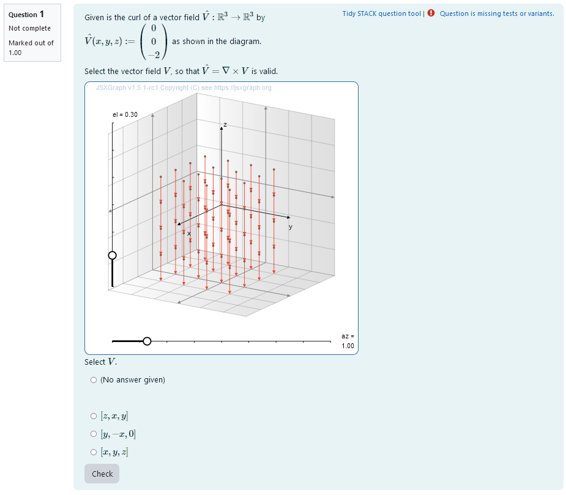
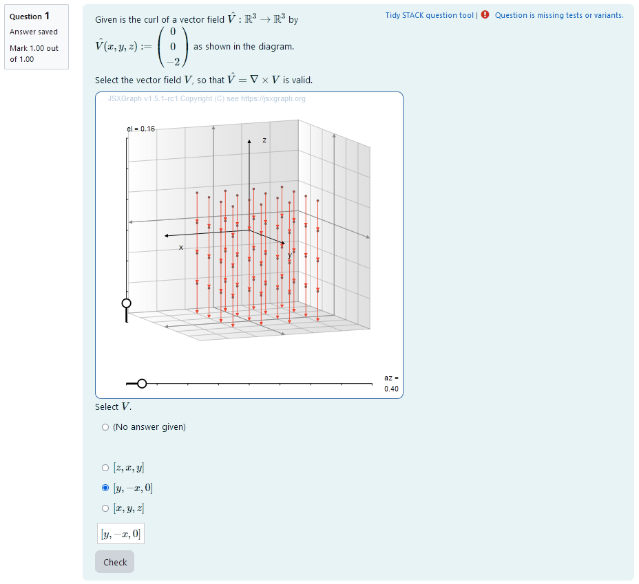
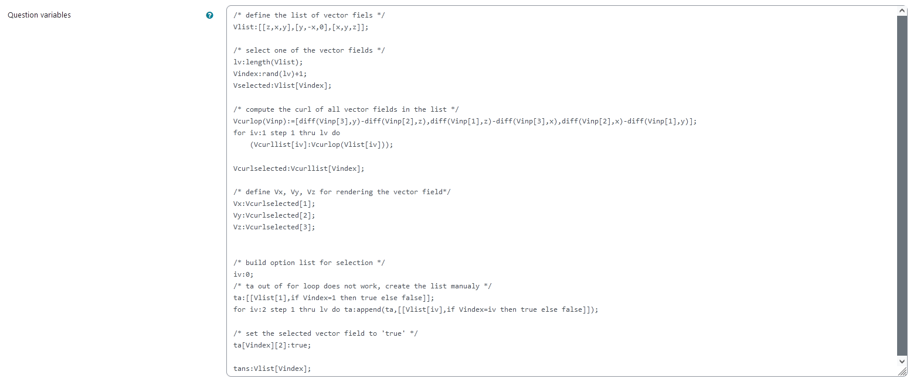
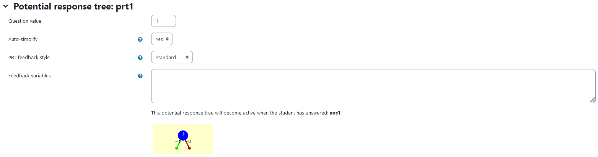
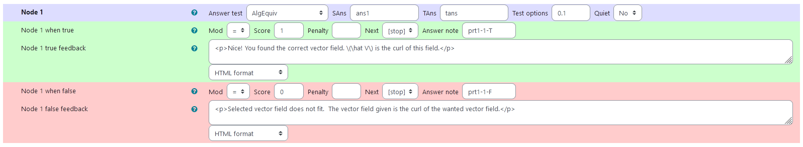

## Aim of task
+	Student knows how to calculate partial derivatives, vector products and curls of 3D vector fields  (Handling mathematical symbols and formalism)
+	Student understands, how a vector field and its curl are connected graphically (Representing mathematical entities)
+ 	Using a visualization of vector field and its curl the student can graphically check whether his calculations are correct (Making use of aids and tools)

|  |
|:--:|
| *First impression of the question* |

+ [XML Code](XML/quiz-IDIAM-Curl%20of%20a%20vector%20field%20(Curl%20given).xml)

## Question description

A 3D vector field is plotted. It is the curl of another vector field. 
3 different options for this field are presented in the form of radio buttons and the student needs to pick what they believe to be correct.

### Student perspective

The student sees a plot of the 3D vector field. They can rotate their point of view using the sliders and get a better idea of the vector field. 


|  |
|:--:|
| *When the student solves the problem* |


### Teacher perspective
The teacher can remove entries from or add entries to the list `Vlist` that contains the vector fields. Possible vector fields need to contain only the variables `x`, `y` and `z`. The coordinates are saved in the shape [x-component, y-component, z-component]. Each of the components can be dependent on all variables.

**The rest of the Question variables should not be altered.**

|  |
|:--:|
| *The above image shows which values the teacher may wish to change* |


## Question code

### Question Variables
+	Vlist is a list of 3D vector fields dependent on x,y,z and constants given in format [f_x,f_y,f_z]  to randomly select from
+	Select one of the vector fields by randomizing the index Vindex of the list and evaluating Vlist via Vselected: Vlist[Vindex]
+	Define Variables Vx, Vy, Vz as the vector field components in order to plot it in Question text
+	Save the curls of all of the vector fields with attribute false to a list in order to access it in Question text
+	Set attribute of curl of selected vector field to true in order to be able to check answer


#### Question variable code
```
/* define the list of vector fields */
Vlist:[[z,x,y],[y,-x,0],[x,y,z]];

/* select one of the vector fields */
lv:length(Vlist);
Vindex:rand(lv)+1;
Vselected:Vlist[Vindex];

/* compute the curl of all vector fields in the list */
Vcurlop(Vinp):=[diff(Vinp[3],y)-diff(Vinp[2],z),diff(Vinp[1],z)-diff(Vinp[3],x),diff(Vinp[2],x)-diff(Vinp[1],y)];
for iv:1 step 1 thru lv do   
    (Vcurllist[iv]:Vcurlop(Vlist[iv])); 

Vcurlselected:Vcurllist[Vindex];

/* define Vx, Vy, Vz for rendering the vector field*/
Vx:Vcurlselected[1];
Vy:Vcurlselected[2];
Vz:Vcurlselected[3];


/* build option list for selection */
iv:0;
/* ta out of for loop does not work, create the list manualy */
ta:[[Vlist[1],if Vindex=1 then true else false]];
for iv:2 step 1 thru lv do ta:append(ta,[[Vlist[iv],if Vindex=iv then true else false]]);

/* set the selected vector field to 'true' */
ta[Vindex][2]:true;

tans:Vlist[Vindex];
```

### Question Text
+	Given is the curl of a vector field  $\hat V:\mathbb{R}^3\to\mathbb{R}^3$ by $\hat V(x,y,z):=\begin{pmatrix}{@Vx@}\\{@Vy@}\\{@Vz@}\end{pmatrix}$ as shown in the diagram. Select the vector fields $\hat V$, so that $\hat V = \nabla \times V$ is valid.

+	JSXGraph applet using the functions and variables defined in **Question variables** plotting the 3D vector field and its curl in a projected plane, the angle of projection can be changed such that the vector fields can be viewed from multiple directions
+	`[[input:ans1]]` at the end of JSXGraph code to allow input of an answer of the student
+	`[[validation:ans1]]` checking of answer

#### Question text code


```javascript
<p>Given is the curl of a vector field  \(\hat V:\mathbb{R}^3\to\mathbb{R}^3\) by \(\hat V(x,y,z) := \begin{pmatrix}{@Vx@} \\ {@Vy@} \\ {@Vz@}\end{pmatrix} \) as shown in the diagram.</p>

<p>Select the vector field \(V\), so that \( \hat V = \nabla \times V\) is valid.</p>

[[jsxgraph width="500px" height="500px" input-ref-ans1='ans1Ref']]
var board = JXG.JSXGraph.initBoard(divid,{boundingbox : [0, 10, 10,0], axis:false, shownavigation : false});
var box = [-3,3]
var view = board.create('view3d',
            [[2,2.5], [6, 6],
            [box, box, box]],
            {});
// Transform components of the vector function
var TF1 = board.jc.snippet('{#Vx#}', true, 'x,y,z');
var TF2 = board.jc.snippet('{#Vy#}', true, 'x,y,z');
var TF3 = board.jc.snippet('{#Vz#}', true, 'x,y,z');

var vector=[];
var scaleVec = 0.5;

/* Funktionen zum Plotten der Vektorfelder */
function clearVectorField(){
    board.removeObject(vector);
    vector=[];
}

function vectorField(){
    clearVectorField();
    board.suspendUpdate();
    var i,j,k,vx,vy;
    var pout=[];
    for(k=-2; k<2; k+=1){
        for(i=-2; i<2; i+=1){
            for(j=-2;j<2; j+=1){
                                //var norm = Math.max((i*i+ j*j ),0.001);
                               var norm =1;
                 vector.push(view.create('line3d',[[i, j,k ],
                                [TF1(i,j,k),TF2(i,j,k),TF3(i,j,k)],[0,scaleVec]],
                                {point: { withLabel: false},
                                point1: {visible: true, size: 1, color: '#EE442F',strokeColor: '#EE442F', withLabel: false},
                                point2: {visible: false, withLabel: false},
                                lastArrow:true, fixed: true, strokeColor:'#EE442F', highlight:false})
                            );

            }
        }
    }
board.unsuspendUpdate();
}
/* end helper functions */
vectorField();

board.update();

                      /* axis labels*/
                       var xlabel=view.create('point3d',[0.9*box[1],0,(0.6*box[0]+0.4*box[1])], {size:0,name:"x"});
                       var ylabel=view.create('point3d',[0,0.9*box[1],(0.6*box[0]+0.4*box[1])], {size:0,name:"y"});
                       var zlabel=view.create('point3d',[
                           0.7*(0.6*box[0]+0.4*box[1]),
                           0.7*(0.6*box[0]+0.4*box[1]),
                           0.9*box[1]], 
                           {size:0,name:"z"});

[[/jsxgraph]]
Select \( V\).
<p>[[input:ans1]] [[validation:ans1]]</p>
```
## Answers
### Answer ans 1
|property | setting| 
|:---|:---|
|Input type |Radio|
|Model answer | `ta` defined in **Question variables** |
| Forbidden words | none |
| Forbid float | No |
| Student must verify | Yes |
| Show the validation | Yes, compact|
--- 
## General feedback

```
<hr>
<p> The notation \(\nabla \times V\) is describing the application of the curl operator on a vector field \(V\). It is based on the notation of the gradient of a potential \(f\) given as \(\nabla f = \begin{pmatrix} \frac{\partial f}{\partial x} \\ \frac{\partial f}{\partial y}\\ \frac{\partial f}{\partial z} \end{pmatrix}\). </p>
<p> The curl is then defined by the vector product of the nabla operator \(\nabla  = \begin{pmatrix} \frac{\partial }{\partial x} \\ \frac{\partial}{\partial y}\\ \frac{\partial}{\partial z} \end{pmatrix}\) and the vector field \(V = \begin{pmatrix} V_x \\ V_y \\V_z \end{pmatrix}\).</p>
<p> We find \(\nabla \times V = \begin{pmatrix}\frac{\partial V_z}{\partial y}- \frac{\partial V_y}{\partial z}\\ \frac{\partial V_x}{\partial z}- \frac{\partial V_z}{\partial x} \\ \frac{\partial V_y }{\partial x}- \frac{\partial V_x}{\partial y} \end{pmatrix} \). </p>
 ```

## Potential response tree
### prt1
|  |
|:--:|
| *Visualization of **prt1*** |

Feedback variables:

None needed, since `ans1` is selected by ticking a button.


|  |
|:--:|
| *Values of **node 1*** |
### Node 1
 |property | setting| 
|:---|:---|
|Answer Test | AlgEquiv|
|SAns | `ans1`|
|TAns | `tans`| 
|Node 1 true feedback | `<p>Nice! You found the correct vector field. \(\hat V\) is the curl of this field.</p>`|
|Node 1 false feedback | `<p>You did not select the correct vector field. The vector field given is the curl of the wanted vector field.</p>`|

|  |
|:--:|
| *Values of **node 1*** |


