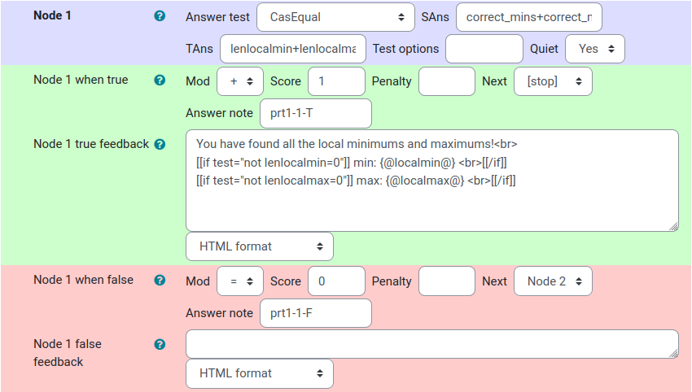
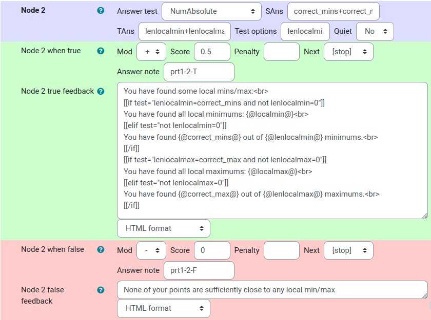

> Given a plot of a function $f(x,y)$ in two variables,
> ask the student to select all local maxima/minima on the plot.
> The algebraic expression for $$f(x,y)$$ is not given to the student.

**TODO** New screenshot

|  |
|:-:|
| *This image shows the students first view of the question* |

- [XML Code](XML/select-extremal.xml)

# Question description

### Pedagogical Motivation


### What the student has to do

The function may have any number of local extremal points,
The 2D figure shows one red point for each minima, and one blue point for each maxima.
The student has to move them to the correct co-ordinate position to identify extramal
points on the surface in the 3D plot.

Depending on the function, the student will need to manipulate the 3D-figure extensively to identify the extremal values.
The sliders control the cameras azimuthal angle (az), elevation (el) and scales the z-axis.
In addition the controls in the lower right hand corner lets the student move the camera position and zoom in/out.

|  |
|:-:|
| *The above image shows the 2D plane where the student can move the points to match approximately with the local min/max* |

Grading allows for a limited error, and the teacher should set a tolerance appropriate to the resolution on the x/y-axes.

## Question code

### Question variables

The following maxima code should be entered into the Question Variables field.

**Caveats**

1.  It does not use random variables.  The function `f` has to be hand-coded.
2.  The x, y, and z ranges (`xrang`, `yrang`, `zrang`) have to be hand-coded.
3.  The tolerance (`maxError`) is absolute (as opposed to relative) and have to be set to a reasonable value

```rust
xrang:[-2,5];  
yrang:[-2,4];
zrang:[-1,10];

maxError:0.3; /*Tolerance (absolute) */

/*Easy example*/
f:(2*x^4+2*y^4-8*x*y+12);

/*Hard example*/
/*f:expand((x-3)*(x+1)*(y-2)*(y+2)*(x*y+3));*/

/*Partial derivatives*/
fx:diff(f,x);
fy:diff(f,y);
fxx:diff(fx,x);
fyy:diff(fy,y);
fxy:diff(fy,x);
D: fxx*fyy-(fxy)^2;

/*Solve for critical points*/
critical:solve([fx,fy],[x,y]);

/*Function noDegen takes a list 'l' of solutions [ [x=a, y=b], ...] and returns a list of 
solutions not containing 'r'*/
noDegen(l,r):=sublist(l, lambda([ll], freeof(r,ll)));
/*Remove degenerate solutions (solutions with free variables stored in %rnum_list)*/
critical_nd: lreduce(noDegen,  %rnum_list,     critical);

/*Function isNotImag returns true if a solution sol ([x=a,y=b]) has no imaginary part*/
isNotImag(sol):=is(equal(imagpart(sol),[0=0,0=0]));
/*Remove complex solutions*/
critical_nd_real:sublist(critical_nd, isNotImag);

/*Classify critical points and collect local max/min */
localmin_expr:sublist(critical_nd_real, lambda([p], ev(fxx,p) >0 and ev(D,p)>0));
localmax_expr:sublist(critical_nd_real, lambda([p], ev(fxx,p) < 0 and ev(D,p)>0));

/*Store min/max in [a,b] form, instead of [x=a, y=b] form*/
localmin:float(map(lambda([x], map(rhs, x)),localmin_expr));
localmax:float(map(lambda([x], map(rhs, x)), localmax_expr));
```

Some lines should be changed by the teacher:

1.  The function `f` to be plotted.
2.  The error tolerance `maxError` which defines how accurately the student
    has to answer.
3.  The arrays `xrang` (`[x_min,x_max]`), `yrang` and `zrang` which sets axis ranges for the plots

### Question text

```html
<p>Given a surface defined by z=f(x,y), shown in the top figure, determine local
minimums and maximums by dragging the min/max points in the bottom figure</p><br>

<p style="display:none">[[input:ans1]] [[validation:ans1]]</p>
<p style="display:none">[[input:ans2]][[validation:ans2]]</p>
[[jsxgraph height='500px' width='700px' input-ref-ans1="points_min_out" input-ref-ans2="points_max_out"]]
      ( Javascript code here )
[[/jsxgraph]]

[[jsxgraph width="500px" height="300px"]]
[[/jsxgraph]]
```

The question text contains two jsxgraph blocks and two hidden input/validation blocks.
The first jsxgraphblock contains all the javascript code for both figures, and the students min/max points are saved in the stack input variables `ans1` and `ans2`, respectively

#### Jsxgraph code
```javascript

//Get divid for bottom jsxgraph figure by incrementing number in divid of top figure
var regexMatchNumber = /([1-9][0-9]|[1-9])/g;  //Regex that matches number between 1-99
var nextDivNum = Number(divid.match(regexMatchNumber))+1;
var divid2 = divid.replace(regexMatchNumber, nextDivNum);

// Ranges for x,y,z from maxima
var xrang = {#xrang#};
var yrang = {#yrang#};
var zrang = {#zrang#};

//Create 3D-board
// Boundingbox sets the vertical and horizontal units and the position of the origin of 
//the figure. For instance a boundingbox [-5,10,5,-10] has upper left corner at (-5,10)
//and lower right corner at (5,-10)
var board = JXG.JSXGraph.initBoard(divid, {
boundingbox: [xrang[0]-4,yrang[1]+4,xrang[1]+4,yrang[0]-4],
keepaspectratio: false,
axis: false
});

//Create the 2D board
var board2=
JXG.JSXGraph.initBoard(divid2,
{boundingbox: [xrang[0],yrang[1],xrang[1],yrang[0]], axis: true});

//Add the 3D board as a child of the 2D board,
//such that the 3D figure updates when we manipulate the 2D figure
board2.addChild(board);

//Arrays holding the min/max points in the 2D figure
var p1min=[];
var p1max=[];

//Arrays holding the min/max points in the base of the 3D figure (xy-plane)
var p2min=[];
var p2max=[];

//Arrays holding the correct max/min points
var localmin = {#localmin#};
var localmax = {#localmax#};
  
// Create the 3D view: -------
/*The large array is of form [ [x,y], [w,h], [[x1,x2], [y1,y2], [z1,z2]] ]. 
The arrays [x, y] and [w, h] define the 2D frame into which the 3D cube is
(roughly) projected.
[[x1, x2], [y1, y2], [z1, z2]] determines the coordinate ranges of the 3D cube. */

var view = 
board.create('view3d',
[[xrang[0], yrang[0]], [xrang[1]-xrang[0],yrang[1]-yrang[0]],[xrang, yrang, zrang]],
{ xPlaneRear: {visible: false}, yPlaneRear: {visible:false}});

//-----------

//Create a slider that scales the z-values [0,0.2,2] are the
//[min,start,max] values of sliders
var z_scale = board.create('slider', [[-3,-5], [3,-5],[0,0.2,2]], {
   name: "Skaler z-akse",
   point1: {frozen: true},
   point2: {frozen: true}
});

//Jessiecode parsing of function from maxima
var FF = board.jc.snippet('{#f#}', true, 'x,y', true);

//Scale function value by multiplying with z_scale slider value
var F = (x,y)=>z_scale.Value()*FF(x,y); 

//Create the surface plot
var c =
view.create('functiongraph3d',
[F,xrang,yrang], { strokeWidth: 0.5, stepsU: 70, stepsV: 70 });


// Create points for every minimum the students musts find
for (let i=0; i<localmin.length; i++){

//Point in 2D plane
   p1min[i] = board2.create('point', [i,i], {name: "Min"+(i+1), color: "red"}); 
  
  //Create the corresponding point in the bottom of
  //the 3D plot - values bound to the 2D plot
   p2min[i] = 
   view.create('point3d',
   [()=>p1min[i].X(), ()=>p1min[i].Y(), zrang[0]],{name: "Min"+(i+1), color: "red"});

   //Create corresponding point on the surface plot - bound by the function value,
   //and (x,y) of the 2D point
   var ptemp=
   view.create('point3d',
   [()=>p1min[i].X(), ()=>p1min[i].Y(), ()=>F(p1min[i].X(), p1min[i].Y())],
   {withLabel: false});

   //Lastly, create a dashed line from the base point to the point on the surface plot
   view.create('line3d', [p2min[i], ptemp], {dash: 1});
}

//Same procedure for the maximal values
for (let i=0; i<localmax.length; i++){
   p1max[i] =
   board2.create('point',
   [i,i], {name: "Max"+(i+1), color: "blue"});
   p2max[i] = 
   view.create('point3d',
   [()=>p1max[i].X(), ()=>p1max[i].Y(), zrang[0]],
   {name: "Max"+(i+1), color: "blue"});
   var ptemp = 
   view.create('point3d',
   [()=>p1max[i].X(), ()=>p1max[i].Y(), ()=>F(p1max[i].X(), p1max[i].Y())],
   {withLabel: false});
   view.create('line3d',[p2max[i], ptemp], {dash: 1});
}


//Obtain references to the answer variables in stack
var answer_min = document.getElementById(points_min_out);
var answer_max=document.getElementById(points_max_out);
var state = document.getElementById(stateRef);

//Check if student has started manipulated the boards earlier,
//and load the state of the graph
if (state.value && state.value != "")
{
   var newState = JSON.parse(state.value);
   var pout = newState['pout'];
   console.log("saved out", pout);
   for (let i=0; i<p1min.length; i++){
       p1min[i].setPositionDirectly(JXG.COORDS_BY_USER, [pout[i][0], pout[i][1]]);
   }
   for (let i=0; i<p1max.length; i++){
       p1max[i].setPositionDirectly(JXG.COORDS_BY_USER, [pout2[i][0], pout2[i][1]]);
   }
   z_scale.setValue(newState["z_scale"]);
   view.D3.el_slide.setValue(newState["el_slider"]);
   view.D3.az_slide.setValue(newState["az_slider"]);
}

board2.update();

//Set an update function that sets the answer variables in stack to the points the
//student has selected
board.on('update', function() {

   //Arrays of min/max points
   var pout =  [];
   var pout2 = [];

   //JSON object containing the state of the boards
   var newState = {};

   //Collect minimum points
   for (let i=0; i<p1min.length; i++){
       pout[i] = [p1min[i].X(), p1min[i].Y()];
   }
   //Set answer variable in stack to the current points selected by students in jsxgraph
   answer_min.value=JSON.stringify(pout);

  //Same procedure for max points
  for(let i=0; i<p1max.length; i++){
     pout2[i] = [p1max[i].X(), p1max[i].Y()];
  }
  answer_max.value=JSON.stringify(pout2); 

//Save state of board to STACK answerfield
newState.pout = pout;
newState.pout2 = pout2;
newState.z_scale = z_scale.Value();
newState.el_slider = view.D3.el_slide.Value();
newState.az_slider = view.D3.az_slide.Value();
state.value = JSON.stringify(newState);

});
```
There are a couple of parts in the jsxgraph block that might need some tuning from the teacher:
1. The boundingbox option given when creating the boards: For positioning the figures
2. The `view` variable takes an array on creation that controls coordinate ranges of, and how the 3D-figure is projected
3. The `z_scale` variable takes an array the controls the min/max and starting values of slider that scales the z-axis


### Specific feedback

We define one partial response tree for this question. The teacher could create seperate response trees for the minimas and maximas
### Feedback Variables 

#### Feedback variabels PRT1

```rust
lenlocalmin:length(localmin);
lenlocalmax:length(localmax);

/*Function dist(u,v) returns the distance between points u and v*/
dist(u,v):=float(sqrt((u[1]-v[1])^2+(u[2]-v[2])^2));

/*Function dists(u,l) takes a point 'u' and a list of points 'l',
and returns a list with the distances between 'u' and the points in 'l'*/
dists(u,l):=map(lambda([x],dist(u,x)), l);

/*'errors' holds the distances from the points the student found, to all the minimums*/
errors:map(lambda([x],dists(x,localmin)),ans1);

/*bestErrorWithIndex takes a list 'e' of errors, and returns a list with the 
smallest error and its index*/
bestErrorWithIndex(e):=[lmin(e), first(sublist_indices(e, lambda([x], x=lmin(e))))];

/*Find the smallest distance from all the student's points to the minimums, along with 
the minimums index*/
errors_best:map(bestErrorWithIndex, errors);

/*Find which of the best errors are smaller than maxError*/
errors_OK:sublist(errors_best, lambda([x], x[1]<maxError));

/*List containing the indices of approved errors*/
indices_OK:map(lambda([x],x[2]), errors_OK);

/*Number of correctly indentified minimums correspond to the number of unique
indices in indices_OK*/
correct_mins:length(unique(indices_OK));

/*Same procedure for local max*/
errors2:map(lambda([x],dists(x,localmax)),ans2);
errors_best2:map(bestErrorWithIndex, errors2);
errors_OK2:sublist(errors_best2, lambda([x], x[1]<maxError));
indices_OK2:map(lambda([x],x[2]), errors_OK2);
correct_max:length(unique(indices_OK2));
```

In the "feedback variables" form, we executes some maxima code after the student has submitted their answer.
We check which extremal value the points the student has submitted are closest to and remove the ones that are further away than `maxError` from an extremal value.
Finally we count how many unique extremas the student has found, and store the correct numbers found in `correct_mins` and `correct_max`.

This question utilizes a single response tree for ease and flexibility. 
Should the teacher to wish create seperate response trees for min/max values, they would need to copy the first two and last 5 lines, along with the functions `dist`, `dists`, and `bestErrorWithIndex` over to the "feedback variables" field in the new response tree.

### Partial Response Tree



#### Node 1
The response tree consists of two nodes. 
Node 1 uses the CasEqual answer test to check if the student's total number of correct extremal values equals the actual total number of extremal values.
If so, the student has found all the extremal values, and is told so and awarded full points. 
In addition we use a if-block `[[if test="expr"]] ... [[/if]]` supplied by stack to show a list of the correct values only when there exists minimas or maximas.

#### Node 2
If node 1 is false we move to node 2, where we utilize the NumAbsolute test. We check if the student has found at least 1 extremal value and, if so award half the points.
By using if blocks again, we can give the student feedback as to how many correct maximas or minimas they have found and excluding feedback regarding minimas or maximas if there are none to be found.
